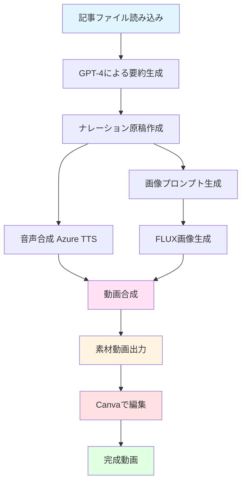
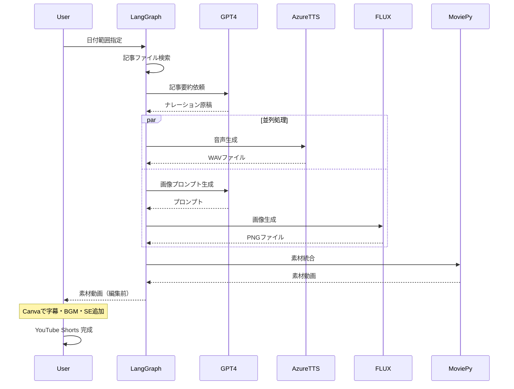

# LangGraphで作る自動ニュース動画生成システム：記事から YouTube 動画までを完全自動化

## はじめに

「毎日書いているブログ記事を動画にできたら、もっと多くの人に届けられるのに…」

そんな思いから、この自動動画生成システムを開発しました。LangGraphを使って記事の要約から画像生成、音声合成、動画編集までを一貫して自動化することで、記事執筆者が新たな視聴者層へアプローチする手段を提供します。

本記事では、実際に稼働している自動動画生成システムの全容を、実装コードとともに詳しく解説します。

## この記事で学べること

- **LangGraphによる複雑なワークフロー設計**：状態管理とノード設計の実践的な手法
- **Azure AI サービスの統合活用**：GPT-4、FLUX画像生成、音声合成の連携方法
- **動画生成の実装ノウハウ**：MoviePyを使った動画編集の自動化
- **プロダクション環境での工夫**：料金最適化やエラーハンドリングの実例

## ⚠️ 重要な注意事項

本システムについて、事前に理解しておくべき重要なポイントがあります。

### 生成される動画の範囲

**このシステムが自動生成するもの**：
- ナレーション音声
- 記事に関連した画像
- フリー素材動画との組み合わせ
- 基本的な動画クリップの結合

**このシステムでは生成されないもの（手動編集が必要）**：
- 字幕・テロップ
- BGM（背景音楽）
- SE（効果音）
- オープニング映像
- エンディング映像
- トランジション効果

つまり、**このプログラムで生成されるのは　素材動画**です。視聴者に公開できる完成品にするには、Canvaなどの動画編集ツールでの追加編集が必須となります。

### その他の重要な注意点

#### 1. 著作権・肖像権への配慮

- **フリー素材動画の選定**：必ず商用利用可能なライセンスの素材を使用してください
- **生成画像の確認**：FLUXで生成された画像に実在の人物や著作物が含まれていないか、必ず目視確認が必要です
- **記事の引用元**：元記事が他サイトからの引用の場合、動画化の許諾が必要な場合があります

#### 2. Azure サービスの料金体系

- **従量課金制**：使用した分だけ課金されるため、大量の記事を一度に処理すると想定外のコストが発生する可能性があります
- **無料枠の確認**：Azure AI サービスには無料枠がありますが、上限を超えると自動的に課金が開始されます
- **事前の見積もり**：本格運用前に、1週間分程度のテスト実行でコストを確認することを強く推奨します

#### 3. ファイル命名規則の厳守

記事ファイルは必ず以下の形式で命名してください：
```
YYYYMMDD_タイトル.md
```

例：`20260214_AI技術の最新動向.md`

この規則を守らないと、システムが記事を認識できません。

#### 4. 動画の長さの制限

- **YouTube Shorts の制限**：最大60秒まで
- 複数記事を1つの動画にまとめる場合、各記事の要約が短くなりすぎないよう、記事数を調整してください
- 目安：3〜5記事程度が1本の動画に適しています

#### 5. 出力ファイルの管理

- `output/`フォルダは実行のたびに大量のファイルが生成されます
- 定期的な整理が必要です（特にWAVファイルはサイズが大きいため）
- 本番環境では、古いファイルを自動削除するスクリプトの追加を推奨します

#### 6. 処理時間について

1記事あたりの処理時間の目安：
- 要約生成：10〜20秒
- 音声生成：10〜15秒
- 画像生成：20〜30秒
- 動画合成：記事の長さに依存（1分の動画で約30〜60秒）

**合計**：5記事で約5〜10分程度の処理時間が必要です。

#### 7. エラー時の対応

システムがエラーで停止した場合：
1. `output/*/node_logs.jsonl`でどのノードで失敗したかを確認
2. Azure のサービス状態を確認（障害が発生していないか）
3. API キーや接続情報が正しいかを確認
4. 必要に応じて特定の記事のみを除外して再実行

## なぜこのシステムを作ったのか

### 背景にあった3つの課題

1. **音声コンテンツとしての活用**
   ニュース解説記事を家事や通勤中に音声で聞きたいというニーズがありました。しかし、毎日手作業で音声化するのは現実的ではありません。

2. **新しい視聴者層へのリーチ**
   テキスト記事だけでは届かない「動画でニュースを見る層」にアプローチしたいという狙いがありました。YouTube Shortsは特に若い世代に強い影響力があります。

3. **LangGraphの実践的な学習**
   LangGraphは通常、文章生成タスクで使われることが多いですが、マルチメディア生成という新しい用途に挑戦してみたかったのです。

## システムアーキテクチャ

### 処理フローの全体像



### データフロー



## 開発過程で直面した課題と解決策

### 1. 動画の単調さ対策

**課題**：最初は各記事1枚の生成画像のみで動画を作成していましたが、1分間同じ画像が表示され続けるのは視聴体験として退屈でした。

**解決策**：
- 生成画像を冒頭5秒のみ使用
- フリー素材の動画クリップをランダムに挿入
- ズームエフェクトで静止画に動きを追加

```python
# ズームエフェクトの実装例（後述のコードより抜粋）
def zoom_factor(t, total=duration):
    return 1 + 0.05 * (t / max(total, 0.001))

base_image = base_image.with_effects([Resize(new_size=zoom_factor)])
```

### 2. 字幕の技術的制約

**課題**：当初は動画に自動で字幕を入れる予定でしたが、使用したライブラリが日本語に対応していませんでした。

**解決策**：
- プログラムでは字幕なし動画を生成
- Canvaなどの動画編集ツールで手動で字幕を追加
- スクリプトファイルも自動生成し、編集作業を効率化

**注意**：この制約により、プログラム実行後は必ず手動での編集工程が必要になります。完全自動化を期待していた場合は、この点にご注意ください。

### 3. コスト最適化

**課題**：各記事ごとにAI動画生成（Runway、Pikaなど）を使うと、料金が高額になりすぎました。

**解決策**：
- AI動画生成から静止画像生成（FLUX）へ変更
- フリー素材動画との組み合わせで動きを確保
- **月間コストを約1/10に削減**

### 4. ナレーション品質の向上

**課題**：記事の冒頭500文字をそのまま読み上げると、URLやハッシュタグまで読み上げてしまい、不自然なナレーションになりました。

**解決策**：
- GPT-4による要約ステップを追加
- URL・記号の除去と自然な話し言葉への変換を明示的に指示
- 500文字以内の制約で簡潔な原稿を生成

## 実装ガイド

### セットアップ

#### 1. プロジェクトフォルダの作成

```bash
mkdir news-article
cd news-article
uv init
uv venv
uv add azure-cognitiveservices-speech dotenv langchain langgraph openai langchain_openai moviepy typer
mkdir article movie output
touch config.py state.py nodes.py graph.py main.py
```

**フォルダ構成**：
- `article/`: 変換元の記事ファイル（`YYYYMMDD_タイトル.md`形式）
- `movie/`: フリー素材動画を配置
- `output/`: 生成された動画・音声・画像の保存先

#### 2. Azure AI サービスの準備

**Azure AI Foundry**：
- リージョン：East US
- デプロイモデル：
  - `FLUX.1-Kontext-pro`（画像生成）
  - `gpt-4.1`（テキスト生成）

**Azure Speech Service**：
- リージョン：East US
- 音声：`ja-JP-NanamiNeural`（自然な日本語女性音声）

[公式ドキュメント](https://learn.microsoft.com/ja-jp/azure/ai-services/speech-service/get-started-text-to-speech)を参考に設定してください。

#### 3. 環境変数の設定

`.env`ファイルを作成：

```txt
# テキスト生成
AZURE_TEXT_API_KEY=
AZURE_TEXT_ENDPOINT=

# 音声
AZURE_SPEECH_KEY=
AZURE_SPEECH_ENDPOINT=
AZURE_SPEECH_REGION=

# 画像生成
AZURE_IMAGE_KEY=
AZURE_IMAGE_ENDPOINT=
```

### コア実装

#### config.py（設定管理）

```py:config.py
import os
from dotenv import load_dotenv

load_dotenv()


def _split_endpoint(endpoint: str | None) -> tuple[str | None, str | None]:
    """Return (resource_base_url, api_version) extracted from a raw endpoint."""
    if not endpoint:
        return None, None

    base = endpoint.strip()
    if not base:
        return None, None

    api_version = None
    if "api-version=" in base:
        api_version = base.split("api-version=")[-1].split("&")[0].strip()
    base = base.split("?")[0]
    if "/openai/" in base:
        base = base.split("/openai/")[0]

    normalized = base.rstrip("/") + "/"
    return normalized, api_version


_raw_text_endpoint = os.getenv("AZURE_TEXT_ENDPOINT")
_text_endpoint, _text_version = _split_endpoint(_raw_text_endpoint)

_raw_image_endpoint = os.getenv("AZURE_IMAGE_ENDPOINT")
_image_endpoint, _image_version = _split_endpoint(_raw_image_endpoint)


class Config:
    # Azure OpenAI text
    AZURE_TEXT_API_KEY = os.getenv("AZURE_TEXT_API_KEY")
    AZURE_TEXT_ENDPOINT = _text_endpoint
    AZURE_TEXT_API_VERSION = os.getenv("AZURE_TEXT_API_VERSION", _text_version or "2024-02-01-preview")
    AZURE_OPENAI_DEPLOYMENT_NAME = "gpt-4.1"

    # Azure AI Speech
    AZURE_SPEECH_KEY = os.getenv("AZURE_SPEECH_KEY")
    AZURE_SPEECH_ENDPOINT = os.getenv("AZURE_SPEECH_ENDPOINT")
    AZURE_SPEECH_REGION = os.getenv("AZURE_SPEECH_REGION")

    # Azure Image
    AZURE_IMAGE_API_KEY = os.getenv("AZURE_IMAGE_KEY")
    AZURE_IMAGE_ENDPOINT = _image_endpoint
    AZURE_IMAGE_API_VERSION = os.getenv("AZURE_IMAGE_API_VERSION", _image_version or "2023-12-01-preview")
    AZURE_IMAGE_DEVELOPMENT_NAME = "FLUX.1-Kontext-pro"

    ARTICLE_DIR = "./article"
    OUTPUT_DIR = "./output"
    JP_FONT_PATH = os.getenv("JP_FONT_PATH")
    MOVIE_DIR = "./movie"
```

#### state.py（状態定義）

LangGraphでは、ノード間で受け渡すデータを型安全に管理します。

```py:state.py
from typing import TypedDict


class ArticleData(TypedDict):
    title: str
    display_title: str
    content: str
    date: str


class AgentState(TypedDict):
    start_date: str
    end_date: str
    run_output_dir: str
    articles: list[ArticleData]
    image_prompts: list[str]
    audio_paths: list[str]
    image_paths: list[str]
    script_paths: list[str]
    video_path: str | None
    error: str | None
```

**ポイント**：
- `ArticleData`：個別記事の情報
- `AgentState`：ワークフロー全体で共有される状態
- 各ノードはこの状態を更新しながら処理を進める

#### nodes.py（処理ノード実装）

このファイルが本システムの心臓部です。3つの主要ノードを実装します。

```py:nodes.py
import base64
import json
import os
import random
import re
from datetime import datetime
import azure.cognitiveservices.speech as speechsdk
from openai import AzureOpenAI
from moviepy.video.VideoClip import ImageClip
from moviepy.audio.io.AudioFileClip import AudioFileClip
from moviepy.audio.AudioClip import concatenate_audioclips
from moviepy.video.compositing.CompositeVideoClip import concatenate_videoclips
from moviepy.video.fx.Resize import Resize
from moviepy.video.io.VideoFileClip import VideoFileClip
from config import Config
from state import AgentState


def _log_node_output(run_dir: str, node_name: str, payload: dict):
    """Append a JSON line containing node metadata to the current run directory."""
    os.makedirs(run_dir, exist_ok=True)
    log_path = os.path.join(run_dir, "node_logs.jsonl")
    entry = {
        "timestamp": datetime.now().isoformat(timespec="seconds"),
        "node": node_name,
        "payload": payload
    }
    with open(log_path, "a", encoding="utf-8") as log_file:
        json.dump(entry, log_file, ensure_ascii=False)
        log_file.write("\n")


def _extract_title_from_content(raw_content: str, fallback: str) -> str:
    """Return the first non-empty line from raw markdown as a human friendly title."""
    for line in raw_content.splitlines():
        candidate = line.strip().lstrip("#").strip()
        if candidate:
            return candidate[:120]
    return fallback


text_client = AzureOpenAI(
    api_key=Config.AZURE_TEXT_API_KEY,
    api_version=Config.AZURE_TEXT_API_VERSION,
    azure_endpoint=Config.AZURE_TEXT_ENDPOINT,
    azure_deployment=Config.AZURE_OPENAI_DEPLOYMENT_NAME,
)

image_client = AzureOpenAI(
    api_key=Config.AZURE_IMAGE_API_KEY,
    api_version=Config.AZURE_IMAGE_API_VERSION,
    azure_endpoint=Config.AZURE_IMAGE_ENDPOINT,
    azure_deployment=Config.AZURE_IMAGE_DEVELOPMENT_NAME,
)

VIDEO_EXTENSIONS = (".mp4", ".mov", ".m4v", ".avi", ".webm", ".mkv")


def _list_movie_files() -> list[str]:
    """Collect usable background video files from the configured movie directory."""
    movie_dir = Config.MOVIE_DIR
    if not movie_dir or not os.path.isdir(movie_dir):
        return []
    files = []
    for name in os.listdir(movie_dir):
        if name.lower().endswith(VIDEO_EXTENSIONS):
            files.append(os.path.join(movie_dir, name))
    return files


def fetch_articles_node(state: AgentState):
    """Load dated markdown articles in range and summarize them for narration."""
    target_articles = []
    start = datetime.strptime(state['start_date'], "%Y%m%d")
    end = datetime.strptime(state['end_date'], "%Y%m%d")
    run_dir = state.get('run_output_dir') or Config.OUTPUT_DIR

    if not os.path.exists(Config.ARTICLE_DIR):
        os.makedirs(Config.ARTICLE_DIR)

    # 1. ファイルのフィルタリング
    files_to_process = []
    for filename in os.listdir(Config.ARTICLE_DIR):
        match = re.match(r"(\d{8})_(.*)\.md", filename)
        if match:
            file_date_str, title = match.groups()
            file_date = datetime.strptime(file_date_str, "%Y%m%d")
            if start <= file_date <= end:
                files_to_process.append((filename, title, file_date_str))

    # 2. 各記事の読み込みと要約（ナレーション原稿作成）
    for filename, title, date_str in files_to_process:
        with open(os.path.join(Config.ARTICLE_DIR, filename), 'r', encoding='utf-8') as f:
            raw_content = f.read()

        # GPT-4oによる要約とナレーション整形
        # ここでURLの除去や自然な言い回しへの変換を指示
        response = text_client.chat.completions.create(
            model=Config.AZURE_OPENAI_DEPLOYMENT_NAME,  # GPT-4o用デプロイ名
            messages=[
                {"role": "system", "content": "あなたは優秀なニュースアナウンサーです。"},
                {"role": "user", "content": f"""
以下のニュース記事を、YouTubeショート用のナレーション原稿に要約してください。

【制約事項】
・500文字以内。
・URLや記号（URL、[ ]、( )など）は読み上げに適さないため、完全に削除または自然な言葉に置き換えること。
・視聴者が聞き取りやすいよう、専門用語は避け、自然な話し言葉（です・ます調）にすること。

記事タイトル: {title}
記事内容:
{raw_content}
"""}
            ]
        )

        summarized_content = response.choices[0].message.content.strip()
        human_title = _extract_title_from_content(
            raw_content, title.replace("_", " "))

        target_articles.append({
            'title': title,
            'display_title': human_title,
            'content': summarized_content,  # ここに綺麗な要約が入る
            'date': date_str
        })
        print(f"✅ 要約完了: {title}")

    _log_node_output(
        run_dir,
        "fetch_articles",
        {
            "article_count": len(target_articles),
            "article_titles": [article['display_title'] for article in target_articles],
            "articles": target_articles
        }
    )

    return {'articles': target_articles, 'run_output_dir': run_dir}


def generate_assets_node(state: AgentState):
    """Create narration audio, scripts, and illustrative prompts for each article."""
    audio_paths = []
    image_paths = []
    image_prompts = []
    script_paths = []
    voice_outputs = []
    image_outputs = []

    run_dir = state.get('run_output_dir') or Config.OUTPUT_DIR
    os.makedirs(run_dir, exist_ok=True)

    for i, article in enumerate(state['articles']):
        speech_config = speechsdk.SpeechConfig(
            subscription=Config.AZURE_SPEECH_KEY,
            region=Config.AZURE_SPEECH_REGION
        )
        speech_config.speech_synthesis_voice_name = "ja-JP-NanamiNeural"

        audio_filename = f"audio_{i}.wav"
        audio_path = os.path.join(run_dir, audio_filename)
        audio_config = speechsdk.audio.AudioOutputConfig(filename=audio_path)

        synthesizer = speechsdk.SpeechSynthesizer(
            speech_config=speech_config, audio_config=audio_config)
        synthesizer.speak_text_async(article['content']).get()
        audio_paths.append(audio_path)

        script_filename = f"script_{i}.txt"
        script_path = os.path.join(run_dir, script_filename)
        with open(script_path, "w", encoding="utf-8") as script_file:
            script_file.write(article['content'])
        script_paths.append(script_path)

        voice_outputs.append({
            "index": i,
            "article_title": article.get('display_title') or article['title'],
            "audio_path": audio_path,
            "script_path": script_path,
            "spoken_text": article['content']
        })

        # 1. GPT-4oに「風景」としてのプロンプトを描写させる
        prompt_response = text_client.chat.completions.create(
            model=Config.AZURE_OPENAI_DEPLOYMENT_NAME,
            messages=[
                {
                    "role": "system",
                    "content": (
                        "あなたは映画のコンセプトアーティストです。ニュース記事を読み、"
                        "その背景を象徴するような『美しく広大な風景』の画像生成用プロンプトを英語で作成してください。"
                        "人物を直接描くのではなく、そのニュースが起きている場所や、"
                        "そのニュースがもたらす雰囲気を象徴する風景を描写してください。"
                    )
                },
                {
                    "role": "user",
                    "content": f"記事タイトル: {article.get('display_title') or article['title']}\n記事内容: {article['content']}"
                }
            ]
        )
        img_prompt = prompt_response.choices[0].message.content.strip()

        image_prompts.append(img_prompt)

        image_result = image_client.images.generate(
            model=Config.AZURE_IMAGE_DEVELOPMENT_NAME,
            prompt=f"{img_prompt} Digital art style, vibrant colors, 9:16 aspect ratio focus.",
            size="1792x1024",
            n=1,
            response_format="b64_json",
        )

        image_data = image_result.data[0]
        image_location = None
        if image_data.url:
            image_location = image_data.url
            image_paths.append(image_location)
        else:
            image_filename = f"image_{i}.png"
            image_path = os.path.join(run_dir, image_filename)
            with open(image_path, "wb") as img_file:
                img_file.write(base64.b64decode(image_data.b64_json))
            image_location = image_path
            image_paths.append(image_location)

        image_outputs.append({
            "index": i,
            "article_title": article.get('display_title') or article['title'],
            "prompt": img_prompt,
            "image_path": image_location
        })

    _log_node_output(
        run_dir,
        "generate_assets",
        {
            "audio_files": audio_paths,
            "image_files": image_paths,
            "script_files": script_paths,
            "voice_outputs": voice_outputs,
            "image_prompts": image_prompts,
            "image_outputs": image_outputs
        }
    )

    return {
        'audio_paths': audio_paths,
        'image_paths': image_paths,
        'image_prompts': image_prompts,
        'script_paths': script_paths,
        'run_output_dir': run_dir
    }


def create_short_video_node(state: AgentState):
    """Combine generated images, stock footage, and narration into one short video."""
    clips = []
    run_dir = state.get('run_output_dir') or Config.OUTPUT_DIR
    os.makedirs(run_dir, exist_ok=True)
    output_path = os.path.join(run_dir, "final_youtube_short.mp4")
    movie_files = _list_movie_files()
    video_sources: list[VideoFileClip] = []
    article_visual_logs = []
    article_audio_clips: list[AudioFileClip] = []
    audio_timeline = []
    audio_cursor = 0.0

    for i, article in enumerate(state['articles']):
        audio = AudioFileClip(state['audio_paths'][i])
        article_audio_clips.append(audio)
        duration = audio.duration or 0
        duration = max(duration, 0.001)

        base_image = ImageClip(state['image_paths'][i], duration=duration)
        base_image = base_image.with_effects([Resize(height=1920)])

        def zoom_factor(t, total=duration):
            return 1 + 0.05 * (t / max(total, 0.001))

        base_image = base_image.with_effects([Resize(new_size=zoom_factor)])
        base_image = base_image.with_position("center")

        segments = []
        movie_segments_log = []

        image_intro_duration = min(5, duration)
        segments.append(base_image.with_duration(image_intro_duration))
        remaining = duration - image_intro_duration

        while remaining > 1e-3 and movie_files:
            movie_path = random.choice(movie_files)
            try:
                video_clip = VideoFileClip(movie_path)
                video_sources.append(video_clip)
            except Exception:
                continue

            clip_duration = min(5, remaining, video_clip.duration or 0)
            if clip_duration <= 0:
                video_clip.close()
                continue

            max_start = max(
                0, (video_clip.duration or clip_duration) - clip_duration)
            start = random.uniform(0, max_start) if max_start > 0 else 0

            segment = video_clip.subclipped(
                start_time=start,
                end_time=start + clip_duration
            ).with_audio(None)

            segment = segment.with_effects(
                [Resize(height=1920)]).with_position("center")
            segments.append(segment)

            movie_segments_log.append({
                "file": os.path.basename(movie_path),
                "start": round(start, 2),
                "duration": round(clip_duration, 2)
            })

            remaining -= clip_duration

        if remaining > 1e-3:
            segments.append(base_image.with_duration(remaining))

        article_video = concatenate_videoclips(
            segments, method="compose").with_duration(duration)
        article_video.audio = audio
        clips.append(article_video)

        article_visual_logs.append({
            "article": article.get('display_title') or article['title'],
            "movie_segments": movie_segments_log
        })

        audio_timeline.append({
            "article": article.get('display_title') or article['title'],
            "audio_path": state['audio_paths'][i],
            "start": round(audio_cursor, 2),
            "duration": round(duration, 2)
        })
        audio_cursor += duration

    final_video = concatenate_videoclips(clips, method="compose")
    final_audio = None
    if article_audio_clips:
        final_audio = concatenate_audioclips(article_audio_clips)
        final_video.audio = final_audio

    try:
        final_video.write_videofile(
            output_path, fps=24, codec="libx264", audio_codec="aac"
        )
    finally:
        final_video.close()
        if final_audio is not None:
            try:
                final_audio.close()
            except Exception:
                pass
        for audio_clip in article_audio_clips:
            try:
                audio_clip.close()
            except Exception:
                pass
        for source in video_sources:
            try:
                source.close()
            except Exception:
                pass

    _log_node_output(
        run_dir,
        "create_video",
        {
            "video_path": output_path,
            "clip_count": len(clips),
            "articles": article_visual_logs,
            "audio_timeline": audio_timeline
        }
    )

    return {"video_path": output_path, 'run_output_dir': run_dir}
```

**重要な実装ポイント**：

1. **`fetch_articles_node`**：記事の要約生成
   - 日付範囲でファイルをフィルタリング
   - GPT-4に明確な制約（500文字、URL除去など）を指示
   - 人間が読みやすいタイトルを抽出

2. **`generate_assets_node`**：音声と画像の並列生成
   - Azure TTSで自然な日本語音声を合成
   - 「風景」に特化した画像プロンプトをGPT-4に生成させることで、人物肖像権の問題を回避
   - スクリプトファイルを出力し、後の編集作業を効率化

3. **`create_short_video_node`**：動画の自動編集
   - 音声の長さに合わせて動的に動画を構成
   - ズームエフェクトで静止画に動きを追加
   - フリー素材動画をランダムに挿入し、視覚的な変化を確保
   - リソースの適切なクローズでメモリリークを防止

#### graph.py（ワークフロー定義）

LangGraphの真骨頂であるDAG（有向非巡回グラフ）の定義です。

```py:graph.py
from langgraph.graph import StateGraph, END
from state import AgentState
from nodes import fetch_articles_node, generate_assets_node, create_short_video_node


def create_graph():
    workflow = StateGraph(AgentState)

    # ノードの登録
    workflow.add_node("fetch_articles", fetch_articles_node)
    workflow.add_node("generate_assets", generate_assets_node)
    workflow.add_node("create_video", create_short_video_node)

    # エッジの接続
    workflow.set_entry_point("fetch_articles")
    workflow.add_edge("fetch_articles", "generate_assets")
    workflow.add_edge("generate_assets", "create_video")
    workflow.add_edge("create_video", END)

    return workflow.compile()
```

**LangGraphの利点**：
- 各処理ステップが独立したノードとして管理される
- 状態の受け渡しが型安全
- エラー発生時に特定ノードからの再実行が容易
- 将来的な条件分岐（エラー時の別ルートなど）の追加が簡単

#### main.py（エントリーポイント）

```py:main.py
import os
import typer
from typing import Annotated
from graph import create_graph
from state import AgentState
from config import Config

app = typer.Typer()


@app.command()
def generate(
    start_date: Annotated[str, typer.Argument(help="開始日 (YYYYMMDD)")],
    end_date: Annotated[str, typer.Argument(help="終了日 (YYYYMMDD)")]
):
    """
    指定した期間(YYYYMMDD)のニュース記事からYouTubeショートを生成します。
    """
    typer.echo(f"🚀 処理を開始: {start_date} から {end_date}")

    # グラフの構築とコンパイル
    graph = create_graph()

    # 初回ステートの初期化
    run_output_dir = os.path.join(
        Config.OUTPUT_DIR, f"{start_date}_{end_date}"
    )
    os.makedirs(run_output_dir, exist_ok=True)

    initial_state: AgentState = {
        "start_date": start_date,
        "end_date": end_date,
        "run_output_dir": run_output_dir,
        "articles": [],
        "image_prompts": [],
        "audio_paths": [],
        "image_paths": [],
        "script_paths": [],
        "video_path": None,
        "error": None
    }

    # LangGraphの実行
    try:
        for output in graph.stream(initial_state):
            for node_name, state_update in output.items():
                typer.echo(f"✅ Node [{node_name}] が完了しました")

        typer.echo(f"✨ 全工程が完了しました！ output/ フォルダを確認してください。")
    except Exception as e:
        typer.secho(f"❌ エラーが発生しました: {e}", fg=typer.colors.RED)


if __name__ == "__main__":
    app()
```

### 実行方法

#### 1. フリー素材動画の準備

`movie/`フォルダに、著作権フリーの動画素材を配置します。

**おすすめの素材サイト**：
- [Pexels Videos](https://www.pexels.com/videos/)
- [Pixabay](https://pixabay.com/videos/)
- [Videvo](https://www.videvo.net/)

**重要**：必ず各サイトのライセンス条項を確認し、商用利用が可能なものを選んでください。

#### 2. 記事ファイルの配置

`article/`フォルダに、以下の命名規則で記事を配置：

```
20260212_AIの最新動向.md
20260213_量子コンピュータの進化.md
20260214_宇宙開発ニュース.md
```

#### 3. 動画生成の実行

```bash
uv run main.py 20260212 20260214
```

**実行結果**：
```
🚀 処理を開始: 20260212 から 20260214
✅ 要約完了: AIの最新動向
✅ 要約完了: 量子コンピュータの進化
✅ 要約完了: 宇宙開発ニュース
✅ Node [fetch_articles] が完了しました
✅ Node [generate_assets] が完了しました
✅ Node [create_video] が完了しました
✨ 全工程が完了しました！ output/ フォルダを確認してください。
```

**生成物**：
- `output/20260212_20260214/final_youtube_short.mp4`（**素材動画**）
- `output/20260212_20260214/audio_0.wav`, `audio_1.wav`, ...
- `output/20260212_20260214/script_0.txt`, `script_1.txt`, ...
- `output/20260212_20260214/image_0.png`, `image_1.png`, ...
- `output/20260212_20260214/node_logs.jsonl`（デバッグ用）

## 仕上げ作業：Canvaでの編集

**重要**：プログラムで生成した動画は「ベース素材」です。視聴者に公開できる完成品にするには、以下の編集作業が**必須**です。

### 編集で追加する要素

| 要素 | 目的 | 推奨ツール |
|------|------|-----------|
| 字幕・テロップ | 視聴者の理解を助ける | Canva、Vrew、CapCut |
| BGM | 動画の雰囲気を作る | Canva音楽ライブラリ、Artlist |
| SE（効果音） | 視聴者の注意を引く | Canva、Freesound |
| オープニング | ブランディング | Canva テンプレート |
| エンディング | チャンネル登録誘導 | Canva テンプレート |

### Canva での編集手順

#### 1. Canvaへのアップロード

生成した`final_youtube_short.mp4`と各`script_*.txt`をCanvaにアップロードします。

#### 2. 字幕の追加

**自動字幕機能を使う場合**：
1. 動画をタイムラインに配置
2. 「字幕を追加」→「自動字幕」を選択
3. 日本語を選択して生成
4. 生成された字幕を確認し、誤りを修正

**手動で追加する場合**：
1. `script_*.txt`の内容を参照
2. テキストボックスを追加
3. 音声のタイミングに合わせて配置

**字幕デザインの推奨設定**：
- フォント：ゴシック体（源ノ角ゴシック、Noto Sans JPなど）
- 色：白文字
- 縁取り：黒（太さ：中〜太）
- サイズ：画面の1/5〜1/6程度
- 位置：画面下部（ただし、YouTubeのUI要素と重ならない位置）

#### 3. BGMとSEの挿入

**BGM選定のポイント**：
- ニュースの雰囲気に合った楽曲（緊張感、希望、好奇心など）
- 音量：ナレーションを邪魔しない程度（-18dB〜-20dB程度）
- ループ素材を活用し、動画の長さに合わせて調整

**SE（効果音）の活用例**：
- 記事の切り替わり時：「シュッ」という遷移音
- 重要なポイント：「ピコン」という強調音
- 動画の開始時：「ジャーン」というインパクト音

**Canva音楽ライブラリの活用**：
Canvaには著作権フリーのBGMが豊富に用意されています。「ニュース」「テクノロジー」などのキーワードで検索すると、適切な楽曲が見つかります。

#### 4. オープニング・エンディングの追加

**オープニング（2〜3秒）**：
- チャンネル名やロゴを表示
- 「今日のニュース」などのキャッチコピー
- アイキャッチとなる効果音

**エンディング（3〜5秒）**：
- 「チャンネル登録お願いします」
- SNSのフォローリンク
- 次回予告（可能であれば）

Canvaには YouTube 向けのテンプレートが豊富にあるので、それを活用すると効率的です。

#### 5. 最終チェック項目

編集完了前に、以下の項目を必ず確認してください：

- [ ] 字幕のタイミングは適切か（音声とずれていないか）
- [ ] 字幕に誤字脱字はないか
- [ ] BGMの音量バランスは適切か（ナレーションが聞き取れるか）
- [ ] SEのタイミングは自然か
- [ ] 各記事の境界が明確か（視聴者が混乱しないか）
- [ ] 動画の長さは60秒以内か（YouTube Shorts の制約）
- [ ] 縦型（9:16）で正しく表示されるか
- [ ] オープニング・エンディングは適切な長さか
- [ ] 生成された画像に不適切な内容が含まれていないか
- [ ] 全体を通して視聴して違和感がないか

## YouTube へのアップロード戦略

### タイトルとサムネイル

**タイトル例**：
```
【60秒ニュース】AIが変える未来の働き方 #テクノロジー #AI
```

**ポイント**：
- 冒頭に【】でフォーマットを明示
- 数字で具体性を出す（60秒、3選、など）
- ハッシュタグで検索性を向上
- 60文字以内に収める

**サムネイル**：
- 生成された画像の中から最も印象的なものを選択
- テキストオーバーレイで記事タイトルを追加
- 高コントラストで視認性を確保

### 説明欄の最適化

```markdown
このニュースの詳細はブログで👇
https://example.com/blog/20260212

【今日のトピック】
・AIの最新動向
・量子コンピュータの進化
・宇宙開発ニュース

🔔 毎日更新中！チャンネル登録で最新ニュースをチェック

#ニュース #テクノロジー #AI #量子コンピュータ
```

**説明欄のポイント**：
- 最初の3行が重要（折りたたまれる前に表示される）
- ブログへの誘導リンクを明確に
- ハッシュタグは3〜5個程度（多すぎるとスパム扱い）

### 投稿タイミング

YouTube Shorts は**19:00〜22:00**の投稿が最も視聴される傾向があります。予約投稿機能を活用しましょう。

**曜日別の傾向**：
- 平日：通勤・帰宅時間（7:00〜9:00、18:00〜20:00）
- 土日：昼過ぎ〜夜（13:00〜22:00）

## 運用コストの実測データ

1週間（7記事 × 3本のセグメント = 21動画セグメント）の運用コストを実測しました。

| サービス | 用途 | 月間コスト（推定） |
|---------|------|-------------------|
| Azure GPT-4 | 要約・プロンプト生成 | ¥800 |
| Azure FLUX | 画像生成 | ¥1,200 |
| Azure TTS | 音声合成 | ¥600 |
| **合計** | | **¥2,600** |

**コスト削減のポイント**：
- AI動画生成を使わず静止画 + フリー素材で代替
- キャッシュ可能な画像プロンプトは再利用
- バッチ処理で API 呼び出しを最小化

**注意**：上記は通常利用時のコストです。大量の記事を一度に処理すると、コストが跳ね上がる可能性があります。本格運用前に、必ず少量でテスト実行してコストを確認してください。

## トラブルシューティング

### Q1: 音声が途切れる・ノイズが入る

**原因**：Azure TTS の一時的な問題、またはネットワークの不安定さ

**解決策**：
```python
# リトライロジックの追加
import time

max_retries = 3
for attempt in range(max_retries):
    try:
        synthesizer.speak_text_async(article['content']).get()
        break
    except Exception as e:
        if attempt == max_retries - 1:
            raise e
        time.sleep(2)
```

### Q2: MoviePy でメモリエラーが発生する

**原因**：大量の動画クリップを同時にメモリ上に保持

**解決策**：
- 各記事ごとに動画を生成してからマージ
- `clip.close()`を確実に実行
- 必要に応じて`gc.collect()`で明示的にガベージコレクション

```python
import gc

# 動画処理後
final_video.close()
gc.collect()
```

### Q3: 生成された画像が記事内容と合わない

**原因**：プロンプト生成が抽象的すぎる、または具体性に欠ける

**解決策**：
```python
# システムプロンプトをより具体的に
"content": (
    "あなたは映画のコンセプトアーティストです。"
    "記事の核心的な場所や雰囲気を、以下の要素を含めて描写してください："
    "1. 具体的な場所（都市、自然、建物など）"
    "2. 時間帯や天候"
    "3. 色調やムード"
    "4. 象徴的なオブジェクト"
)
```

### Q4: 記事が認識されない

**原因**：ファイル名が規則に従っていない

**解決策**：
- ファイル名を`YYYYMMDD_タイトル.md`形式に変更
- 日付部分が正確な8桁の数字であることを確認
- ファイル拡張子が`.md`であることを確認

### Q5: 動画が60秒を超えてしまう

**原因**：記事数が多すぎる、または各記事の要約が長すぎる

**解決策**：
- 記事数を3〜5個に制限
- GPT-4への要約指示で文字数をさらに削減（300文字など）
- 複数の短い動画に分割することを検討

### Q6: Canva で字幕追加時に日本語が文字化けする

**原因**：フォントが日本語に対応していない

**解決策**：
- 日本語対応フォントを選択（Noto Sans JP、源ノ角ゴシックなど）
- Canvaの「言語設定」で日本語を選択

## 今後の改善アイデア

### 1. 完全自動字幕生成

Whisper API を使って音声から自動で字幕を生成し、`MoviePy` の `TextClip` で動画に焼き込む仕組みを実装予定です。

**実装イメージ**：
```python
import openai

# Whisperで音声から字幕生成
with open(audio_path, "rb") as audio_file:
    transcript = openai.Audio.transcribe(
        model="whisper-1",
        file=audio_file,
        response_format="srt"
    )

# SRTファイルを解析してTextClipを生成
# MoviePyで動画に焼き込み
```

### 2. A/Bテスト自動化

複数のサムネイルやタイトルを自動生成し、YouTube Analytics API と連携してエンゲージメントの高いパターンを学習する仕組みも検討しています。

### 3. リアルタイムニュース対応

RSS フィードやニュース API と連携し、最新ニュースを自動で記事化 → 動画化する完全自動パイプラインの構築も視野に入れています。

### 4. マルチ言語対応

Azure TTSは多言語対応しているため、英語・中国語・韓国語などの音声も生成可能です。グローバル展開を見据えた多言語動画生成も実現可能です。

### 5. YouTube API による自動アップロード

YouTube Data API を使って、動画の自動アップロードまで実現できれば、真の意味での完全自動化が達成できます。

## まとめ

本記事では、LangGraphを用いた自動ニュース動画生成システムの全容を解説しました。

**実装のポイント**：
- LangGraphによる状態管理と処理フローの明確化
- Azure AI サービスの効果的な組み合わせ
- コスト最適化のための技術選定
- 実用性を高めるための細かな工夫

**重要な留意点**：
- ⚠️ 生成されるのは「素材動画」であり、Canvaなどでの編集が必須
- ⚠️ BGM、SE、字幕、オープニング・エンディングは手動で追加
- ⚠️ 著作権・肖像権への配慮が不可欠
- ⚠️ Azure料金の従量課金に注意

このシステムは、**ブログ記事を書くだけで YouTube コンテンツの素材も自動生成される**という、効率的なワークフローを実現します。

完成品にするには追加の編集作業が必要ですが、それでも記事執筆に集中しながら、動画という新しいチャネルで視聴者にリーチできる大きなメリットがあります。

記事執筆とYouTube運営の両立に悩んでいる方は、ぜひこのシステムを試してみてください。

---

**質問やフィードバックは、ぜひコメント欄でお待ちしています！**
