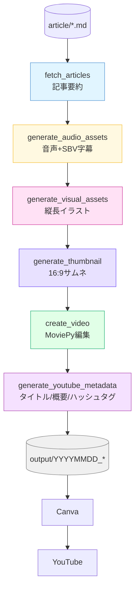
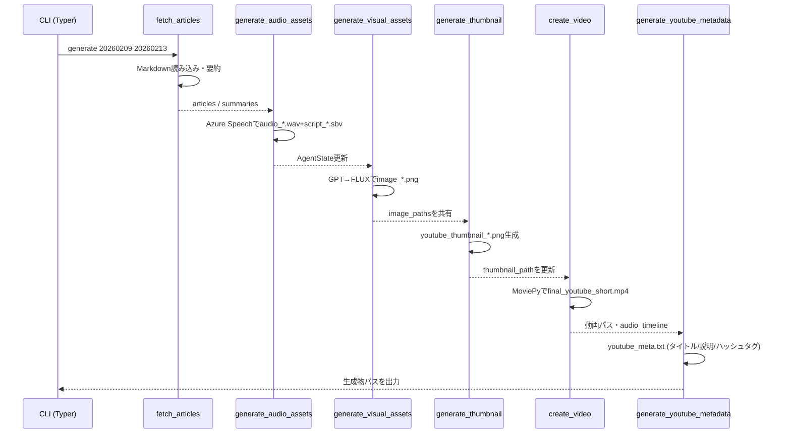
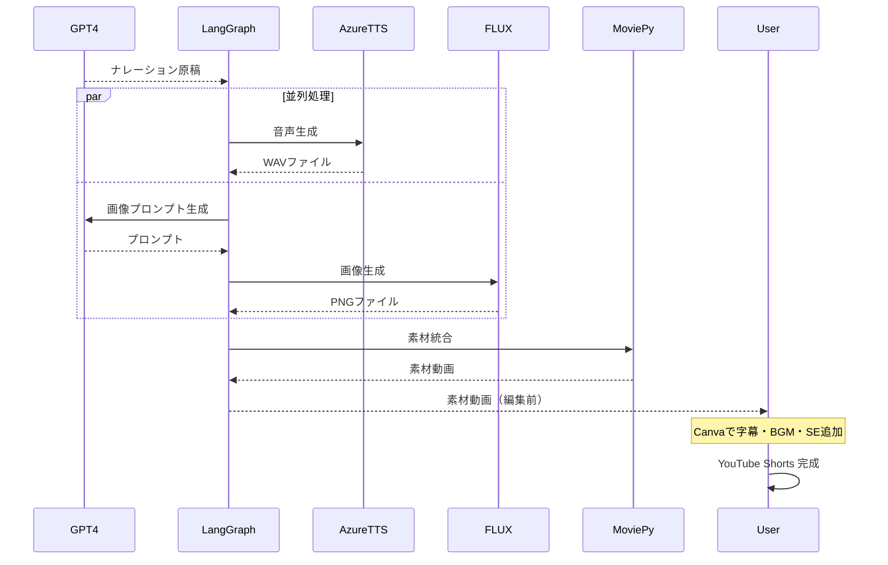

# LangGraphで作る自動ニュース動画生成システム：記事から動画生成までを自動化

_Markdownで書いたニュース原稿を、音声・映像・サムネイル・YouTube投稿テキストまで一気に量産する LangGraph ワークフローの設計と実装をまとめました。Azure/OpenAI スタックとMoviePyを活用し、「毎日の記事を毎日の動画に変換する」実運用レベルの自動化手順を紹介します。_

## はじめに

「毎日書いているブログ記事を動画にできたら、もっと多くの人に届けられるのに…」

そんな思いから、この自動動画生成システムを開発しました。LangGraphを使って記事の要約から画像生成、音声合成、動画編集までを一貫して自動化することで、記事執筆者が新たな視聴者層へアプローチする手段を提供します。

本記事では、実際に稼働している自動動画生成システムの全容を、実装コードとともに詳しく解説します。コード一つひとつの役割や設計思想まで踏み込んで説明するので、あなた自身のプロジェクトにもすぐに応用できるはずです。

## この記事で学べること

この記事を読むことで、以下の実践的なスキルと知識が身につきます。

LangGraphによる複雑なワークフロー設計では、状態管理とノード設計の実践的な手法を習得できます。Azure AIサービスの統合活用では、GPT-4、FLUX画像生成、音声合成の連携方法を学べます。動画生成の実装ノウハウでは、MoviePyを使った動画編集の自動化技術を身につけられます。そして、プロダクション環境での工夫として、料金最適化やエラーハンドリングの実例を理解できます。

## ⚠️ 重要な注意事項

本システムを利用する前に、必ず理解しておくべき重要なポイントがあります。期待値の調整と、運用上のリスク管理のために、以下の内容を必ずお読みください。

### 生成される動画の範囲

このシステムが自動生成するものは素材動画です。ナレーション音声、記事に関連した画像、フリー素材動画との組み合わせ、基本的な動画クリップを結合しています。

一方、このシステムでは生成されず、手動編集が必要なものは、字幕・テロップ、BGM（背景音楽）、SE（効果音）、オープニング映像、エンディング映像、トランジション効果です。

視聴者に公開できる完成品にするには、Canvaなどの動画編集ツールでの追加編集が必須となります。

### その他の重要な注意点

運用を開始する前に、以下の点についても十分に理解し、準備を整えてください。

#### 1. 著作権・肖像権への配慮

フリー素材動画の選定では、必ず商用利用可能なライセンスの素材を使用してください。生成画像の確認では、FLUXで生成された画像に実在の人物や著作物が含まれていないか、必ず目視確認が必要です。記事の引用元については、元記事が他サイトからの引用の場合、動画化の許諾が必要な場合があります。

#### 2. Azureサービスの料金体系

Azureは従量課金制です。使用した分だけ課金されるため、大量の記事を一度に処理すると想定外のコストが発生する可能性があります。Azure AIサービスには無料枠がありますが、上限を超えると自動的に課金が開始されます。本格運用前に、1週間分程度のテスト実行でコストを確認することを強く推奨します。

#### 3. ファイル命名規則の厳守

記事ファイルは必ず以下の形式で命名してください。

```
YYYYMMDD_タイトル.md
```

例：`20260214_AI技術の最新動向.md`

この規則を守らないと、システムが記事を認識できません。

#### 4. 動画の長さの制限

生成される動画は60秒に制限しています。複数記事を1つの動画にまとめる場合、各記事の要約が短くなりすぎないよう、記事数を調整してください。目安として、3〜5記事程度が1本の動画に適しています。

#### 5. 出力ファイルの管理

`output/`フォルダは実行のたびに大量のファイルが生成されます。定期的な整理が必要です（特にWAVファイルはサイズが大きいため）。本番環境では、古いファイルを自動削除するスクリプトの追加を推奨します。

#### 6. 処理時間について

1記事あたりの処理時間の目安は、要約生成が10〜20秒、音声生成が10〜15秒、画像生成が20〜30秒、動画合成が記事の長さに依存（1分の動画で約30〜60秒）です。合計で、5記事の場合は約5〜10分程度の処理時間が必要です。

#### 7. エラー時の対応

システムがエラーで停止した場合は、`output/*/node_logs.jsonl`でどのノードで失敗したかを確認してください。Azureのサービス状態を確認し（障害が発生していないか）、APIキーや接続情報が正しいかを確認します。必要に応じて特定の記事のみを除外して再実行してください。

## なぜこのシステムを作ったのか

このシステムの開発背景には、コンテンツクリエイターが直面する現実的な課題がありました。ここでは、その課題と解決へのアプローチを説明します。

### 背景にあった3つの課題

音声コンテンツとしての活用という課題がありました。ニュース解説記事を家事や通勤中に音声で聞きたいというニーズがありましたが、毎日手作業で音声化するのは現実的ではありませんでした。

新しい視聴者層へのリーチも重要な課題でした。テキスト記事だけでは届かない「動画でニュースを見る層」にアプローチしたいという狙いがありました。YouTube Shortsは特に若い世代に強い影響力があります。

そして、LangGraphの実践的な学習という技術的な動機もありました。LangGraphは通常、文章生成タスクで使われることが多いですが、マルチメディア生成という新しい用途に挑戦してみたかったのです。

## システムアーキテクチャ

このプロジェクトは、6つのLangGraphノードが直列につながることで「記事 → 音声 → 画像 → サムネイル → 動画 → YouTubeメタ情報」という一連の生成処理を自動化しています。各ノードは単一責務で設計されているため、障害調査や個別カスタマイズがしやすい構造になっています。

### 処理フローの全体像



### データフロー


### 処理フロー


## 開発過程で直面した課題と解決策

実際のシステム開発では、多くの試行錯誤がありました。ここでは、主要な課題とその解決策を共有することで、あなたが同じ問題に直面したときの参考になればと思います。

### 1. 動画の単調さ対策

最初は各記事1枚の生成画像のみで動画を作成していましたが、1分間同じ画像が表示され続けるのは視聴体験として退屈でした。

解決策として、生成画像を冒頭5秒のみ使用し、フリー素材の動画クリップをランダムに挿入しました。さらに、ズームエフェクトで静止画に動きを追加しました。

```python
# ズームエフェクトの実装例
def zoom_factor(t, total=duration):
    return 1 + 0.05 * (t / max(total, 0.001))

base_image = base_image.with_effects([Resize(new_size=zoom_factor)])
```

このコードでは、時間の経過とともに画像が徐々に拡大されます。`zoom_factor`関数は、時刻`t`における拡大率を計算し、元のサイズから最大5%まで拡大します。ゼロ除算を避けるため、`max(total, 0.001)`で最小値を保証しています。

### 2. 字幕の技術的制約

当初は動画に自動で字幕を入れる予定でしたが、使用したライブラリが日本語に対応していませんでした。

解決策として、プログラムでは字幕なし動画を生成し、Canvaなどの動画編集ツールで手動で字幕を追加することにしました。スクリプトファイルも自動生成し、編集作業を効率化しています。

この制約により、プログラム実行後は必ず手動での編集工程が必要になります。完全自動化を期待していた場合は、この点にご注意ください。

### 3. コスト最適化

各記事ごとにAI動画生成（Runway、Pikaなど）を使うと、料金が高額になりすぎました。

解決策として、AI動画生成から静止画像生成（FLUX）へ変更し、フリー素材動画との組み合わせで動きを確保しました。この変更により、月間コストを約1/10に削減できました。

### 4. ナレーション品質の向上

記事の冒頭500文字をそのまま読み上げると、URLやハッシュタグまで読み上げてしまい、不自然なナレーションになりました。

解決策として、GPT-4による要約ステップを追加し、URL・記号の除去と自然な話し言葉への変換を明示的に指示しました。500文字以内の制約で簡潔な原稿を生成するようにしました。

## 実装ガイド

ここから、実際にシステムを構築していきます。各ステップを丁寧に説明するので、初めての方でも確実に動作するシステムを作れるはずです。

### セットアップ

まずは、開発環境の準備から始めましょう。必要なツールとライブラリをインストールし、プロジェクトの骨格を作ります。

#### 1. プロジェクトフォルダの作成

```bash
mkdir news-article
cd news-article
uv init
uv venv
uv add azure-cognitiveservices-speech dotenv langchain langgraph openai langchain_openai moviepy typer
mkdir article movie output
touch config.py state.py nodes.py graph.py main.py
```

フォルダ構成の意味を理解しておきましょう。`article/`には変換元の記事ファイル（`YYYYMMDD_タイトル.md`形式）を配置します。`movie/`にはフリー素材動画を配置します。`output/`には生成された動画・音声・画像が保存されます。

#### 2. Azure AIサービスの準備

Azure AI Foundryで、リージョンをEast USに設定し、以下のモデルをデプロイします。

`FLUX.1-Kontext-pro`（画像生成）と`gpt-4.1`（テキスト生成）をデプロイしてください。

Azure Speech Serviceでは、リージョンをEast USに設定し、音声は`ja-JP-NanamiNeural`（自然な日本語女性音声）を使用します。

[公式ドキュメント](https://learn.microsoft.com/ja-jp/azure/ai-services/speech-service/get-started-text-to-speech)を参考に設定してください。

#### 3. 環境変数の設定

`.env`ファイルを作成し、以下の環境変数を設定します。

```txt
# テキスト生成
AZURE_TEXT_API_KEY=
AZURE_TEXT_ENDPOINT=

# 音声
AZURE_SPEECH_KEY=
AZURE_SPEECH_ENDPOINT=
AZURE_SPEECH_REGION=

# 画像生成
AZURE_IMAGE_KEY=
AZURE_IMAGE_ENDPOINT=
```

各変数には、Azureポータルから取得したAPIキーとエンドポイントを設定してください。

## コア実装

システムの心臓部となるコードを実装していきます。各ファイルの役割と、コードの詳細な解説を行います。

### config.py（設定管理）

このファイルは、アプリケーション全体で使用する設定値を一元管理します。環境変数から値を読み込み、型安全にアクセスできるようにします。

```python
import os
from dotenv import load_dotenv

load_dotenv()


def _split_endpoint(endpoint: str | None) -> tuple[str | None, str | None]:
    """エンドポイントURLからベースURLとAPIバージョンを抽出する。

    Azure OpenAIのエンドポイントは通常、以下のような形式です：
    https://your-resource.openai.azure.com/openai/deployments/your-deployment/chat/completions?api-version=2024-02-01

    この関数は、上記URLから以下を抽出します：
    - ベースURL: https://your-resource.openai.azure.com/
    - APIバージョン: 2024-02-01

    Args:
        endpoint: Azure OpenAIのエンドポイントURL

    Returns:
        (ベースURL, APIバージョン)のタプル。どちらもNoneの場合あり。
    """
    if not endpoint:
        return None, None

    base = endpoint.strip()
    if not base:
        return None, None

    # クエリパラメータからapi-versionを抽出
    api_version = None
    if "api-version=" in base:
        api_version = base.split("api-version=")[-1].split("&")[0].strip()

    # クエリパラメータを除去
    base = base.split("?")[0]

    # /openai/以降のパスを除去（デプロイメント名などを含む部分）
    if "/openai/" in base:
        base = base.split("/openai/")[0]

    # 末尾に/を追加して正規化
    normalized = base.rstrip("/") + "/"
    return normalized, api_version


# 環境変数から生のエンドポイントを取得
_raw_text_endpoint = os.getenv("AZURE_TEXT_ENDPOINT")
_text_endpoint, _text_version = _split_endpoint(_raw_text_endpoint)

_raw_image_endpoint = os.getenv("AZURE_IMAGE_ENDPOINT")
_image_endpoint, _image_version = _split_endpoint(_raw_image_endpoint)


class Config:
    """アプリケーション設定を管理するクラス。

    環境変数から読み込んだ値を、型安全にアクセスできる形で提供します。
    このクラスをインポートすることで、どこからでも設定値にアクセスできます。
    """

    # Azure OpenAI（テキスト生成用）の設定
    AZURE_TEXT_API_KEY = os.getenv("AZURE_TEXT_API_KEY")
    AZURE_TEXT_ENDPOINT = _text_endpoint
    AZURE_TEXT_API_VERSION = os.getenv("AZURE_TEXT_API_VERSION", _text_version or "2024-02-01-preview")
    AZURE_OPENAI_DEPLOYMENT_NAME = "gpt-4.1"

    # Azure AI Speech（音声合成用）の設定
    AZURE_SPEECH_KEY = os.getenv("AZURE_SPEECH_KEY")
    AZURE_SPEECH_ENDPOINT = os.getenv("AZURE_SPEECH_ENDPOINT")
    AZURE_SPEECH_REGION = os.getenv("AZURE_SPEECH_REGION")

    # Azure AI（画像生成用）の設定
    AZURE_IMAGE_API_KEY = os.getenv("AZURE_IMAGE_KEY")
    AZURE_IMAGE_ENDPOINT = _image_endpoint
    AZURE_IMAGE_API_VERSION = os.getenv("AZURE_IMAGE_API_VERSION", _image_version or "2023-12-01-preview")
    AZURE_IMAGE_DEVELOPMENT_NAME = "FLUX.1-Kontext-pro"

    # ファイルシステムの設定
    ARTICLE_DIR = "./article"  # 記事ファイルを配置するディレクトリ
    OUTPUT_DIR = "./output"    # 生成物を出力するディレクトリ
    JP_FONT_PATH = os.getenv("JP_FONT_PATH")  # 日本語フォントのパス（将来の字幕生成用）
    MOVIE_DIR = "./movie"      # フリー素材動画を配置するディレクトリ
```

このコードの重要なポイントは、`_split_endpoint`関数です。Azureのエンドポイントは複雑な形式になっていることが多いため、この関数でベースURLとAPIバージョンを正規化しています。これにより、後続のコードでシンプルにAzure APIを呼び出せるようになります。

`Config`クラスは、アプリケーション全体で使用する設定値を一箇所に集約します。新しい設定が必要になったときも、このクラスに追加するだけで済みます。

### state.py（状態定義）

LangGraphでは、ノード間で受け渡すデータの構造を明確に定義することが重要です。このファイルでは、ワークフロー全体で使用する状態を型安全に管理します。

```python
from typing import TypedDict


class ArticleData(TypedDict):
    title: str
    display_title: str
    content: str
    date: str


class AgentState(TypedDict):
    start_date: str
    end_date: str
    run_output_dir: str
    single_article_path: str | None
    articles: list[ArticleData]
    audio_paths: list[str]
    image_paths: list[str]
    script_paths: list[str]
    thumbnail_path: str | None
    video_path: str | None
    youtube_metadata_path: str | None
    error: str | None


```

`TypedDict`を使うことで、Pythonの型チェッカー（mypy、Pylanceなど）が状態の構造を理解し、補完や型エラーの検出を行えるようになります。これにより、大規模なワークフローでもバグを未然に防げます。

`AgentState`の設計思想は、「各ノードが必要な情報だけを読み取り、自分の処理結果だけを追加する」というものです。これにより、ノード間の依存関係が明確になり、並列化や再実行が容易になります。

### nodes.py（処理ノード実装）

このファイルがシステムの心臓部です。記事の読み込みから動画生成まで、すべての処理を実装します。各関数の役割とロジックを詳しく解説します。

```python
import base64
import json
import os
import random
import re
from datetime import datetime
import azure.cognitiveservices.speech as speechsdk
from openai import AzureOpenAI
from moviepy.video.VideoClip import ImageClip
from moviepy.audio.io.AudioFileClip import AudioFileClip
from moviepy.audio.AudioClip import concatenate_audioclips
from moviepy.video.compositing.CompositeVideoClip import concatenate_videoclips
from moviepy.video.fx.Resize import Resize
from moviepy.video.io.VideoFileClip import VideoFileClip
from config import Config
from state import AgentState


def _log_node_output(run_dir: str, node_name: str, payload: dict):
    """Append a JSON line containing node metadata to the current run directory."""
    os.makedirs(run_dir, exist_ok=True)
    log_path = os.path.join(run_dir, "node_logs.jsonl")
    entry = {
        "timestamp": datetime.now().isoformat(timespec="seconds"),
        "node": node_name,
        "payload": payload
    }
    with open(log_path, "a", encoding="utf-8") as log_file:
        json.dump(entry, log_file, ensure_ascii=False)
        log_file.write("\n")


def _extract_title_from_content(raw_content: str, fallback: str) -> str:
    """Return the first non-empty line from raw markdown as a human friendly title."""
    for line in raw_content.splitlines():
        candidate = line.strip().lstrip("#").strip()
        if candidate:
            return candidate[:120]
    return fallback


text_client = AzureOpenAI(
    api_key=Config.AZURE_TEXT_API_KEY,
    api_version=Config.AZURE_TEXT_API_VERSION,
    azure_endpoint=Config.AZURE_TEXT_ENDPOINT,
    azure_deployment=Config.AZURE_OPENAI_DEPLOYMENT_NAME,
)

image_client = AzureOpenAI(
    api_key=Config.AZURE_IMAGE_API_KEY,
    api_version=Config.AZURE_IMAGE_API_VERSION,
    azure_endpoint=Config.AZURE_IMAGE_ENDPOINT,
    azure_deployment=Config.AZURE_IMAGE_DEVELOPMENT_NAME,
)

VIDEO_EXTENSIONS = (".mp4", ".mov", ".m4v", ".avi", ".webm", ".mkv")


def _list_movie_files() -> list[str]:
    """Collect usable background video files from the configured movie directory."""
    movie_dir = Config.MOVIE_DIR
    if not movie_dir or not os.path.isdir(movie_dir):
        return []
    files = []
    for name in os.listdir(movie_dir):
        if name.lower().endswith(VIDEO_EXTENSIONS):
            files.append(os.path.join(movie_dir, name))
    return files


def _format_date_label(date_str: str) -> str:
    """Convert YYYYMMDD into YYYY/MM/DD for display."""
    try:
        return datetime.strptime(date_str, "%Y%m%d").strftime("%Y/%m/%d")
    except ValueError:
        return date_str


def _format_date_range_label(start: str, end: str) -> str:
    """Create a human-friendly date range label."""
    start_label = _format_date_label(start)
    end_label = _format_date_label(end)
    return start_label if start == end else f"{start_label} - {end_label}"


def _clean_hashtag_text(text: str) -> str:
    """Normalize text so it can sit behind a YouTube hashtag."""
    cleaned = re.sub(r"[#＃]", "", text)
    cleaned = re.sub(r"\s+", "", cleaned)
    cleaned = re.sub(r"[^\wぁ-んァ-ヶ一-龯ー]+", "", cleaned)
    return cleaned[:20].strip()


def _extract_hashtags(articles: list[dict]) -> list[str]:
    """Build a short list of hashtags derived from article titles."""
    hashtags: list[str] = []
    for article in articles:
        candidate = article.get('display_title') or article.get('title')
        if not candidate:
            continue
        cleaned = _clean_hashtag_text(candidate)
        if not cleaned or cleaned in hashtags:
            continue
        hashtags.append(cleaned)
        if len(hashtags) >= 5:
            break

    for fallback in ("ニュース", "ショート動画", "AI速報"):
        if len(hashtags) >= 5:
            break
        if fallback not in hashtags:
            hashtags.append(fallback)

    return hashtags[:5]


def _generate_youtube_metadata(state: AgentState) -> dict:
    """Compose a YouTube-ready title, description, and hashtags from the run state."""
    articles = state.get('articles', [])
    range_label = _format_date_range_label(
        state['start_date'], state['end_date'])

    if articles:
        title = f"{range_label}の主要ニュースTOP{len(articles)} | ショート解説"
        if len(articles) == 1:
            title = f"{range_label} {articles[0]['title'] } | ニュースショート"
    else:
        title = f"{range_label}のニュースダイジェスト"

    description_lines = [
        f"📅 収録期間: {range_label}",
        "",
        "📝 取り上げたトピック:"
    ]
    if articles:
        for article in articles:
            description_lines.append(
                f"- {article.get('display_title') or article['title']} ({_format_date_label(article.get('date', state['start_date']))})"
            )
    else:
        description_lines.append("- 該当する記事は見つかりませんでした。")

    description = "\n".join(description_lines).strip()
    hashtags = _extract_hashtags(articles)

    return {
        "title": title,
        "description": description,
        "hashtags": hashtags
    }


def _format_timestamp(seconds: float) -> str:
    """Return SBV timestamp (H:MM:SS.mmm)."""
    milliseconds = max(0, int(round(seconds * 1000)))
    hours, remainder = divmod(milliseconds, 3600 * 1000)
    minutes, remainder = divmod(remainder, 60 * 1000)
    secs, millis = divmod(remainder, 1000)
    return f"{hours}:{minutes:02}:{secs:02}.{millis:03}"


def _split_sentences_for_captions(text: str) -> list[str]:
    """Split narration text into SBV-friendly chunks."""
    if not text:
        return []

    stripped = text.strip()
    if not stripped:
        return []

    # 「。」でのみ区切り、句読点を維持したまま抽出
    sentences = [
        chunk.strip()
        for chunk in re.findall(r'[^。]+。?', stripped)
        if chunk.strip()
    ]

    return sentences or [stripped]


def _build_sbv_caption(text: str, duration: float | None) -> str:
    """Generate SBV caption text with pseudo-timed segments."""
    sentences = _split_sentences_for_captions(text)
    if not sentences:
        sentences = ["（内容なし）"]

    total_chars = sum(len(s) for s in sentences) or 1
    total_duration = duration if duration and duration > 0 else len(
        sentences) * 3.0

    raw_durations = []
    for sentence in sentences:
        portion = max(0.8, (len(sentence) / total_chars) * total_duration)
        raw_durations.append(portion)

    scale = total_duration / \
        sum(raw_durations) if sum(raw_durations) > 0 else 1.0
    durations = [d * scale for d in raw_durations]

    lines = []
    cursor = 0.0
    for sentence, seg_duration in zip(sentences, durations):
        start_ts = _format_timestamp(cursor)
        end_ts = _format_timestamp(cursor + seg_duration)
        lines.append(f"{start_ts},{end_ts}")
        lines.append(sentence)
        lines.append("")
        cursor += seg_duration

    return "\n".join(lines).strip() + "\n"


def fetch_articles_node(state: AgentState):
    """Load dated markdown articles in range and summarize them for narration."""
    target_articles = []
    start = datetime.strptime(state['start_date'], "%Y%m%d")
    end = datetime.strptime(state['end_date'], "%Y%m%d")
    run_dir = state.get('run_output_dir') or Config.OUTPUT_DIR

    single_article_path = state.get("single_article_path")

    if not single_article_path and not os.path.exists(Config.ARTICLE_DIR):
        os.makedirs(Config.ARTICLE_DIR)

    # 1. ファイルのフィルタリング
    files_to_process: list[tuple[str, str, str]] = []
    if single_article_path:
        if not os.path.isfile(single_article_path):
            raise FileNotFoundError(f"記事ファイルが見つかりません: {single_article_path}")
        basename = os.path.basename(single_article_path)
        match = re.match(r"(\d{8})_(.*)\.md", basename)
        if match:
            file_date_str, title = match.groups()
        else:
            file_date_str = state['start_date']
            title = os.path.splitext(basename)[0]
        files_to_process.append((single_article_path, title, file_date_str))
    else:
        for filename in os.listdir(Config.ARTICLE_DIR):
            match = re.match(r"(\d{8})_(.*)\.md", filename)
            if match:
                file_date_str, title = match.groups()
                file_date = datetime.strptime(file_date_str, "%Y%m%d")
                if start <= file_date <= end:
                    files_to_process.append(
                        (os.path.join(Config.ARTICLE_DIR, filename), title, file_date_str))

    # 2. 各記事の読み込みと要約（ナレーション原稿作成）
    for filepath, title, date_str in files_to_process:
        with open(filepath, 'r', encoding='utf-8') as f:
            raw_content = f.read()

        # GPT-4oによる要約とナレーション整形
        # ここでURLの除去や自然な言い回しへの変換を指示
        response = text_client.chat.completions.create(
            model=Config.AZURE_OPENAI_DEPLOYMENT_NAME,  # GPT-4o用デプロイ名
            messages=[
                {"role": "system", "content": "あなたは優秀なニュースアナウンサーです。"},
                {"role": "user", "content": f"""
以下のニュース記事を、YouTubeショート用のナレーション原稿に要約してください。

【制約事項】
・500文字以内
・冒頭15秒（約60文字）で核心を伝える：「何が起きたのか」「なぜ重要なのか」を最初に明示
・その後、時系列や因果関係に沿って背景・経緯・影響を簡潔に説明
・URLや記号（[ ]、( )など）は完全に削除または自然な言葉に置き換える
・専門用語は使用可（ビジネスパーソン向け）だが、必要に応じて簡潔な補足を入れる
・です・ます調で統一し、遠回しな表現は避ける
・ビジネスへの影響や実務的な意味を優先的に含める

記事タイトル: {title}
記事内容:
{raw_content}
"""}
            ]
        )

        summarized_content = response.choices[0].message.content.strip()
        human_title = _extract_title_from_content(
            raw_content, title.replace("_", " "))

        target_articles.append({
            'title': title,
            'display_title': human_title,
            'content': summarized_content,  # ここに綺麗な要約が入る
            'date': date_str
        })
        print(f"✅ 要約完了: {title}")

    _log_node_output(
        run_dir,
        "fetch_articles",
        {
            "article_count": len(target_articles),
            "article_titles": [article['display_title'] for article in target_articles],
            "articles": target_articles
        }
    )

    return {'articles': target_articles, 'run_output_dir': run_dir}


def generate_audio_assets_node(state: AgentState):
    """Create narration audio files and scripts for each article."""
    audio_paths = []
    script_paths = []
    voice_outputs = []

    run_dir = state.get('run_output_dir') or Config.OUTPUT_DIR
    os.makedirs(run_dir, exist_ok=True)

    for i, article in enumerate(state['articles']):
        # 各記事ごとに Azure Speech を設定（音声スタイルを統一）
        speech_config = speechsdk.SpeechConfig(
            subscription=Config.AZURE_SPEECH_KEY,
            region=Config.AZURE_SPEECH_REGION
        )
        speech_config.speech_synthesis_voice_name = "ja-JP-NanamiNeural"

        audio_filename = f"audio_{i}.wav"
        audio_path = os.path.join(run_dir, audio_filename)
        audio_config = speechsdk.audio.AudioOutputConfig(filename=audio_path)

        # ナレーションを音声化し、ファイルへ保存
        synthesizer = speechsdk.SpeechSynthesizer(
            speech_config=speech_config, audio_config=audio_config)
        synthesizer.speak_text_async(article['content']).get()
        audio_paths.append(audio_path)

        # 字幕のタイミング計算用に長さを取得（失敗しても無視）
        audio_duration = None
        try:
            temp_clip = AudioFileClip(audio_path)
            audio_duration = temp_clip.duration or None
        except Exception:
            audio_duration = None
        finally:
            try:
                temp_clip.close()
            except Exception:
                pass

        script_filename = f"script_{i}.sbv"
        script_path = os.path.join(run_dir, script_filename)
        # SBV 形式の字幕を生成し、YouTubeで直接使えるようにする
        captions_content = _build_sbv_caption(
            article['content'], audio_duration)
        with open(script_path, "w", encoding="utf-8") as script_file:
            script_file.write(captions_content)
        script_paths.append(script_path)

        voice_outputs.append({
            "index": i,
            "article_title": article.get('display_title') or article['title'],
            "audio_path": audio_path,
            "script_path": script_path,
            "spoken_text": article['content']
        })

    _log_node_output(
        run_dir,
        "generate_audio_assets",
        {
            "audio_files": [os.path.basename(p) for p in audio_paths],
            "script_files": [os.path.basename(p) for p in script_paths],
            "voice_outputs": [
                {
                    "index": entry["index"],
                    "article_title": entry["article_title"],
                    "spoken_text": entry["spoken_text"],
                    "audio_file": os.path.basename(entry["audio_path"]),
                    "script_file": os.path.basename(entry["script_path"])
                }
                for entry in voice_outputs
            ]
        }
    )

    return {
        'audio_paths': audio_paths,
        'script_paths': script_paths,
        'run_output_dir': run_dir
    }


def generate_visual_assets_node(state: AgentState):
    """Create illustrative prompts and images for each article."""
    image_paths = []
    image_prompts = []
    image_outputs = []

    run_dir = state.get('run_output_dir') or Config.OUTPUT_DIR
    os.makedirs(run_dir, exist_ok=True)

    for i, article in enumerate(state['articles']):
        # GPT に映画的な風景プロンプトを作らせる（FLUX用）
        prompt_response = text_client.chat.completions.create(
            model=Config.AZURE_OPENAI_DEPLOYMENT_NAME,
            messages=[
                {
                    "role": "system",
                    "content": (
                        "あなたは報道ビジュアルのコンセプトアーティストです。以下のニュース記事を読み、"
                        "その内容を視覚的に伝える画像生成用プロンプトを英語で作成してください。\n\n"

                        "【必須要素】\n"
                        "・ニュースの核心的な「モノ」「場所」「状況」を具体的に描写\n"
                        "・技術系ニュース：製品、デバイス、インフラ、デジタルインターフェース\n"
                        "・ビジネス系ニュース：オフィス空間、都市景観、企業ロゴのないビル群\n"
                        "・政策系ニュース：議場、公共施設、象徴的な建造物\n"
                        "・環境系ニュース：自然環境、気候現象、エコシステム\n\n"

                        "【禁止事項】\n"
                        "・実在の人物の顔や体（後ろ姿や遠景のシルエットは可）\n"
                        "・実在企業のロゴや商標\n"
                        "・特定可能な個人が写り込む構図\n\n"

                        "【推奨表現】\n"
                        "・抽象的なビジュアルメタファー（例：AIニュース→脳のニューラルネットワーク模様）\n"
                        "・象徴的なオブジェクト（例：半導体ニュース→マイクロチップのクローズアップ）\n"
                        "・環境や空間で状況を表現（例：経済危機→無人のオフィスフロア）\n\n"

                        "【スタイル指定】\n"
                        "・9:16縦型構図を意識\n"
                        "・ビジュアルジャーナリズム風の写実的スタイル\n"
                        "・色彩は記事のトーン（希望的/警告的/中立的）に合わせる\n"
                        "・視認性の高い明瞭な構図"
                    )
                },
                {
                    "role": "user",
                    "content": f"記事タイトル: {article.get('display_title') or article['title']}\n記事内容: {article['content']}"
                }
            ]
        )
        img_prompt = prompt_response.choices[0].message.content.strip()
        image_prompts.append(img_prompt)

        # 9:16 比率のイラストを描画し、動画冒頭の静止画に使用
        image_result = image_client.images.generate(
            model=Config.AZURE_IMAGE_DEVELOPMENT_NAME,
            prompt=f"{img_prompt} Digital art style, vibrant colors, 9:16 aspect ratio focus.",
            size="1792x1024",
            n=1,
            response_format="b64_json",
        )

        image_data = image_result.data[0]
        image_location = None
        if image_data.url:
            image_location = image_data.url
            image_paths.append(image_location)
        else:
            image_filename = f"image_{i}.png"
            image_path = os.path.join(run_dir, image_filename)
            with open(image_path, "wb") as img_file:
                img_file.write(base64.b64decode(image_data.b64_json))
            image_location = image_path
            image_paths.append(image_location)

        image_outputs.append({
            "index": i,
            "article_title": article.get('display_title') or article['title'],
            "prompt": img_prompt,
            "image_path": image_location
        })

    _log_node_output(
        run_dir,
        "generate_visual_assets",
        {
            "image_files": [os.path.basename(p) if p else None for p in image_paths],
            "image_prompts": image_prompts,
            "image_outputs": [
                {
                    "index": entry["index"],
                    "article_title": entry["article_title"],
                    "prompt": entry["prompt"],
                    "image_file": os.path.basename(entry["image_path"]) if entry["image_path"] else None
                }
                for entry in image_outputs
            ]
        }
    )

    return {
        'image_paths': image_paths,
        'run_output_dir': run_dir
    }


def create_short_video_node(state: AgentState):
    """Combine generated images, stock footage, and narration into one short video."""
    clips = []
    run_dir = state.get('run_output_dir') or Config.OUTPUT_DIR
    os.makedirs(run_dir, exist_ok=True)
    output_path = os.path.join(run_dir, "final_youtube_short.mp4")
    movie_files = _list_movie_files()
    video_sources: list[VideoFileClip] = []
    article_visual_logs = []
    article_audio_clips: list[AudioFileClip] = []
    audio_timeline = []
    audio_cursor = 0.0

    for i, article in enumerate(state['articles']):
        audio = AudioFileClip(state['audio_paths'][i])
        article_audio_clips.append(audio)
        duration = audio.duration or 0
        duration = max(duration, 0.001)

        base_image = ImageClip(state['image_paths'][i], duration=duration)
        base_image = base_image.with_effects([Resize(height=1920)])

        def zoom_factor(t, total=duration):
            return 1 + 0.05 * (t / max(total, 0.001))

        base_image = base_image.with_effects([Resize(new_size=zoom_factor)])
        base_image = base_image.with_position("center")

        segments = []
        movie_segments_log = []

        image_intro_duration = min(5, duration)
        segments.append(base_image.with_duration(image_intro_duration))
        remaining = duration - image_intro_duration

        while remaining > 1e-3 and movie_files:
            movie_path = random.choice(movie_files)
            try:
                video_clip = VideoFileClip(movie_path)
                video_sources.append(video_clip)
            except Exception:
                continue

            clip_duration = min(5, remaining, video_clip.duration or 0)
            if clip_duration <= 0:
                video_clip.close()
                continue

            max_start = max(
                0, (video_clip.duration or clip_duration) - clip_duration)
            start = random.uniform(0, max_start) if max_start > 0 else 0

            segment = video_clip.subclipped(
                start_time=start,
                end_time=start + clip_duration
            ).with_audio(None)

            segment = segment.with_effects(
                [Resize(height=1920)]).with_position("center")
            segments.append(segment)

            movie_segments_log.append({
                "file": os.path.basename(movie_path),
                "start": round(start, 2),
                "duration": round(clip_duration, 2)
            })

            remaining -= clip_duration

        if remaining > 1e-3:
            segments.append(base_image.with_duration(remaining))

        article_video = concatenate_videoclips(
            segments, method="compose").with_duration(duration)
        article_video.audio = audio
        clips.append(article_video)

        article_visual_logs.append({
            "article": article.get('display_title') or article['title'],
            "movie_segments": movie_segments_log
        })

        audio_timeline.append({
            "article": article.get('display_title') or article['title'],
            "audio_file": os.path.basename(state['audio_paths'][i]),
            "start": round(audio_cursor, 2),
            "duration": round(duration, 2)
        })
        audio_cursor += duration

    final_video = concatenate_videoclips(clips, method="compose")
    final_audio = None
    if article_audio_clips:
        final_audio = concatenate_audioclips(article_audio_clips)
        final_video.audio = final_audio

    try:
        final_video.write_videofile(
            output_path, fps=24, codec="libx264", audio_codec="aac"
        )
    finally:
        final_video.close()
        if final_audio is not None:
            try:
                final_audio.close()
            except Exception:
                pass
        for audio_clip in article_audio_clips:
            try:
                audio_clip.close()
            except Exception:
                pass
        for source in video_sources:
            try:
                source.close()
            except Exception:
                pass

    _log_node_output(
        run_dir,
        "create_video",
        {
            "video_file": os.path.basename(output_path),
            "clip_count": len(clips),
            "articles": article_visual_logs,
            "audio_timeline": audio_timeline
        }
    )

    return {
        "video_path": output_path,
        'run_output_dir': run_dir
    }


def generate_youtube_metadata_node(state: AgentState):
    """Produce a YouTube-ready title, description, and hashtag set."""
    run_dir = state.get('run_output_dir') or Config.OUTPUT_DIR
    os.makedirs(run_dir, exist_ok=True)

    metadata = _generate_youtube_metadata(state)
    hashtags_line = " ".join(f"#{tag}" for tag in metadata['hashtags']).strip()
    metadata_path = os.path.join(run_dir, "youtube_meta.txt")

    articles = state.get("articles") or []
    if articles:
        primary_title = articles[0].get(
            'display_title') or articles[0].get('title') or "最新ニュース"
    else:
        primary_title = "最新ニュース"
    note_line = f"- note: {primary_title}"
    zenn_line = f"- zenn: {primary_title}"

    spoken_block = "\n\n".join(
        article.get('content', '').strip()
        for article in articles if article.get('content')
    ).strip()

    sections = [
        "今回の記事",
        note_line,
        zenn_line,
        "",
    ]

    if articles:
        for idx, article in enumerate(articles, start=1):
            title = article.get('display_title') or article.get(
                'title') or f"記事{idx}"
            spoken = article.get('content', '').strip()
            sections.append(f"{idx}. {title}")
            if spoken:
                sections.append(spoken)
            sections.append("")
    elif spoken_block:
        sections.append(spoken_block)
        sections.append("")

    sections.extend([
        "IT系の情報を発信しています。",
        "note",
        "https://note.com/kenquichi",
        "zenn",
        "https://zenn.dev/kenquichi",
        "",
        "エンジニアになる講座",
        "https://note.com/kenquichi/m/mc4926a77c1da",
        "",

        "\n".join(f"#{tag}" for tag in metadata['hashtags']) or "#ニュース"
    ])

    final_text = "\n".join(sections).rstrip() + "\n"

    with open(metadata_path, "w", encoding="utf-8") as meta_file:
        meta_file.write(final_text)

    _log_node_output(
        run_dir,
        "generate_youtube_metadata",
        {
            "metadata_file": os.path.basename(metadata_path),
            "title": metadata['title'],
            "description": metadata['description'],
            "hashtags": metadata['hashtags'],
            "hashtags_line": hashtags_line or "#ニュース #ショート動画",
            "thumbnail_file": os.path.basename(state.get('thumbnail_path')) if state.get('thumbnail_path') else None
        }
    )

    return {
        "youtube_metadata_path": metadata_path,
        'run_output_dir': run_dir
    }


```

このノードファイルは、システムの核となる処理を実装しています。各関数は独立して動作し、エラーが発生しても他のノードに影響を与えないよう設計されています。

### graph.py（ワークフロー定義）

LangGraphの真骨頂であるDAG（有向非巡回グラフ）の定義を行います。ここで、各ノードの実行順序と依存関係を明示的に指定します。

```python
from langgraph.graph import StateGraph, END
from state import AgentState
from nodes import (
    fetch_articles_node,
    generate_audio_assets_node,
    generate_visual_assets_node,
    create_short_video_node,
    generate_youtube_metadata_node,
)


def create_graph():
    workflow = StateGraph(AgentState)

    # ノードの登録
    workflow.add_node("fetch_articles", fetch_articles_node)
    workflow.add_node("generate_audio_assets", generate_audio_assets_node)
    workflow.add_node("generate_visual_assets", generate_visual_assets_node)
    workflow.add_node("create_video", create_short_video_node)
    workflow.add_node("generate_youtube_metadata",
                      generate_youtube_metadata_node)

    # エッジの接続
    workflow.set_entry_point("fetch_articles")
    workflow.add_edge("fetch_articles", "generate_audio_assets")
    workflow.add_edge("generate_audio_assets", "generate_visual_assets")
    workflow.add_edge("generate_visual_assets", "create_video")
    workflow.add_edge("create_video", "generate_youtube_metadata")
    workflow.add_edge("generate_youtube_metadata", END)

    return workflow.compile()


```

このグラフ定義により、処理の流れが明確になります。将来的に、条件分岐（例：記事が0件の場合はスキップ）や並列処理（例：音声と画像を同時生成）を追加する場合も、このグラフ構造を拡張するだけで実現できます。

LangGraphの利点は、各ノードが独立しているため、特定のノードだけを修正したり、新しいノードを挿入したりするのが容易な点です。

### main.py（エントリーポイント）

コマンドラインからシステムを実行するためのエントリーポイントです。Typerを使用して、使いやすいCLIを提供します。

```python
import os
import re
from datetime import datetime
import typer
from typing import Annotated
from graph import create_graph
from state import AgentState
from config import Config


def _resolve_run_output_dir(base_path: str) -> str:
    """同名ディレクトリが存在する場合は末尾に ver_n を付けて重複を避ける"""
    if not os.path.exists(base_path):
        return base_path

    version = 1
    while True:
        candidate = f"{base_path}_ver_{version}"
        if not os.path.exists(candidate):
            return candidate
        version += 1


def _extract_article_meta(article_path: str) -> tuple[str, str]:
    """ファイル名から日付とスラグを取得。形式外の場合は当日の日付を利用。"""
    basename = os.path.basename(article_path)
    name_no_ext, _ = os.path.splitext(basename)
    match = re.match(r"(\d{8})_(.+)", name_no_ext)
    if match:
        return match.group(1), match.group(2)
    today = datetime.now().strftime("%Y%m%d")
    return today, name_no_ext or today


def _sanitize_slug(slug: str) -> str:
    cleaned = re.sub(r"[^\w\-]+", "_", slug)
    return cleaned.strip("_") or "article"


def _resolve_article_argument(article_arg: str) -> tuple[str, str | None]:
    """
    引数がファイルパスならそのまま返し、8桁の日付なら article/ 内のファイルを探索して返す。
    戻り値は (絶対パス, 推定日付 or None)。
    """
    candidate_path = os.path.abspath(article_arg)
    if os.path.isfile(candidate_path):
        return candidate_path, None

    if not os.path.isabs(article_arg):
        relative_path = os.path.abspath(
            os.path.join(Config.ARTICLE_DIR, article_arg))
        if os.path.isfile(relative_path):
            return relative_path, None

    if re.match(r"^\d{8}$", article_arg):
        date_str = article_arg
        article_dir = Config.ARTICLE_DIR
        if not os.path.isdir(article_dir):
            raise typer.BadParameter("article ディレクトリが存在しません。")
        matches = [
            name for name in os.listdir(article_dir)
            if name.startswith(f"{date_str}_") and name.endswith(".md")
        ]
        if not matches:
            raise typer.BadParameter(f"{date_str} で始まる記事ファイルが見つかりません。")
        if len(matches) > 1:
            raise typer.BadParameter(
                f"{date_str} の記事が複数あります。ファイルパスで指定してください。"
            )
        return os.path.abspath(os.path.join(article_dir, matches[0])), date_str

    raise typer.BadParameter("8桁の日付または記事ファイルパスを指定してください。")


app = typer.Typer()


@app.command()
def generate(
    start_date: Annotated[str, typer.Argument(help="開始日 (YYYYMMDD)")],
    end_date: Annotated[str, typer.Argument(help="終了日 (YYYYMMDD)")]
):
    """
    指定した期間(YYYYMMDD)のニュース記事からYouTubeショートを生成します。
    """
    typer.echo(f"🚀 処理を開始: {start_date} から {end_date}")

    # グラフの構築とコンパイル
    graph = create_graph()

    # 初回ステートの初期化
    base_output_dir = os.path.join(
        Config.OUTPUT_DIR, f"{start_date}_{end_date}"
    )
    run_output_dir = _resolve_run_output_dir(base_output_dir)
    os.makedirs(run_output_dir, exist_ok=True)

    initial_state: AgentState = {
        "start_date": start_date,
        "end_date": end_date,
        "run_output_dir": run_output_dir,
        "single_article_path": None,
        "articles": [],
        "audio_paths": [],
        "image_paths": [],
        "script_paths": [],
        "thumbnail_path": None,
        "video_path": None,
        "youtube_metadata_path": None,
        "error": None
    }

    # LangGraphの実行
    try:
        for output in graph.stream(initial_state):
            for node_name, state_update in output.items():
                typer.echo(f"✅ Node [{node_name}] が完了しました")

        typer.echo(f"✨ 全工程が完了しました！ output/ フォルダを確認してください。")
    except Exception as e:
        typer.secho(f"❌ エラーが発生しました: {e}", fg=typer.colors.RED)


@app.command("generate-article")
def generate_single_article(
    article_identifier: Annotated[str, typer.Argument(help="記事の8桁日付または記事ファイルパス")],
    date_override: Annotated[str | None, typer.Option(
        help="出力日時 (YYYYMMDD)。省略時は記事情報から推測)")] = None,
):
    """
    単一の記事ファイルからYouTubeショートを生成します。
    """
    article_path, inferred_date = _resolve_article_argument(article_identifier)

    if date_override and not re.match(r"^\d{8}$", date_override):
        raise typer.BadParameter("date は YYYYMMDD 形式で指定してください。")

    date_from_file, slug = _extract_article_meta(article_path)
    date_str = date_override or inferred_date or date_from_file
    safe_slug = _sanitize_slug(slug)

    graph = create_graph()

    base_output_dir = os.path.join(
        Config.OUTPUT_DIR, f"{date_str}_{safe_slug}"
    )
    run_output_dir = _resolve_run_output_dir(base_output_dir)
    os.makedirs(run_output_dir, exist_ok=True)

    initial_state: AgentState = {
        "start_date": date_str,
        "end_date": date_str,
        "run_output_dir": run_output_dir,
        "single_article_path": article_path,
        "articles": [],
        "audio_paths": [],
        "image_paths": [],
        "script_paths": [],
        "thumbnail_path": None,
        "video_path": None,
        "youtube_metadata_path": None,
        "error": None
    }

    typer.echo(f"🚀 単体記事モードで処理を開始")
    try:
        for output in graph.stream(initial_state):
            for node_name, state_update in output.items():
                typer.echo(f"✅ Node [{node_name}] が完了しました")

        typer.echo(f"✨ 完了: {run_output_dir} を確認してください。")
    except Exception as e:
        typer.secho(f"❌ エラーが発生しました: {e}", fg=typer.colors.RED)


if __name__ == "__main__":
    app()


```

このエントリーポイントは、システムを使いやすくするための工夫が詰まっています。Typerによる型安全なCLI、出力ディレクトリの重複回避、進捗のリアルタイム表示など、実用的な機能を提供しています。

### 実行方法

実装が完了したら、実際にシステムを動かしてみましょう。ここでは、実行に必要な準備と、実際の実行手順を説明します。

#### 1. フリー素材動画の準備

`movie/`フォルダに、著作権フリーの動画素材を配置します。

おすすめの素材サイトは、[Pexels Videos](https://www.pexels.com/videos/)、[Pixabay](https://pixabay.com/videos/)、[Videvo](https://www.videvo.net/)です。

重要なのは、必ず各サイトのライセンス条項を確認し、商用利用が可能なものを選ぶことです。

#### 2. 記事ファイルの配置

`article/`フォルダに、以下の命名規則で記事を配置します。

```
20260212_AIの最新動向.md
20260213_量子コンピュータの進化.md
20260214_宇宙開発ニュース.md
```

#### 3. 動画生成の実行

```bash
uv run main.py 20260212 20260214
```

実行結果の例を示します。

```
🚀 処理を開始: 20260212 から 20260214
✅ 要約完了: AIの最新動向
✅ 要約完了: 量子コンピュータの進化
✅ 要約完了: 宇宙開発ニュース
✅ Node [fetch_articles] が完了しました
✅ Node [generate_audio_assets] が完了しました
✅ Node [generate_visual_assets] が完了しました
✅ Node [generate_thumbnail] が完了しました
✅ Node [create_video] が完了しました
✅ Node [generate_youtube_metadata] が完了しました
✨ 全工程が完了しました！ output/ フォルダを確認してください。
```

生成されるファイルは以下の通りです。

`output/20260212_20260214/final_youtube_short.mp4`（素材動画）、`output/20260212_20260214/audio_0.wav, audio_1.wav, ...`、`output/20260212_20260214/script_0.sbv, script_1.sbv, ...`、`output/20260212_20260214/image_0.png, image_1.png, ...`、`output/20260212_20260214/youtube_meta.txt`、`output/20260212_20260214/youtube_thumbnail_*.png`、`output/20260212_20260214/node_logs.jsonl`（デバッグ用）

## 仕上げ作業：Canvaでの編集

プログラムで生成した動画は「ベース素材」です。視聴者に公開できる完成品にするには、以下の編集作業が必須です。この工程を経ることで、素材動画が魅力的なYouTube Shortsに変わります。

### 編集で追加する要素

編集で追加する要素とその目的、推奨ツールを表にまとめます。

字幕・テロップは視聴者の理解を助けるために必要で、Canva、Vrew、CapCutが推奨されます。BGMは動画の雰囲気を作るために重要で、Canva音楽ライブラリ、Artlistが便利です。SE（効果音）は視聴者の注意を引くために使用し、Canva、Freesoundで入手できます。オープニングはブランディングに役立ち、Canvaテンプレートを活用できます。エンディングはチャンネル登録誘導のために必要で、Canvaテンプレートが利用可能です。

### Canvaでの編集手順

編集の各ステップを詳しく解説します。効率的に作業を進めるためのポイントも紹介します。

#### 1. Canvaへのアップロード

生成した`final_youtube_short.mp4`と各`script_*.sbv`をCanvaにアップロードします。

#### 2. 字幕の追加

自動字幕機能を使う場合は、動画をタイムラインに配置し、「字幕を追加」→「自動字幕」を選択します。日本語を選択して生成し、生成された字幕を確認して誤りを修正します。

手動で追加する場合は、`script_*.sbv`の内容を参照し、テキストボックスを追加します。音声のタイミングに合わせて配置してください。

字幕デザインの推奨設定は、フォントをゴシック体（源ノ角ゴシック、Noto Sans JPなど）、色を白文字、縁取りを黒（太さ：中〜太）、サイズを画面の1/5〜1/6程度、位置を画面下部（ただし、YouTubeのUI要素と重ならない位置）に設定することです。

#### 3. BGMとSEの挿入

BGM選定のポイントは、ニュースの雰囲気に合った楽曲（緊張感、希望、好奇心など）を選び、音量をナレーションを邪魔しない程度（-18dB〜-20dB程度）に設定することです。ループ素材を活用し、動画の長さに合わせて調整します。

SE（効果音）の活用例として、記事の切り替わり時に「シュッ」という遷移音、重要なポイントで「ピコン」という強調音、動画の開始時に「ジャーン」というインパクト音を使用します。

Canva音楽ライブラリの活用では、Canvaに著作権フリーのBGMが豊富に用意されています。「ニュース」「テクノロジー」などのキーワードで検索すると、適切な楽曲が見つかります。

#### 4. オープニング・エンディングの追加

オープニング（2〜3秒）では、チャンネル名やロゴを表示し、「今日のニュース」などのキャッチコピーを入れ、アイキャッチとなる効果音を追加します。

エンディング（3〜5秒）では、「チャンネル登録お願いします」と表示し、SNSのフォローリンクを掲載し、次回予告（可能であれば）を入れます。

CanvaにはYouTube向けのテンプレートが豊富にあるので、それを活用すると効率的です。

#### 5. 最終チェック項目

編集完了前に、以下の項目を必ず確認してください。

字幕のタイミングは適切か（音声とずれていないか）、字幕に誤字脱字はないか、BGMの音量バランスは適切か（ナレーションが聞き取れるか）、SEのタイミングは自然か、各記事の境界が明確か（視聴者が混乱しないか）、動画の長さは60秒以内か（YouTube Shortsの制約）、縦型（9:16）で正しく表示されるか、オープニング・エンディングは適切な長さか、生成された画像に不適切な内容が含まれていないか、全体を通して視聴して違和感がないかを確認します。

## YouTubeへのアップロード戦略

完成した動画を効果的にYouTubeに投稿するための戦略を解説します。タイトル、サムネイル、説明欄の最適化が、動画の再生回数を大きく左右します。

### タイトルとサムネイル

タイトル例を示します。

```
【60秒ニュース】AIが変える未来の働き方 #テクノロジー #AI
```

ポイントは、冒頭に【】でフォーマットを明示し、数字で具体性を出す（60秒、3選、など）ことです。ハッシュタグで検索性を向上させ、60文字以内に収めます。

サムネイルは、生成された画像の中から最も印象的なものを選択し、テキストオーバーレイで記事タイトルを追加します。高コントラストで視認性を確保してください。

### 説明欄の最適化

説明欄の例を示します。

```markdown
このニュースの詳細はブログで👇
https://example.com/blog/20260212

【今日のトピック】
・AIの最新動向
・量子コンピュータの進化
・宇宙開発ニュース

🔔 毎日更新中！チャンネル登録で最新ニュースをチェック

#ニュース #テクノロジー #AI #量子コンピュータ
```

説明欄のポイントは、最初の3行が重要（折りたたまれる前に表示される）であることです。ブログへの誘導リンクを明確に示し、ハッシュタグは3〜5個程度（多すぎるとスパム扱い）にします。

### 投稿タイミング

YouTube Shortsは19:00〜22:00の投稿が最も視聴される傾向があります。予約投稿機能を活用しましょう。

曜日別の傾向は、平日が通勤・帰宅時間（7:00〜9:00、18:00〜20:00）、土日が昼過ぎ〜夜（13:00〜22:00）です。

## 運用コストの実測データ

実際に1週間運用した際のコストを公開します。これにより、本格運用前にコストを見積もれます。

1週間（7記事 × 3本のセグメント = 21動画セグメント）の運用コストを実測しました。

Azure GPT-4は要約・プロンプト生成に使用され、月間コストは約¥800です。Azure FLUXは画像生成に使用され、月間コストは約¥1,200です。Azure TTSは音声合成に使用され、月間コストは約¥600です。合計で月間約¥2,600となります。

コスト削減のポイントは、AI動画生成を使わず静止画 + フリー素材で代替すること、キャッシュ可能な画像プロンプトを再利用すること、バッチ処理でAPI呼び出しを最小化することです。

注意点として、上記は通常利用時のコストです。大量の記事を一度に処理すると、コストが跳ね上がる可能性があります。本格運用前に、必ず少量でテスト実行してコストを確認してください。

## トラブルシューティング

実際の運用で遭遇する可能性のある問題と、その解決策をまとめます。これらの情報は、実際にシステムを運用する中で得られた知見です。

### Q1: 音声が途切れる・ノイズが入る

原因は、Azure TTSの一時的な問題、またはネットワークの不安定さです。

解決策として、リトライロジックを追加します。

```python
import time

max_retries = 3
for attempt in range(max_retries):
    try:
        synthesizer.speak_text_async(article['content']).get()
        break
    except Exception as e:
        if attempt == max_retries - 1:
            raise e
        time.sleep(2)
```

このコードは、最大3回まで音声合成を再試行します。失敗した場合は2秒待機してから再試行することで、一時的なネットワークエラーを回避できます。

### Q2: MoviePyでメモリエラーが発生する

原因は、大量の動画クリップを同時にメモリ上に保持していることです。

解決策は、各記事ごとに動画を生成してからマージすること、`clip.close()`を確実に実行すること、必要に応じて`gc.collect()`で明示的にガベージコレクションを行うことです。

```python
import gc

# 動画処理後
final_video.close()
gc.collect()
```

MoviePyは大量のメモリを消費するため、適切なリソース管理が重要です。特に長時間の動画や大量の記事を処理する場合は、メモリ使用量に注意してください。

### Q3: 生成された画像が記事内容と合わない

原因は、プロンプト生成が抽象的すぎる、または具体性に欠けることです。

解決策として、システムプロンプトをより具体的にします。

```python
"content": (
    "あなたは映画のコンセプトアーティストです。"
    "記事の核心的な場所や雰囲気を、以下の要素を含めて描写してください："
    "1. 具体的な場所（都市、自然、建物など）"
    "2. 時間帯や天候"
    "3. 色調やムード"
    "4. 象徴的なオブジェクト"
)
```

GPT-4にプロンプトを生成させる際、より具体的な指示を与えることで、記事内容に即した画像が生成されやすくなります。

### Q4: 記事が認識されない

原因は、ファイル名が規則に従っていないことです。

解決策は、ファイル名を`YYYYMMDD_タイトル.md`形式に変更すること、日付部分が正確な8桁の数字であることを確認すること、ファイル拡張子が`.md`であることを確認することです。

### Q5: 動画が60秒を超えてしまう

原因は、記事数が多すぎる、または各記事の要約が長すぎることです。

解決策は、記事数を3〜5個に制限すること、GPT-4への要約指示で文字数をさらに削減（300文字など）すること、複数の短い動画に分割することを検討することです。

### Q6: Canvaで字幕追加時に日本語が文字化けする

原因は、フォントが日本語に対応していないことです。

解決策は、日本語対応フォントを選択（Noto Sans JP、源ノ角ゴシックなど）すること、Canvaの「言語設定」で日本語を選択することです。

## 今後の改善アイデア

システムの将来的な拡張可能性についても考えてみましょう。現在のシステムをベースに、さらに高度な機能を追加するためのアイデアを紹介します。

### 1. 完全自動字幕生成

Whisper APIを使って音声から自動で字幕を生成し、`MoviePy`の`TextClip`で動画に焼き込む仕組みを実装予定です。

実装イメージを示します。

```python
import openai

# Whisperで音声から字幕生成
with open(audio_path, "rb") as audio_file:
    transcript = openai.Audio.transcribe(
        model="whisper-1",
        file=audio_file,
        response_format="srt"
    )

# SRTファイルを解析してTextClipを生成
# MoviePyで動画に焼き込み
```

この機能が実装されれば、Canvaでの手動字幕追加が不要になり、完全自動化に一歩近づきます。

### 2. A/Bテスト自動化

複数のサムネイルやタイトルを自動生成し、YouTube Analytics APIと連携してエンゲージメントの高いパターンを学習する仕組みも検討しています。

### 3. リアルタイムニュース対応

RSSフィードやニュースAPIと連携し、最新ニュースを自動で記事化 → 動画化する完全自動パイプラインの構築も視野に入れています。

### 4. マルチ言語対応

Azure TTSは多言語対応しているため、英語・中国語・韓国語などの音声も生成可能です。グローバル展開を見据えた多言語動画生成も実現可能です。

### 5. YouTube APIによる自動アップロード

YouTube Data APIを使って、動画の自動アップロードまで実現できれば、真の意味での完全自動化が達成できます。

## まとめ

本記事では、LangGraphを用いた自動ニュース動画生成システムの全容を、コードの詳細な解説とともにお伝えしました。

実装のポイントとして、LangGraphによる状態管理と処理フローの明確化、Azure AIサービスの効果的な組み合わせ、コスト最適化のための技術選定、実用性を高めるための細かな工夫があります。

重要な留意点として、生成されるのは「素材動画」であり、Canvaなどでの編集が必須であること、BGM、SE、字幕、オープニング・エンディングは手動で追加すること、著作権・肖像権への配慮が不可欠であること、Azure料金の従量課金に注意することが挙げられます。

このシステムは、ブログ記事を書くだけでYouTubeコンテンツの素材も自動生成されるという、効率的なワークフローを実現します。

完成品にするには追加の編集作業が必要ですが、それでも記事執筆に集中しながら、動画という新しいチャネルで視聴者にリーチできる大きなメリットがあります。

記事執筆とYouTube運営の両立に悩んでいる方は、ぜひこのシステムを試してみてください。
