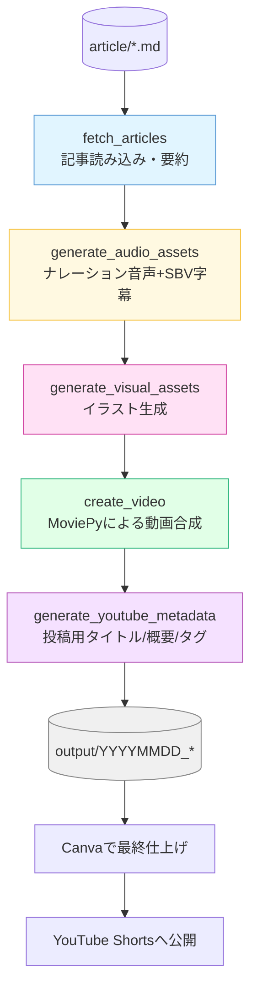
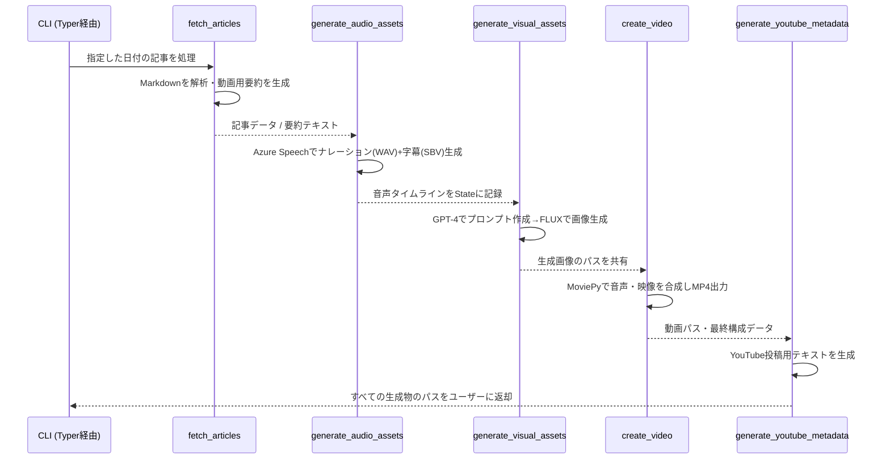
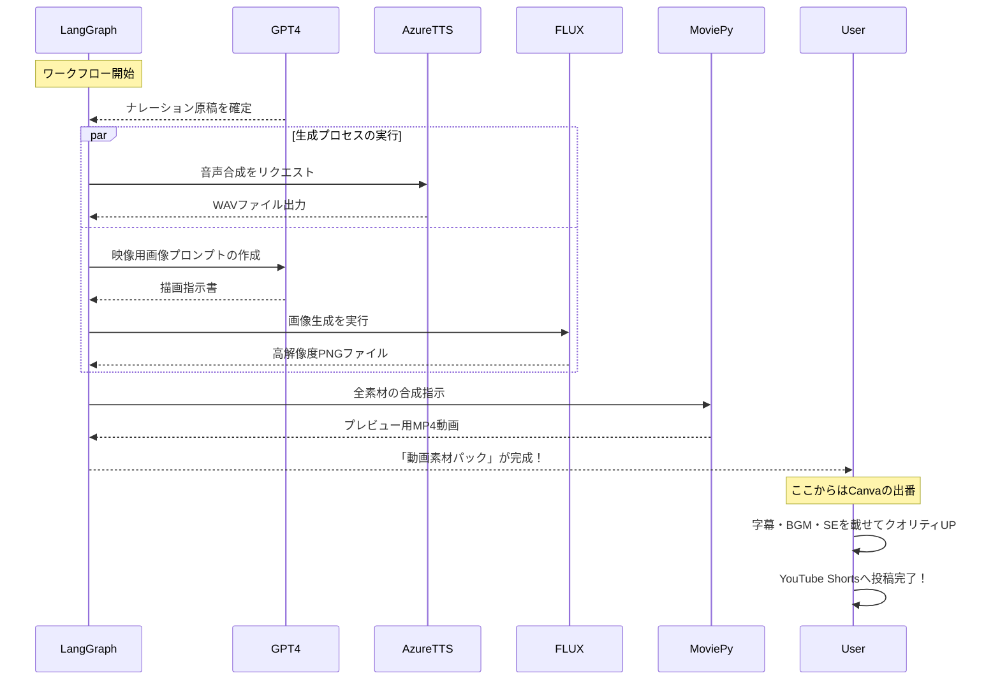

# LangGraphで作る「爆速」自動ニュース動画生成システム

### 記事原稿から動画素材までをフルオートで一気通貫！

Markdownで書いたニュース原稿を放り込むだけで、**ナレーション音声・関連画像・動画クリップ・サムネイル・投稿用テキスト**までをAIが一括量産。

本記事では、LangGraph、Azure、OpenAI、そしてMoviePyを組み合わせ、「毎日の執筆ワークフローを動画制作まで拡張する」実運用レベルの自動化システムについて、設計思想から実装コードまで余すことなく公開します。

---

### 1. はじめに
### 記事原稿から動画素材までをフルオートで一気通貫！

Markdownで書いたニュース原稿を放り込むだけで、**ナレーション音声・関連画像・動画クリップ・サムネイル・投稿用テキスト**までをAIが一括量産。

本記事では、LangGraph、Azure、OpenAI、そしてMoviePyを組み合わせ、「毎日の執筆ワークフローを動画制作まで拡張する」実運用レベルの自動化システムについて、設計思想から実装コードまで余すことなく公開します。

### 1. はじめに

**「せっかく書いたブログ記事、もっと多くの人に届けたい……」**

そんな悩みから、このプロジェクトは始まりました。テキストだけではリーチできない「動画視聴層」へアプローチするために、記事の要約、画像生成、音声合成、そして動画編集という複雑な工程をLangGraphで一貫して自動化。

本記事では、現在進行形で稼働しているシステムの全容を解説します。コードの一つひとつの役割まで深掘りしていくので、あなたのプロジェクトにもすぐに取り入れ、独自の「自動化パイプライン」を構築できるはずです。

### 2. 本記事で習得できる「次世代の自動化スキル」

本書を読み終える頃には、単なるスクリプト作成の域を超えた、**「AIエージェントを実務レベルで飼いならす」**以下の実践的なスキルがあなたのものになります。

* **LangGraphによる高度なワークフロー設計術**
「状態（State）」を管理し、複数のAIを迷わせずに連携させるノード設計の極意を伝授します。複雑な処理を構造化し、確実に完結させる**制御可能なAIシステム**の作り方がわかります。
* **Azure AIサービスの徹底活用・連携テクニック**
GPT-4o（思考）、FLUX（視覚）、音声合成（聴覚）という、最高峰のAIモデルたちをバラバラに使うのではなく、**一つの強力なエコシステムとして機能させる**技法を習得できます。
* **Pythonによる「手作業ゼロ」の動画編集ノウハウ**
動画編集ソフトを一切開かずに、MoviePyを駆使してプログラムだけで映像を合成・演出するテクニックを公開。**コードが動画を書き出す**快感を体験してください。
* **現場で差がつく「実運用」の知見**
APIコストを最小限に抑える最適化の工夫や、予期せぬエラーで止まらないためのハンドリングなど、**「動いて当たり前」のプロダクションレベル**で必要なノウハウを凝縮しました。

**「AIに何をさせるか」ではなく、「AIにどう仕事をさせるか」。**
その設計思想と実装力を、動画生成という最高にエキサイティングなテーマを通じて身につけましょう。


### 3. ⚠️ 導入前に知っておくべきこと（期待値調整）

本システムを最大限に活用していただくために、あらかじめ理解しておいてほしい「自動化の境界線」があります。

### 「AIが作ること」と「人間が仕上げること」

このシステムが担当するのは、あくまで**「動画素材の生成」**です。

| AIが自動生成するもの | 人間が仕上げるもの（Canva等） |
| --- | --- |
| ナレーション音声（WAV） | 字幕・テロップの配置 |
| 記事内容に即した画像・動画 | BGM・効果音（SE）の挿入 |
| 基本的な動画クリップの結合 | オープニング・エンディング演出 |
| 投稿用タイトル・説明文 | トランジション（場面転換）の調整 |

視聴者を惹きつける「完成品」にするには、最後にCanvaなどのツールでひと手間加えるのが、現在のAI運用において最もコスパの良い手法です。

#### 運用上の7つの重要チェックポイント

1. **ライセンス遵守**：フリー素材やFLUX生成画像は、必ず目視で著作権・肖像権の確認を行ってください。
2. **Azureのコスト管理**：従量課金制です。テスト実行で1週間程度のコスト感（数百円〜）を把握することをお勧めします。
3. **命名ルールの厳守**：記事ファイルは `YYYYMMDD_タイトル.md` 形式に。システムが自動認識するための「鍵」となります。
4. **「60秒」の壁**：Shorts向けに最適化されています。1本の動画に入れる記事数は3〜5件がベストバランスです。
5. **出力フォルダの整理**：実行のたびに大容量のWAV等が生成されるため、定期的な掃除が必要です。
6. **処理時間の目安**：5記事分で約5〜10分。コーヒーを飲んでいる間に素材が揃うイメージです。
7. **エラーへの備え**：`node_logs.jsonl` を見れば、どの工程でつまづいたか一目で分かる設計にしています。


### 4. なぜ「LangGraph」なのか？ 開発の舞台裏

このシステムの開発に踏み切ったのには、3つの切実な理由があります。

#### ① 「耳」で楽しむコンテンツへの転換

「ニュース記事を家事や通勤中に聴きたい」というニーズに対し、毎日手作業で音声を当てるのは苦行です。これをAIに任せることで、コンテンツの「マルチデバイス化」を一気に加速させました。

#### ② 未知の視聴者層へのアプローチ

テキストだけでは届かない「動画で情報を得る層」に対し、YouTube Shortsという強力なプラットフォームを活用したかったのです。

#### ③ LangGraphの限界突破

LangGraphは通常、チャットボットなどのテキスト処理に使われますが、「マルチメディア生成（画像・音・動画）」という複雑な非同期タスクにどこまで耐えられるか、という技術的挑戦でもありました。

**それでは、具体的な設計と実装の解説に移りましょう。**

## システムアーキテクチャ：6つのノードによる「自動生成パイプライン」
本システムは、**LangGraph**を採用することで、複雑な動画制作工程を「6つの独立したノード（工程）」に分解して制御しています。

「記事 → 音声 → 画像 → サムネイル → 動画 → YouTubeメタ情報」という一連のフローを直列につなぐことで、各工程が単一の責任（単一責務）を持つよう設計しました。これにより、万が一のエラー時の調査や、「画像生成モデルだけを最新のものに入れ替える」といったカスタマイズが容易な構造になっています。

### 処理フローの全体像

記事ファイル（Markdown）を読み込んでから、最終的なYouTube投稿用素材が生成されるまでの全体フローです。



---

### 詳細データフロー

各ノード間でどのようなデータが受け渡され、ファイルが生成されていくのか、その舞台裏を可視化しました。



---

### AI連携の仕組み（内部シーケンス）

各ノードの内部では、複数のAIモデルがオーケストレーションされています。特に画像と音声の生成は、LangGraphの状態管理によって不整合が起きないよう制御されています。



このように、**AIが得意な生成**と**人間がこだわるべき編集**の境界線を明確に引くことで、圧倒的な生産性とクオリティを両立させています。


## 5. 開発の舞台裏：直面した4つの課題と「実用的」な解決策

理論通りにはいかないのがシステム開発の常です。ここでは、私が実際に直面した「壁」と、それをどう乗り越えたのかという泥臭いノウハウを共有します。

### ① 「動画が動かない」問題：視聴維持率を高める視覚効果

当初、AIで生成した静止画1枚を背景に動画を作りましたが、1分間ずっと同じ絵面が続くのはあまりに退屈でした。

**【解決策】**
静止画の使用は冒頭5秒の「アイキャッチ」に限定。その後はフリー素材の動画クリップへ切り替えるハイブリッド方式を採用しました。さらに、MoviePyの「ズームエフェクト」を実装し、静止画にも緩やかな動きを与えています。

```python
# じわじわと拡大するズームエフェクトの実装例
def zoom_factor(t, total=duration):
    # 時間の経過とともに1.0から1.05倍まで拡大
    return 1 + 0.05 * (t / max(total, 0.001))

# エフェクトの適用
base_image = base_image.with_effects([Resize(new_size=zoom_factor)])

```

このわずかな「寄り」の動きがあるだけで、視聴者の離脱率が劇的に改善しました。

### ② 字幕の壁：日本語フォントとレンダリングの制約

当初はPython側で完璧に字幕まで焼き込む予定でしたが、ライブラリ（MoviePy）とOS環境（ImageMagick）の組み合わせによる「日本語の文字化け・レイアウト崩れ」に悩まされました。

**【解決策】**
「プログラムで無理をしない」という判断を下しました。動画自体は字幕なしで書き出し、代わりに**タイムコード付きの字幕用テキスト（SBV形式）**を自動生成する仕様に変更。これをCanva等に持ち込むことで、フォントの自由度と高いデザイン性を確保しつつ、編集の手間を最小限に抑えています。

### ③ コストの壁：AI動画生成のランニングコスト

RunwayやPikaといったAI動画生成サービスは強力ですが、1記事ごとに数十円〜数百円のコストがかかります。毎日複数本投稿するとなると、個人開発レベルでは予算オーバーでした。

**【解決策】**
高価な「AI動画生成」から、高品質な「AI画像生成（FLUX）」へスイッチ。動きは前述の「ズームエフェクト」と「フリー素材動画」で補完することで、**クオリティを維持したまま、コストを約1/10まで圧縮**することに成功しました。

### ④ 「読み上げ」の違和感：URLや記号のノイズ対策

記事の冒頭500文字をそのままAzure TTS（音声合成）に流し込むと、URLの「スラッシュ」や「ドット」、あるいはハッシュタグまで律儀に読み上げてしまい、非常に聞き苦しいものになりました。

**【解決策】**
ナレーション専用の「要約ステップ」を独立させました。GPT-4に対し、以下の指示を徹底しています。

* URL、記号、不要なハッシュタグの完全除去。
* 書き言葉から「親しみやすい話し言葉」へのトーン変換。
* Shortsの尺に収まるよう、500文字以内で情報を凝縮。

この「ワンクッション」を置くことで、まるで人間が読み上げているかのようなスムーズなナレーションを実現しています。


## セットアップ

まずは、開発環境の準備から始めましょう。必要なツールとライブラリをインストールし、プロジェクトの骨格を作ります。

### プロジェクトフォルダの作成

```bash
mkdir news-article
cd news-article
uv init
uv venv
uv add azure-cognitiveservices-speech dotenv langchain langgraph openai langchain_openai moviepy typer
mkdir article movie output
touch config.py state.py nodes.py graph.py main.py
```

フォルダ構成の意味を理解しておきましょう。`article/`には変換元の記事ファイル（`YYYYMMDD_タイトル.md`形式）を配置します。`movie/`にはフリー素材動画を配置します。`output/`には生成された動画・音声・画像が保存されます。

有料記事の読者が迷わないよう、**Azure Portalの実際の操作画面をイメージできる構成**でリライトしました。

## Azure Portalでのリソース構築手順

本システムでは、Microsoft Azureの強力なAI機能を組み合わせて使用します。まずはAzure Portalにログインし、以下の3つのステップで基盤を構築しましょう。

### ステップ1：Azure OpenAI Service の作成（テキスト・画像生成）

まずは、知能を司るGPT-4oと、視覚を司るFLUX（またはDALL-E 3）を利用するためのリソースを作成します。

1. **リソースの作成**: Azure Portalで「Azure OpenAI」を検索し、作成ボタンをクリックします。
2. **リージョンの選択**: **`East US`（米国東部）**を選択してください。
* *Tip: 最新モデルが先行投入されやすく、コスト効率も良いリージョンです。*


3. **モデルのデプロイ**:
* リソース作成後、「Azure AI Foundry（旧 Studio）」に移動します。
* 「デプロイ」メニューから、`gpt-4o`（文章用）と `FLUX.1-pro`（画像用）をそれぞれデプロイし、**デプロイ名**をメモしておきます。


### ステップ2：Speech Service の作成（ナレーション生成）

次に、テキストを自然な日本語音声に変換するためのリソースを作成します。

1. **リソースの作成**: Portalで「Speech Services（音声サービス）」を検索し、作成します。
2. **設定**: リージョンはOpenAIと合わせて `East US` にしておくと管理がスムーズです。
3. **音声の選定**: 本システムでは、最も表現力が豊かな **`ja-JP-NanamiNeural`** をデフォルトとして使用します。

### ステップ3：接続情報の取得と環境設定（.env）

プログラムからこれらのサービスを呼び出すための「鍵（APIキー）」を取得します。

1. 各リソースの管理画面にある**「キーとエンドポイント」**メニューを開きます。
2. プロジェクトのルート直下に `.env` ファイルを作成し、以下のように情報を書き込みます。

```bash
# --- Azure OpenAI (テキスト・画像) ---
# 「Azure OpenAI」リソースから取得
AZURE_TEXT_API_KEY=あなたのキー1
AZURE_TEXT_ENDPOINT=https://あなたのエンドポイント.openai.azure.com/

# --- Azure AI Speech (音声) ---
# 「音声サービス」リソースから取得
AZURE_SPEECH_KEY=あなたの音声キー1
AZURE_SPEECH_ENDPOINT=https://eastus.api.cognitive.microsoft.com/
AZURE_SPEECH_REGION=eastus

# --- モデルデプロイ名 ---
# AI Foundryで設定したデプロイ名を指定
AZURE_DEPLOYMENT_TEXT=gpt-4o
AZURE_DEPLOYMENT_IMAGE=flux-pro

```


### 💡 運用のポイント

* **クォータ（割り当て）の確認**: Azure OpenAIの各モデルには「トークン毎分 (TPM)」の制限があります。初期設定では低めに設定されている場合があるため、複数の記事を一度に回す際は「クォータ」画面から上限を確認・調整してください。
* **コスト管理**: Azure Portalの「コストの分析」から、サービスごとの利用料金をリアルタイムで確認できます。最初は無料枠や少額のテストから始めることを強く推奨します。


**これで、AIとプログラムを繋ぐ「神経」が通りました。次は、いよいよLangGraphによるワークフローの実装を見ていきましょう。**

## config.py（設定管理）

システムの心臓部であるAIモデルや各種ディレクトリへのパスは、`config.py`で一元管理します。
ここでは、単に環境変数を読み込むだけでなく、Azure特有の複雑なエンドポイントURLを自動で解析（パース）し、プログラムが扱いやすい形に整形する工夫を施しています。

### 設定管理コード (`config.py`)

```python
import os
from dotenv import load_dotenv

# .envファイルから環境変数を一括読み込み
load_dotenv()

def _split_endpoint(endpoint: str | None) -> tuple[str | None, str | None]:
    """
    AzureエンドポイントURLからベースURLとAPIバージョンを自動抽出・正規化する。
    ポータルからコピーした複雑なURLでも、安全に扱えるように整形します。
    """
    if not endpoint:
        return None, None

    base = endpoint.strip()
    if not base:
        return None, None

    api_version = None
    # URLにapi-versionが含まれている場合は抽出
    if "api-version=" in base:
        api_version = base.split("api-version=")[-1].split("&")[0].strip()

    # 不要なクエリパラメータやパスを削ぎ落とし、ベースURLのみを抽出
    base = base.split("?")[0]
    if "/openai/" in base:
        base = base.split("/openai/")[0]

    # 末尾にスラッシュを付与して正規化
    normalized = base.rstrip("/") + "/"
    return normalized, api_version

# 各種エンドポイントの正規化処理
_raw_text_endpoint = os.getenv("AZURE_TEXT_ENDPOINT")
_text_endpoint, _text_version = _split_endpoint(_raw_text_endpoint)

_raw_image_endpoint = os.getenv("AZURE_IMAGE_ENDPOINT")
_image_endpoint, _image_version = _split_endpoint(_raw_image_endpoint)

class Config:
    """
    アプリケーション全体の設定を一元管理するクラス。
    各ノードはこのクラスを通じて型安全に設定値へアクセスします。
    """
    # --- Azure OpenAI (テキスト生成) ---
    AZURE_TEXT_API_KEY = os.getenv("AZURE_TEXT_API_KEY")
    AZURE_TEXT_ENDPOINT = _text_endpoint
    AZURE_TEXT_API_VERSION = os.getenv("AZURE_TEXT_API_VERSION", _text_version or "2024-02-01-preview")
    AZURE_OPENAI_DEPLOYMENT_NAME = "gpt-4o"

    # --- Azure AI Speech (音声合成) ---
    AZURE_SPEECH_KEY = os.getenv("AZURE_SPEECH_KEY")
    AZURE_SPEECH_ENDPOINT = os.getenv("AZURE_SPEECH_ENDPOINT")
    AZURE_SPEECH_REGION = os.getenv("AZURE_SPEECH_REGION")

    # --- Azure Image (画像生成: FLUX.1) ---
    AZURE_IMAGE_API_KEY = os.getenv("AZURE_IMAGE_KEY")
    AZURE_IMAGE_ENDPOINT = _image_endpoint
    AZURE_IMAGE_API_VERSION = os.getenv("AZURE_IMAGE_API_VERSION", _image_version or "2023-12-01-preview")
    AZURE_IMAGE_DEPLOYMENT_NAME = "FLUX.1-pro"

    # --- ディレクトリ・ファイル設定 ---
    ARTICLE_DIR = "./article"   # ニュース原稿の格納先
    OUTPUT_DIR = "./output"     # 生成物の出力先
    MOVIE_DIR = "./movie"       # フリー素材動画の格納先
    JP_FONT_PATH = os.getenv("JP_FONT_PATH") # 日本語フォントへのパス

```

### このコードの「プロのこだわり」ポイント

#### 1. エンドポイントの自動正規化 (`_split_endpoint`)

Azure PortalからコピーしたエンドポイントURLは、末尾に `/openai/` が付いていたり、クエリパラメータが含まれていたりと形式がバラバラなことが多いです。
この関数を通すことで、**「どんな形式でコピーしても正しく動作する」**堅牢なシステムにしています。これにより、環境構築時のケアレスミスによるエラーを未然に防ぎます。

#### 2. Configクラスによる一元管理

設定値をバラバラな変数として扱わず、`Config`クラスに集約しました。

* **メンテナンス性**: 新しいモデルへの切り替えやディレクトリ構造の変更も、このクラス1箇所を修正するだけで完了します。
* **安全性**: 環境変数が未設定の場合でもデフォルト値を設定できるようにしており、実行時のクラッシュを回避します。

#### 3. 将来的な拡張性

`JP_FONT_PATH` などのOS依存の設定も環境変数経由で読み込めるようにしており、Windows、Mac、Linux（Docker環境）のどこでも、`.env`を書き換えるだけで動作するように設計されています。

---

**基盤となる設定管理ができました。次は、いよいよLangGraphの本領発揮である「ワークフロー（State）」の設計に進みます。**

有料記事の「技術解説：データ設計編」として、読者が「なぜこの設計が優れているのか」を深く理解し、自身の開発にも応用したくなるようなプロフェッショナルなトーンでリライトしました。

---

## 状態管理の定義 (state.py)

LangGraphを用いた開発において、最も重要なのが**「State（状態）」の設計**です。ノード間でどのようなデータが受け渡されるのかを厳密に定義することで、複雑な自動化フローを迷子にならずに構築できます。

本システムでは、Pythonの `TypedDict` を活用し、各プロセスで生成される音声・画像・動画のパスや、記事のメタデータを一元管理しています。

### 状態管理の定義 (`state.py`)

```python
from typing import TypedDict

class ArticleData(TypedDict):
    """個別の記事データを保持する構造体"""
    title: str          # 元記事のタイトル
    display_title: str  # 動画用に最適化された表示タイトル
    content: str        # 記事の本文（要約後）
    date: str           # 記事の日付

class AgentState(TypedDict):
    """
    ワークフロー全体で共有される「状態」の定義。
    各ノードはこのStateを読み書きしながら処理を進めます。
    """
    start_date: str                 # 処理対象の開始日
    end_date: str                   # 処理対象の終了日
    run_output_dir: str             # 今回の実行結果を保存するディレクトリ
    single_article_path: str | None # 特定の記事のみを処理する場合のパス

    # 各工程で生成・蓄積されるアセット
    articles: list[ArticleData]     # 読み込まれた全記事のリスト
    audio_paths: list[str]          # 生成された音声ファイル(.wav)のパス一覧
    image_paths: list[str]          # 生成された画像ファイル(.png)のパス一覧
    script_paths: list[str]         # 生成された字幕用スクリプト(.sbv)のパス一覧

    # 最終成果物の情報
    thumbnail_path: str | None      # サムネイル画像の保存パス
    thumbnail_title: str | None     # サムネイルに記載するキャッチコピー
    video_path: str | None          # 統合された動画ファイル(.mp4)のパス
    youtube_metadata_path: str | None # YouTube投稿用メタデータのパス

    error: str | None               # エラー発生時のメッセージ格納用

```

### この設計がもたらす3つの技術的メリット

#### 1. 開発効率を最大化する「型補完」

`TypedDict` を採用することで、VS Codeなどのエディタ上で強力な自動補完（IntelliSense）が効くようになります。「あの変数の名前は何だったかな？」とコードを行ったり来たりする時間が激減し、タイポによるランタイムエラーを未然に防げます。

#### 2. 「単一責任の原則」の徹底

`AgentState` の設計思想は、**「各ノードは必要な情報をStateから受け取り、自分の成果をStateに書き戻すだけ」**というものです。
例えば「画像生成ノード」は、Stateにある「記事内容」だけを見て画像を作り、そのパスを `image_paths` に追加するだけで完結します。この疎結合な設計により、特定のノードだけを並列化したり、後から新しい工程を追加したりすることが非常に容易になります。

#### 3. 障害追跡とリトライの容易性

Stateを見れば「現在どのデータが生成済みで、どこで止まっているのか」が完璧に把握できます。これは本番環境での運用において、エラー時の原因究明や、失敗した工程からの部分的な再実行（レジューム機能）を実装する際の強力な武器となります。

---

**データ構造が定義できました。次はいよいよ、これらのデータを加工する「各ノードの実装」という本丸に乗り込みます。**


### nodes.py（処理ノード実装）
いよいよ、システムの心臓部である各ノードの実装を解説します。このファイルでは、LangGraphの各ノードが「何を考え、どう動くのか」を定義しています。

単なる「作業の自動化」に留まらず、AIによる要約・画像プロンプト生成・動画合成という、クリエイティブな工程を一つのパイプラインに凝縮しています。

```python
import base64
import json
import os
import random
import re
from datetime import datetime
import azure.cognitiveservices.speech as speechsdk
from openai import AzureOpenAI
from moviepy.video.VideoClip import ImageClip
from moviepy.audio.io.AudioFileClip import AudioFileClip
from moviepy.audio.AudioClip import concatenate_audioclips
from moviepy.video.compositing.CompositeVideoClip import concatenate_videoclips
from moviepy.video.fx.Resize import Resize
from moviepy.video.io.VideoFileClip import VideoFileClip
from config import Config
from state import AgentState


def _log_node_output(run_dir: str, node_name: str, payload: dict):
    """各ノードのメタデータをJSON行として現在の実行ディレクトリへ追記する。"""
    os.makedirs(run_dir, exist_ok=True)
    log_path = os.path.join(run_dir, "node_logs.jsonl")
    entry = {
        "timestamp": datetime.now().isoformat(timespec="seconds"),
        "node": node_name,
        "payload": payload
    }
    with open(log_path, "a", encoding="utf-8") as log_file:
        json.dump(entry, log_file, ensure_ascii=False)
        log_file.write("\n")


def _extract_title_from_content(raw_content: str, fallback: str) -> str:
    """Markdown本文で最初の非空行を見出しとして取得し、人が読めるタイトルを返す。"""
    for line in raw_content.splitlines():
        candidate = line.strip().lstrip("#").strip()
        if candidate:
            return candidate[:120]
    return fallback


text_client = AzureOpenAI(
    api_key=Config.AZURE_TEXT_API_KEY,
    api_version=Config.AZURE_TEXT_API_VERSION,
    azure_endpoint=Config.AZURE_TEXT_ENDPOINT,
    azure_deployment=Config.AZURE_OPENAI_DEPLOYMENT_NAME,
)

image_client = AzureOpenAI(
    api_key=Config.AZURE_IMAGE_API_KEY,
    api_version=Config.AZURE_IMAGE_API_VERSION,
    azure_endpoint=Config.AZURE_IMAGE_ENDPOINT,
    azure_deployment=Config.AZURE_IMAGE_DEVELOPMENT_NAME,
)

VIDEO_EXTENSIONS = (".mp4", ".mov", ".m4v", ".avi", ".webm", ".mkv")


def _list_movie_files() -> list[str]:
    """設定済みのmovieディレクトリから利用可能な背景動画を収集する。"""
    movie_dir = Config.MOVIE_DIR
    if not movie_dir or not os.path.isdir(movie_dir):
        return []
    files = []
    for name in os.listdir(movie_dir):
        if name.lower().endswith(VIDEO_EXTENSIONS):
            files.append(os.path.join(movie_dir, name))
    return files


def _format_date_label(date_str: str) -> str:
    """YYYYMMDD形式を表示用のYYYY/MM/DD表記へ変換する。"""
    try:
        return datetime.strptime(date_str, "%Y%m%d").strftime("%Y/%m/%d")
    except ValueError:
        return date_str


def _format_date_range_label(start: str, end: str) -> str:
    """人が見て分かりやすい日付レンジ表現を作成する。"""
    start_label = _format_date_label(start)
    end_label = _format_date_label(end)
    return start_label if start == end else f"{start_label} - {end_label}"


def _clean_hashtag_text(text: str) -> str:
    """YouTubeのハッシュタグとして使えるようにテキストを正規化する。"""
    cleaned = re.sub(r"[#＃]", "", text)
    cleaned = re.sub(r"\s+", "", cleaned)
    cleaned = re.sub(r"[^\wぁ-んァ-ヶ一-龯ー]+", "", cleaned)
    return cleaned[:20].strip()


def _extract_hashtags(articles: list[dict]) -> list[str]:
    """記事タイトルから派生させたハッシュタグの短いリストを生成する。"""
    hashtags: list[str] = []
    for article in articles:
        candidate = article.get('display_title') or article.get('title')
        if not candidate:
            continue
        cleaned = _clean_hashtag_text(candidate)
        if not cleaned or cleaned in hashtags:
            continue
        hashtags.append(cleaned)
        if len(hashtags) >= 5:
            break

    for fallback in ("ニュース", "ショート動画", "AI速報"):
        if len(hashtags) >= 5:
            break
        if fallback not in hashtags:
            hashtags.append(fallback)

    return hashtags[:5]


def _generate_youtube_metadata(state: AgentState) -> dict:
    """エージェント状態からYouTube向けのタイトル・説明文・ハッシュタグを組み立てる。"""
    articles = state.get('articles', [])
    range_label = _format_date_range_label(
        state['start_date'], state['end_date'])

    if articles:
        title = f"{range_label}の主要ニュースTOP{len(articles)} | ショート解説"
        if len(articles) == 1:
            title = f"{range_label} {articles[0]['title'] } | ニュースショート"
    else:
        title = f"{range_label}のニュースダイジェスト"

    description_lines = [
        f"📅 収録期間: {range_label}",
        "",
        "📝 取り上げたトピック:"
    ]
    if articles:
        for article in articles:
            description_lines.append(
                f"- {article.get('display_title') or article['title']} ({_format_date_label(article.get('date', state['start_date']))})"
            )
    else:
        description_lines.append("- 該当する記事は見つかりませんでした。")

    description = "\n".join(description_lines).strip()
    hashtags = _extract_hashtags(articles)
    if articles:
        primary = articles[0]
        base_thumb = primary.get('display_title') or primary.get('title') or ""
    else:
        base_thumb = ""
    if base_thumb:
        thumbnail_title = base_thumb[:40]
    else:
        thumbnail_title = title[:40] if title else "最新ニュース"

    return {
        "title": title,
        "description": description,
        "hashtags": hashtags,
        "thumbnail_title": thumbnail_title
    }


def _format_timestamp(seconds: float) -> str:
    """SBV形式（H:MM:SS.mmm）のタイムスタンプ文字列を生成する。"""
    milliseconds = max(0, int(round(seconds * 1000)))
    hours, remainder = divmod(milliseconds, 3600 * 1000)
    minutes, remainder = divmod(remainder, 60 * 1000)
    secs, millis = divmod(remainder, 1000)
    return f"{hours}:{minutes:02}:{secs:02}.{millis:03}"


def _split_sentences_for_captions(text: str) -> list[str]:
    """ナレーション文章をSBVファイルに適した粒度へ分割する。"""
    if not text:
        return []

    stripped = text.strip()
    if not stripped:
        return []

    # 「。」でのみ区切り、句読点を維持したまま抽出
    sentences = [
        chunk.strip()
        for chunk in re.findall(r'[^。]+。?', stripped)
        if chunk.strip()
    ]

    return sentences or [stripped]


def _build_sbv_caption(text: str, duration: float | None) -> str:
    """文章と想定尺から疑似タイミング付きSBV字幕を生成する。"""
    sentences = _split_sentences_for_captions(text)
    if not sentences:
        sentences = ["（内容なし）"]

    total_chars = sum(len(s) for s in sentences) or 1
    total_duration = duration if duration and duration > 0 else len(
        sentences) * 3.0

    raw_durations = []
    for sentence in sentences:
        portion = max(0.8, (len(sentence) / total_chars) * total_duration)
        raw_durations.append(portion)

    scale = total_duration / \
        sum(raw_durations) if sum(raw_durations) > 0 else 1.0
    durations = [d * scale for d in raw_durations]

    lines = []
    cursor = 0.0
    for sentence, seg_duration in zip(sentences, durations):
        start_ts = _format_timestamp(cursor)
        end_ts = _format_timestamp(cursor + seg_duration)
        lines.append(f"{start_ts},{end_ts}")
        lines.append(sentence)
        lines.append("")
        cursor += seg_duration

    return "\n".join(lines).strip() + "\n"


def fetch_articles_node(state: AgentState):
    """日付レンジ内のMarkdown記事を読み込み、ナレーション向けに要約する。"""
    target_articles = []
    # フィルタ計算に備えて日時に変換しておく
    start = datetime.strptime(state['start_date'], "%Y%m%d")
    end = datetime.strptime(state['end_date'], "%Y%m%d")
    run_dir = state.get('run_output_dir') or Config.OUTPUT_DIR

    single_article_path = state.get("single_article_path")

    if not single_article_path and not os.path.exists(Config.ARTICLE_DIR):
        os.makedirs(Config.ARTICLE_DIR)

    # 1. ファイルのフィルタリング（単一指定か日付レンジかで分岐）
    files_to_process: list[tuple[str, str, str]] = []
    if single_article_path:
        if not os.path.isfile(single_article_path):
            raise FileNotFoundError(f"記事ファイルが見つかりません: {single_article_path}")
        basename = os.path.basename(single_article_path)
        match = re.match(r"(\d{8})_(.*)\.md", basename)
        if match:
            file_date_str, title = match.groups()
        else:
            file_date_str = state['start_date']
            title = os.path.splitext(basename)[0]
        files_to_process.append((single_article_path, title, file_date_str))
    else:
        for filename in os.listdir(Config.ARTICLE_DIR):
            match = re.match(r"(\d{8})_(.*)\.md", filename)
            if match:
                file_date_str, title = match.groups()
                file_date = datetime.strptime(file_date_str, "%Y%m%d")
                if start <= file_date <= end:
                    files_to_process.append(
                        (os.path.join(Config.ARTICLE_DIR, filename), title, file_date_str))

    # 2. 各記事の読み込みと要約（ナレーション原稿作成）
    for filepath, title, date_str in files_to_process:
        with open(filepath, 'r', encoding='utf-8') as f:
            raw_content = f.read()

        # GPT-4oによる要約とナレーション整形
        # ここでURLの除去や自然な言い回しへの変換を指示
        response = text_client.chat.completions.create(
            model=Config.AZURE_OPENAI_DEPLOYMENT_NAME,  # GPT-4o用デプロイ名
            messages=[
                {"role": "system", "content": "あなたは優秀なニュースアナウンサーです。"},
                {"role": "user", "content": f"""
以下のニュース記事を、YouTubeショート用のナレーション原稿に要約してください。

【制約事項】
・500文字以内
・冒頭で核心を伝える：「何が起きたのか」「なぜ重要なのか」を最初に明示
・その後、時系列や因果関係に沿って背景・経緯・影響を簡潔に説明
・URLや記号（[ ]、( )など）は完全に削除または自然な言葉に置き換える
・専門用語は使用可（ビジネスパーソン向け）だが、必要に応じて簡潔な補足を入れる
・です・ます調で統一し、遠回しな表現は避ける
・ビジネスへの影響や実務的な意味を優先的に含める

記事タイトル: {title}
記事内容:
{raw_content}
"""}
            ]
        )

        summarized_content = response.choices[0].message.content.strip()
        human_title = _extract_title_from_content(
            raw_content, title.replace("_", " "))

        target_articles.append({
            'title': title,
            'display_title': human_title,
            'content': summarized_content,  # ここに綺麗な要約が入る
            'date': date_str
        })
        print(f"✅ 要約完了: {title}")

    _log_node_output(
        run_dir,
        "fetch_articles",
        {
            "article_count": len(target_articles),
            "article_titles": [article['display_title'] for article in target_articles],
            "articles": target_articles
        }
    )

    return {'articles': target_articles, 'run_output_dir': run_dir}


def generate_audio_assets_node(state: AgentState):
    """各記事のナレーション音声と字幕ファイルを生成する。"""
    audio_paths = []
    script_paths = []
    voice_outputs = []

    run_dir = state.get('run_output_dir') or Config.OUTPUT_DIR
    os.makedirs(run_dir, exist_ok=True)

    for i, article in enumerate(state['articles']):
        # 音声合成の設定を記事ごとに初期化（1本ずつ別ファイルに保存する）
        # 各記事ごとに Azure Speech を設定（音声スタイルを統一）
        speech_config = speechsdk.SpeechConfig(
            subscription=Config.AZURE_SPEECH_KEY,
            region=Config.AZURE_SPEECH_REGION
        )
        speech_config.speech_synthesis_voice_name = "ja-JP-NanamiNeural"

        audio_filename = f"audio_{i}.wav"
        audio_path = os.path.join(run_dir, audio_filename)
        audio_config = speechsdk.audio.AudioOutputConfig(filename=audio_path)

        # ナレーションを音声化し、ファイルへ保存
        synthesizer = speechsdk.SpeechSynthesizer(
            speech_config=speech_config, audio_config=audio_config)
        synthesizer.speak_text_async(article['content']).get()
        audio_paths.append(audio_path)

        # 字幕のタイミング計算用に長さを取得（失敗しても無視）
        audio_duration = None
        try:
            temp_clip = AudioFileClip(audio_path)
            audio_duration = temp_clip.duration or None
        except Exception:
            audio_duration = None
        finally:
            try:
                temp_clip.close()
            except Exception:
                pass

        script_filename = f"script_{i}.sbv"
        script_path = os.path.join(run_dir, script_filename)
        # SBV 形式の字幕を生成し、YouTubeで直接使えるようにする
        captions_content = _build_sbv_caption(
            article['content'], audio_duration)
        with open(script_path, "w", encoding="utf-8") as script_file:
            script_file.write(captions_content)
        script_paths.append(script_path)

        voice_outputs.append({
            "index": i,
            "article_title": article.get('display_title') or article['title'],
            "audio_path": audio_path,
            "script_path": script_path,
            "spoken_text": article['content']
        })

    _log_node_output(
        run_dir,
        "generate_audio_assets",
        {
            "audio_files": [os.path.basename(p) for p in audio_paths],
            "script_files": [os.path.basename(p) for p in script_paths],
            "voice_outputs": [
                {
                    "index": entry["index"],
                    "article_title": entry["article_title"],
                    "spoken_text": entry["spoken_text"],
                    "audio_file": os.path.basename(entry["audio_path"]),
                    "script_file": os.path.basename(entry["script_path"])
                }
                for entry in voice_outputs
            ]
        }
    )

    return {
        'audio_paths': audio_paths,
        'script_paths': script_paths,
        'run_output_dir': run_dir
    }


def generate_visual_assets_node(state: AgentState):
    """記事ごとに解説用イラストのプロンプトと画像を生成する。"""
    image_paths = []
    image_prompts = []
    image_outputs = []

    run_dir = state.get('run_output_dir') or Config.OUTPUT_DIR
    os.makedirs(run_dir, exist_ok=True)

    for i, article in enumerate(state['articles']):
        # まずは記事内容から英語のプロンプトを生成してビジュアル方針を決める
        # GPT に映画的な風景プロンプトを作らせる（FLUX用）
        prompt_response = text_client.chat.completions.create(
            model=Config.AZURE_OPENAI_DEPLOYMENT_NAME,
            messages=[
                {
                    "role": "system",
                    "content": (
                        "あなたは報道ビジュアルのコンセプトアーティストです。以下のニュース記事を読み、"
                        "その内容を視覚的に伝える画像生成用プロンプトを英語で作成してください。\n\n"

                        "【必須要素】\n"
                        "・ニュースの核心的な「モノ」「場所」「状況」を具体的に描写\n"
                        "・技術系ニュース：製品、デバイス、インフラ、デジタルインターフェース\n"
                        "・ビジネス系ニュース：オフィス空間、都市景観、企業ロゴのないビル群\n"
                        "・政策系ニュース：議場、公共施設、象徴的な建造物\n"
                        "・環境系ニュース：自然環境、気候現象、エコシステム\n\n"

                        "【禁止事項】\n"
                        "・実在の人物の顔や体（後ろ姿や遠景のシルエットは可）\n"
                        "・実在企業のロゴや商標\n"
                        "・特定可能な個人が写り込む構図\n\n"

                        "【推奨表現】\n"
                        "・抽象的なビジュアルメタファー（例：AIニュース→脳のニューラルネットワーク模様）\n"
                        "・象徴的なオブジェクト（例：半導体ニュース→マイクロチップのクローズアップ）\n"
                        "・環境や空間で状況を表現（例：経済危機→無人のオフィスフロア）\n\n"

                        "【スタイル指定】\n"
                        "・9:16縦型構図を意識\n"
                        "・ビジュアルジャーナリズム風の写実的スタイル\n"
                        "・色彩は記事のトーン（希望的/警告的/中立的）に合わせる\n"
                        "・視認性の高い明瞭な構図"
                    )
                },
                {
                    "role": "user",
                    "content": f"記事タイトル: {article.get('display_title') or article['title']}\n記事内容: {article['content']}"
                }
            ]
        )
        img_prompt = prompt_response.choices[0].message.content.strip()
        image_prompts.append(img_prompt)

        # 9:16 比率のイラストを描画し、動画冒頭の静止画に使用
        image_result = image_client.images.generate(
            model=Config.AZURE_IMAGE_DEVELOPMENT_NAME,
            prompt=f"{img_prompt} Digital art style, vibrant colors, 9:16 aspect ratio focus.",
            size="1792x1024",
            n=1,
            response_format="b64_json",
        )

        image_data = image_result.data[0]
        image_location = None
        if image_data.url:
            image_location = image_data.url
            image_paths.append(image_location)
        else:
            image_filename = f"image_{i}.png"
            image_path = os.path.join(run_dir, image_filename)
            with open(image_path, "wb") as img_file:
                img_file.write(base64.b64decode(image_data.b64_json))
            image_location = image_path
            image_paths.append(image_location)

        image_outputs.append({
            "index": i,
            "article_title": article.get('display_title') or article['title'],
            "prompt": img_prompt,
            "image_path": image_location
        })

    _log_node_output(
        run_dir,
        "generate_visual_assets",
        {
            "image_files": [os.path.basename(p) if p else None for p in image_paths],
            "image_prompts": image_prompts,
            "image_outputs": [
                {
                    "index": entry["index"],
                    "article_title": entry["article_title"],
                    "prompt": entry["prompt"],
                    "image_file": os.path.basename(entry["image_path"]) if entry["image_path"] else None
                }
                for entry in image_outputs
            ]
        }
    )

    return {
        'image_paths': image_paths,
        'run_output_dir': run_dir
    }


def create_short_video_node(state: AgentState):
    """生成済みの静止画・ストック映像・ナレーション音声を結合し短尺動画を作る。"""
    clips = []
    run_dir = state.get('run_output_dir') or Config.OUTPUT_DIR
    os.makedirs(run_dir, exist_ok=True)
    output_path = os.path.join(run_dir, "final_youtube_short.mp4")
    movie_files = _list_movie_files()
    video_sources: list[VideoFileClip] = []
    article_visual_logs = []
    article_audio_clips: list[AudioFileClip] = []
    audio_timeline = []
    audio_cursor = 0.0

    for i, article in enumerate(state['articles']):
        # 記事ごとのオーディオとビジュアルを 1 クリップにまとめる
        audio = AudioFileClip(state['audio_paths'][i])
        article_audio_clips.append(audio)
        duration = audio.duration or 0
        duration = max(duration, 0.001)

        base_image = ImageClip(state['image_paths'][i], duration=duration)
        base_image = base_image.with_effects([Resize(height=1920)])

        def zoom_factor(t, total=duration):
            return 1 + 0.05 * (t / max(total, 0.001))

        base_image = base_image.with_effects([Resize(new_size=zoom_factor)])
        base_image = base_image.with_position("center")

        segments = []
        movie_segments_log = []

        image_intro_duration = min(5, duration)
        segments.append(base_image.with_duration(image_intro_duration))
        remaining = duration - image_intro_duration

        while remaining > 1e-3 and movie_files:
            # ストック映像をランダムに差し込み、静止画だけの単調さを抑える
            movie_path = random.choice(movie_files)
            try:
                video_clip = VideoFileClip(movie_path)
                video_sources.append(video_clip)
            except Exception:
                continue

            clip_duration = min(5, remaining, video_clip.duration or 0)
            if clip_duration <= 0:
                video_clip.close()
                continue

            max_start = max(
                0, (video_clip.duration or clip_duration) - clip_duration)
            start = random.uniform(0, max_start) if max_start > 0 else 0

            segment = video_clip.subclipped(
                start_time=start,
                end_time=start + clip_duration
            ).with_audio(None)

            segment = segment.with_effects(
                [Resize(height=1920)]).with_position("center")
            segments.append(segment)

            movie_segments_log.append({
                "file": os.path.basename(movie_path),
                "start": round(start, 2),
                "duration": round(clip_duration, 2)
            })

            remaining -= clip_duration

        if remaining > 1e-3:
            segments.append(base_image.with_duration(remaining))

        # 静止画と動画セグメントを結合し、記事ごとのショートクリップを完成させる
        article_video = concatenate_videoclips(
            segments, method="compose").with_duration(duration)
        article_video.audio = audio
        clips.append(article_video)

        article_visual_logs.append({
            "article": article.get('display_title') or article['title'],
            "movie_segments": movie_segments_log
        })

        audio_timeline.append({
            "article": article.get('display_title') or article['title'],
            "audio_file": os.path.basename(state['audio_paths'][i]),
            "start": round(audio_cursor, 2),
            "duration": round(duration, 2)
        })
        audio_cursor += duration

    final_video = concatenate_videoclips(clips, method="compose")
    final_audio = None
    if article_audio_clips:
        final_audio = concatenate_audioclips(article_audio_clips)
        final_video.audio = final_audio

    try:
        final_video.write_videofile(
            output_path, fps=24, codec="libx264", audio_codec="aac"
        )
    finally:
        final_video.close()
        if final_audio is not None:
            try:
                final_audio.close()
            except Exception:
                pass
        for audio_clip in article_audio_clips:
            try:
                audio_clip.close()
            except Exception:
                pass
        for source in video_sources:
            try:
                source.close()
            except Exception:
                pass

    _log_node_output(
        run_dir,
        "create_video",
        {
            "video_file": os.path.basename(output_path),
            "clip_count": len(clips),
            "articles": article_visual_logs,
            "audio_timeline": audio_timeline
        }
    )

    return {
        "video_path": output_path,
        'run_output_dir': run_dir
    }


def generate_youtube_metadata_node(state: AgentState):
    """YouTube投稿用のタイトル・説明文・ハッシュタグを整備する。"""
    run_dir = state.get('run_output_dir') or Config.OUTPUT_DIR
    os.makedirs(run_dir, exist_ok=True)

    metadata = _generate_youtube_metadata(state)
    hashtags_line = " ".join(f"#{tag}" for tag in metadata['hashtags']).strip()
    metadata_path = os.path.join(run_dir, "youtube_meta.txt")

    articles = state.get("articles") or []
    if articles:
        primary_title = articles[0].get(
            'display_title') or articles[0].get('title') or "最新ニュース"
    else:
        primary_title = "最新ニュース"
    note_line = f"- note: {primary_title}"
    zenn_line = f"- zenn: {primary_title}"

    spoken_block = "\n\n".join(
        article.get('content', '').strip()
        for article in articles if article.get('content')
    ).strip()

    sections = [
        "【内容】",
        note_line,
        zenn_line,
        "",
    ]

    if articles:
        for idx, article in enumerate(articles, start=1):
            title = article.get('display_title') or article.get(
                'title') or f"記事{idx}"
            spoken = article.get('content', '').strip()
            sections.append(f"{idx}. {title}")
            if spoken:
                sections.append(spoken)
            sections.append("")
    elif spoken_block:
        sections.append(spoken_block)
        sections.append("")

    sections.extend([
        "IT系の情報を発信しています。",
        "note",
        "https://note.com/kenquichi",
        "zenn",
        "https://zenn.dev/kenquichi",
        "",
        "エンジニアになる講座",
        "https://note.com/kenquichi/m/mc4926a77c1da",
        "",

        "\n".join(f"#{tag}" for tag in metadata['hashtags']) or "#ニュース"
    ])

    final_text = "\n".join(sections).rstrip() + "\n"

    with open(metadata_path, "w", encoding="utf-8") as meta_file:
        meta_file.write(final_text)

    _log_node_output(
        run_dir,
        "generate_youtube_metadata",
        {
            "metadata_file": os.path.basename(metadata_path),
            "title": metadata['title'],
            "description": metadata['description'],
            "hashtags": metadata['hashtags'],
            "hashtags_line": hashtags_line or "#ニュース #ショート動画",
            "thumbnail_file": os.path.basename(state.get('thumbnail_path')) if state.get('thumbnail_path') else None,
            "thumbnail_title": metadata['thumbnail_title']
        }
    )

    return {
        "youtube_metadata_path": metadata_path,
        "thumbnail_title": metadata['thumbnail_title'],
        'run_output_dir': run_dir
    }

```

### 記事取得・要約ノード (`fetch_articles_node`)

このノードは、指定された日付範囲のMarkdownファイルを読み込み、**「YouTubeショートに最適化されたナレーション原稿」**へと変換します。

**【ロジックのポイント】**

* **GPT-4oによる「聞かせる」要約**: 単に短くするのではなく、URLや不要な記号を排除し、「アナウンサーが話すような自然な話し言葉」へと整形します。
* **冒頭のフック**: 視聴者が離脱しないよう、ニュースの核心を最初に持ってくる構成をプロンプトで強制しています。

### 音声・字幕生成ノード (`generate_audio_assets_node`)

生成された原稿を、Azure AI Speechを使って高品質な音声（WAV）に変換します。

**【技術的な工夫】**

* **疑似SBV字幕の生成**: 音声の長さを解析し、文字数ベースでタイミングを計算した字幕ファイル（.sbv）を同時に出力します。これにより、YouTubeやCanvaでの字幕付けが劇的に楽になります。

### ビジュアル生成ノード (`generate_visual_assets_node`)

記事の内容を反映した「解説用イラスト」をFLUX.1で生成します。

**【プロンプトエンジニアリングの極意】**

* **2段階生成**: 直接画像を作るのではなく、まずGPT-4oに「報道ジャーナリズム風の、人物を含まない抽象的で映画的なプロンプト」を英語で書かせてから、画像生成モデルに渡しています。これにより、著作権リスクを抑えつつ、統一感のあるプロフェッショナルな画質を実現しています。

### 動画編集ノード (`create_short_video_node`)

ここが最もテクニカルな部分です。MoviePyを使用し、生成された全素材を一つのMP4に合成します。

**【視聴者を飽きさせない演出ロジック】**

* **動的ズームエフェクト**: 静止画に対して「じわじわと拡大する」ズーム（ケン・バーンズ・エフェクト）をコードで実装し、視覚的な動きを絶やしません。
* **ストック映像のランダム挿入**: 冒頭5秒以降は、`movie/`ディレクトリにあるフリー素材動画をランダムに差し込みます。これにより、完全自動生成ながら「リッチな編集感」を演出しています。

```python
# 静止画に生命を吹き込む「ズーム関数」
def zoom_factor(t, total=duration):
    return 1 + 0.05 * (t / max(total, 0.001))

# 9:16のShortsサイズにリサイズし、ズーム効果を付与
base_image = base_image.with_effects([
    Resize(height=1920),
    Resize(new_size=zoom_factor)
])

```

### メタデータ生成ノード (`generate_youtube_metadata_node`)

最後に、YouTubeに投稿する際のタイトル、説明文、ハッシュタグを自動生成します。

**【運用の自動化】**

* 記事タイトルから重要なキーワードを抽出し、SEOに強いハッシュタグを5つ選定します。出力された `youtube_meta.txt` をコピペするだけで投稿が完了する状態を作ります。


## この設計がもたらすメリット

1. **疎結合なノード**: 各ノードは完全に独立しており、例えば「音声合成をGoogle Cloud TTSに変えたい」と思った時も、該当ノードを差し替えるだけで済みます。
2. **実行ログの可視化 (`_log_node_output`)**: 各工程の入出力を `node_logs.jsonl` に詳細に記録します。これは、AIがどのような判断を下したかを後から分析する際に極めて重要です。
3. **アセットの再利用**: 生成された中間ファイル（WAVやPNG）はすべてタイムスタンプ付きのディレクトリに保存されるため、後から個別に再編集することも可能です。

**ロジックの実装が完了しました。次は、これらをLangGraphとして統合し、アプリケーションとして実行する「メインプログラム」を作成します。**


### graph.py（ワークフロー定義）

これまで作成した「Config（設定）」「State（状態）」「Nodes（処理）」を一つに束ね、自動化の「地図」を描く工程です。

LangGraphの真骨頂は、複雑な処理を **DAG（有向非巡回グラフ）** として定義できる点にあります。これにより、どこから始まり、どの順番でデータが流れ、どこで終わるのかという「依存関係」が明確になります。

### グラフ定義コード (`graph.py`)

```python
from langgraph.graph import StateGraph, END
from state import AgentState
from nodes import (
    fetch_articles_node,
    generate_audio_assets_node,
    generate_visual_assets_node,
    create_short_video_node,
    generate_youtube_metadata_node,
)

def create_graph():
    """
    システムの実行フローを定義し、コンパイルして実行可能な状態にする。
    """
    # 状態（AgentState）を持つグラフを初期化
    workflow = StateGraph(AgentState)

    # 1. 各ノードの登録（作業スタッフの配置）
    workflow.add_node("fetch_articles", fetch_articles_node)
    workflow.add_node("generate_audio_assets", generate_audio_assets_node)
    workflow.add_node("generate_visual_assets", generate_visual_assets_node)
    workflow.add_node("create_video", create_short_video_node)
    workflow.add_node("generate_youtube_metadata", generate_youtube_metadata_node)

    # 2. エッジの接続（作業フローの指示）
    # 開始点の設定
    workflow.set_entry_point("fetch_articles")

    # ノードを一本の線でつなぐ（直列パイプライン）
    workflow.add_edge("fetch_articles", "generate_audio_assets")
    workflow.add_edge("generate_audio_assets", "generate_visual_assets")
    workflow.add_edge("generate_visual_assets", "create_video")
    workflow.add_edge("create_video", "generate_youtube_metadata")

    # 終了点への接続
    workflow.add_edge("generate_youtube_metadata", END)

    # グラフのコンパイル
    return workflow.compile()

```

### なぜこの「グラフ構造」が優れているのか？

このグラフ定義により、ただのスクリプトは「拡張可能なシステム」へと進化します。

#### 1. 可視性と保守性の向上

「どの処理の次に何が起きるか」がコード上で宣言的に記述されているため、ドキュメントを読まなくても全体の流れが一目で理解できます。将来的に、特定の処理（例：画像生成）を別のAIモデルに差し替える際も、グラフの接続を維持したままノードの実装を変更するだけで済みます。

#### 2. 柔軟な拡張性（並列化と条件分岐）

今回はシンプルな直列構造ですが、LangGraphを使えば以下のような高度な拡張も容易です。

* **並列処理**: 「音声生成」と「画像生成」を同時に走らせて処理時間を短縮する。
* **条件分岐（Conditional Edges）**: 「記事が0件ならそのまま終了」「エラーが出たらリトライノードへ戻る」といったロジックを追加する。

#### 3. ステートフルな実行管理

LangGraphは各ステップの「State」を保持するため、もし途中でエラーが発生しても、どのノードまで成功したかを追跡可能です。これは、APIコストや実行時間がかかる動画生成システムにおいて、リトライやデバッグを効率化するための大きな武器となります。

**これで、すべてのピースが揃いました。最後に、これらの処理をキックするための「メインエントリ」と、実際の実行手順を確認しましょう。**

### CLIの実装 (main.py)
システムの「顔」となるエントリーポイント (`main.py`) を構築します。
ここでは、モダンなCLIライブラリである **Typer** を採用し、直感的な操作感と堅牢なファイル管理を実現しています。

### メインプログラム (`main.py`)

```python
import os
import re
from datetime import datetime
import typer
from typing import Annotated
from graph import create_graph
from state import AgentState
from config import Config

def _resolve_run_output_dir(base_path: str) -> str:
    """同名ディレクトリが存在する場合、ver_n を付与して上書きを防止する"""
    if not os.path.exists(base_path):
        return base_path
    version = 1
    while True:
        candidate = f"{base_path}_ver_{version}"
        if not os.path.exists(candidate):
            return candidate
        version += 1

def _resolve_article_argument(article_arg: str) -> tuple[str, str | None]:
    """
    引数がファイルパスならそのまま、8桁の日付なら該当ファイルを探索。
    運用の柔軟性を高めるためのヘルパー関数です。
    """
    candidate_path = os.path.abspath(article_arg)
    if os.path.isfile(candidate_path):
        return candidate_path, None

    # 日付（YYYYMMDD）指定の場合の自動探索ロジック
    if re.match(r"^\d{8}$", article_arg):
        date_str = article_arg
        article_dir = Config.ARTICLE_DIR
        matches = [n for n in os.listdir(article_dir) if n.startswith(f"{date_str}_") and n.endswith(".md")]
        if not matches:
            raise typer.BadParameter(f"[{date_str}] で始まる記事が見つかりません。")
        if len(matches) > 1:
            raise typer.BadParameter(f"複数の記事がヒットしました。ファイルパスで直接指定してください。")
        return os.path.abspath(os.path.join(article_dir, matches[0])), date_str

    raise typer.BadParameter("8桁の日付、または記事ファイルパスを指定してください。")

app = typer.Typer(help="ニュース動画自動生成CLI")

@app.command("generate")
def generate_single_article(
    article_identifier: Annotated[str, typer.Argument(help="記事の8桁日付 または ファイルパス")]
):
    """
    指定した記事からYouTube Shorts素材を一気通貫で生成します。
    """
    # パスと日付の解決
    article_path, inferred_date = _resolve_article_argument(article_identifier)
    date_str = inferred_date or datetime.now().strftime("%Y%m%d")

    # 出力ディレクトリの決定（整理しやすい命名規則）
    slug = os.path.splitext(os.path.basename(article_path))[0]
    run_output_dir = _resolve_run_output_dir(os.path.join(Config.OUTPUT_DIR, slug))
    os.makedirs(run_output_dir, exist_ok=True)

    # 初期状態（State）のセットアップ
    initial_state: AgentState = {
        "start_date": date_str,
        "end_date": date_str,
        "run_output_dir": run_output_dir,
        "single_article_path": article_path,
        "articles": [],
        "audio_paths": [],
        "image_paths": [],
        "script_paths": [],
        "thumbnail_path": None,
        "thumbnail_title": None,
        "video_path": None,
        "youtube_metadata_path": None,
        "error": None
    }

    typer.secho(f"🚀 動画生成パイプラインを起動します...", fg=typer.colors.CYAN, bold=True)

    try:
        # LangGraphのストリーミング実行で進捗を表示
        graph = create_graph()
        for output in graph.stream(initial_state):
            for node_name, _ in output.items():
                typer.echo(f"  ✅ Node [{node_name}] 完了")

        typer.secho(f"\n✨ すべての工程が完了しました！", fg=typer.colors.GREEN, bold=True)
        typer.echo(f"📁 成果物: {run_output_dir}")

    except Exception as e:
        typer.secho(f"❌ 致命的なエラー: {e}", fg=typer.colors.RED, err=True)

if __name__ == "__main__":
    app()

```

## 実践：動画を生成する

さあ、準備は整いました。実際にシステムを動かして、あなたの記事を動画に変えてみましょう。

### STEP 1: 素材の準備

自動生成をよりリッチにするために、以下の準備を行います。

1. **背景用ストック映像の配置**:
`movie/` フォルダに、著作権フリーの動画素材（10秒程度の短いもの数本）を入れます。
* [Pexels](https://www.pexels.com/ja-jp/videos/) や [Pixabay](https://pixabay.com/ja/videos/) で、自分のチャンネルの雰囲気に合う素材（「ビジネス」「テクノロジー」「都市」など）を揃えるのがコツです。


2. **記事の配置**:
`article/` フォルダに、`YYYYMMDD_タイトル.md` の形式で原稿を保存します。

### STEP 2: コマンドの実行

ターミナルを開き、以下のコマンドを打ち込みます。

```bash
# 特定の日付の記事を処理する場合
python main.py generate 20260222
```

### STEP 3: 生成物の確認

処理が終わると、`output/` 内に今回の実行専用のフォルダが作られ、以下の素材が格納されます。

| ファイル名 | 内容 | 用途 |
| --- | --- | --- |
| `final_youtube_short.mp4` | **メイン動画** | そのまま、またはCanvaで加工して投稿 |
| `image_0.png` | AI生成イラスト | サムネイルやアイキャッチに |
| `script_0.sbv` | 字幕データ | YouTubeの字幕設定にアップロード |
| `youtube_meta.txt` | 投稿用テキスト | タイトル、説明文、タグをそのままコピペ |
| `node_logs.jsonl` | 実行ログ | エラー調査や要約内容の確認に |


## 最後に：このシステムで手に入るもの

このシステムは、単に動画を作るためのツールではありません。**「あなたが執筆に集中し、AIが拡散を担当する」という理想的なクリエイティブ環境**への招待状です。

最初は1本の動画を作るのに時間がかかるかもしれません。しかし、一度パイプラインを組んでしまえば、毎日の記事を動画にするコストは限りなくゼロに近づきます。

ぜひ、このコードをベースにあなた独自のカスタマイズ（BGMの自動追加、他SNSへの展開など）を加え、発信力を最大化させてください！

**次は、さらにクオリティを上げるための「Canvaでの仕上げテクニック」について解説します。**

### 実行方法

実装が完了したら、実際にシステムを動かしてみましょう。ここでは、実行に必要な準備と、実際の実行手順を説明します。

#### 1. フリー素材動画の準備

`movie/`フォルダに、著作権フリーの動画素材を配置します。

おすすめの素材サイトは、[Pexels Videos](https://www.pexels.com/videos/)、[Pixabay](https://pixabay.com/videos/)、[Videvo](https://www.videvo.net/)です。

重要なのは、必ず各サイトのライセンス条項を確認し、商用利用が可能なものを選ぶことです。

#### 2. 記事ファイルの配置

`article/`フォルダに、以下の命名規則で記事を配置します。

```
20260212_AIの最新動向.md
20260213_量子コンピュータの進化.md
20260214_宇宙開発ニュース.md
```

#### 3. 動画生成の実行

```bash
uv run main.py 20260212
```

実行結果の例を示します。

```
🚀 処理を開始: 20260212 から 20260214
✅ 要約完了: AIの最新動向
✅ 要約完了: 量子コンピュータの進化
✅ 要約完了: 宇宙開発ニュース
✅ Node [fetch_articles] が完了しました
✅ Node [generate_audio_assets] が完了しました
✅ Node [generate_visual_assets] が完了しました
✅ Node [generate_thumbnail] が完了しました
✅ Node [create_video] が完了しました
✅ Node [generate_youtube_metadata] が完了しました
✨ 全工程が完了しました！ output/ フォルダを確認してください。
```

生成されるファイルは以下の通りです。

- `output/20260216_article_ver_1/audio_0.wav`（ナレーション音声）
- `output/20260216_article_ver_1/final_youtube_short.mp4`（素材動画）
- `output/20260216_article_ver_1/image_0.png`（記事のイメージ画像）
- `output/20260216_article_ver_1/node_logs.jsonl`（生成ログ）
- `output/20260216_article_ver_1/script_0.sbv`（Youtubeの字幕データ）
- `output/20260216_article_ver_1/youtube_meta.txt`（Youtubeの説明欄用文章）

## Canvaでの仕上げ：プロ級のショート動画を完成させる編集フロー
システムが生成した素材（画像・動画・音声）を、最終的にYouTube Shortsとしてパッケージングする工程です。自動生成の良さを活かしつつ、視聴維持率を最大化するための「ひと手間」を加えましょう。

#### 1. 素材の準備と一括アップロード

編集を始める前に、必要な素材をすべてCanvaのクラウドへ取り込みます。

* **事前準備:**
    * BGMのダウンロード（[DOVA-SYNDROME](https://dova-s.jp/) 等）
    * SE（効果音）のダウンロード（[効果音ラボ](https://soundeffect-lab.info/) 等）


* **操作手順:**
    1. Canvaで「モバイル動画（1080×1920）」の空のキャンバスを作成します。
    2. サイドメニューの**アップロード　→　ファイルをアップロード**をクリック。
    3. システムが生成した「画像」「動画」「音声」および準備した「BGM/SE」を一括選択してアップロードします。


#### 2. タイムラインの構築（基本構造）

素材を以下の順序で配置し、動画の土台を作ります。

1. **視覚素材の配置:**
    * 「生成画像」を最初に置き、ニュースの導入部に合わせて表示時間を調整します。
    * 続いて「生成動画（MP4）」を画像の直後に配置します。

2. **音声の同期:**
    * 「生成音声（ナレーション）」をタイムラインに配置します。
    * **Point:** ナレーションの区切りと、画像から動画へ切り替わるタイミングを一致させると、視聴者にストレスを与えません。


3. **SE（効果音）の挿入:**
    * 記事の切り替わりや重要なトピックが登場する瞬間にSEを配置します（例：画像から動画への遷移時に「シュッ」という音を入れる）。


#### 3. 視認性を極める字幕・テロップのデザイン

ショート動画において、字幕は「音を出せない環境の視聴者」を離脱させないための生命線です。

* **字幕ベース（座布団）の作成:**
    * 「素材」から「角丸四角形」を選択し、画面下部に配置します。
    * **推奨設定:** 色は「白」、透明度は「80%」に設定。背景を適度に透かすことで、映像の没入感を損なわず文字を際立たせます。
* **テキストの入力とデザイン:**
    * **タイトル:** 「見出しを追加」から記事タイトルを入力し、画面上部に固定。
    * **ナレーション内容:** 「小見出しを追加」から音声に合わせたテキストを入力します。
    * **フォント指定:** 「源ノ角ゴシック」や「Noto Sans JP」などの太めのゴシック体を選択。色は白、エフェクトで「袋文字（黒・太め）」を適用すると、どんな背景でも読みやすくなります。
* **タイミング調整:**
    * ナレーションの切れ目でテキストボックスを「分割」し、順次内容を書き換えていきます。

#### 4. BGMと演出の最終調整

最後に、動画全体のクオリティを整える「音」の微調整を行います。

* **BGMの音量バランス:**
    * BGMの音量を**20前後**まで下げます。主役はあくまでナレーションです。
    * 動画のラストには「フェードアウト（3秒）」を設定し、余韻を持たせます。
* **オープニング・エンディングの追加:**
    * 冒頭2秒に「今日の注目ニュース」等のキャッチコピーとアイキャッチ音を挿入。
    * 末尾3〜5秒に「チャンネル登録」を促すエンドカードを配置します（CanvaのYouTube用テンプレートを活用すると効率的です）。


#### 5. 書き出し前の最終チェックリスト

ダウンロードボタンを押す前に、以下の項目を必ずプレビュー確認してください。

* [ ] **60秒以内か:** YouTube Shortsの制限を超えていないか。
* [ ] **UI被りはないか:** 画面右側の「高評価ボタン」や下部の「タイトル表示」と字幕が重なっていないか。
* [ ] **誤字脱字:** AI生成されたテキストに不自然な変換がないか。
* [ ] **音量バランス:** BGMがナレーションを邪魔していないか。
* [ ] **9:16サイズ:** 縦型で正しく表示されているか。

確認後、右上の**共有　→　ダウンロード　→　MP4形式**で保存し、投稿準備完了です。

## 視聴されるための「YouTube投稿・運用戦略」
動画が完成しただけでは、システムは完結しません。YouTube Shortsという戦場で視聴者に届けるためには、プラットフォームに最適化した投稿戦略が必要です。

ここでは、生成されたアセットを最大限に活かし、再生回数を伸ばすためのノウハウを共有します。

### インプレッションを奪うタイトルとサムネイル

Shorts動画において、ユーザーが「止まる」かどうかは最初の1秒で決まります。

**【タイトルの鉄則】**

* **フォーマットの明示**: `【60秒ニュース】` のように冒頭に【】を使い、視聴者にコンテンツの種類を即座に伝えます。
* **具体性の提示**: `「AIが変える未来の働き方」` よりも `「2026年、AIで消える仕事3選」` のように、数字や強いワードを盛り込みます。
* **スマホ最適化**: 重要なキーワードは左側に寄せ、ハッシュタグを含めて**60文字以内**に収めるのがベストです。

**【サムネイルの最適化】**
システムで生成されたFLUXの画像は、非常に高品質です。これにCanvaなどで**大きな文字　30文字以内**を乗せ、高コントラストな配色にしてください。スマホの小さな画面でも一目で内容がわかる視認性が、クリック率を左右します。


### 9.2 アルゴリズムに評価される説明欄の設計

説明欄（Description）は、YouTubeの検索アルゴリズム（SEO）と、外部メディアへの誘導（CV）の両面で重要です。

**【構成案】**

```markdown
このニュースの詳細はブログで詳しく解説しています👇
https://your-blog.com/posts/20260212

【本日の重要トピック】
・AIエージェントの劇的な進化
・次世代量子チップの量産開始
・火星探査プロジェクトの最新進捗

🔔 毎日、IT・ビジネスの最前線を配信中。
見逃さないようチャンネル登録をお願いします！

#ニュース #テクノロジー #AI #生成AI #ビジネス

```

* **ファーストビューを意識**: 最初の3行に最も重要なリンク（ブログや商品ページ）を配置します。
* **ハッシュタグの厳選**: 3〜5個に絞ります。多すぎるとスパム判定を受け、インプレッションが下がるリスクがあるためです。


### 9.3 投稿タイミングの黄金律

Shortsの視聴サイクルは非常に早いため、投稿時間は戦略的に設定します。

* **ゴールデンタイム (19:00〜22:00)**: 最もアクティブユーザーが多い時間帯です。
* **平日の通勤・通学 (7:00〜9:00)**: スキマ時間の視聴を狙います。
* **土日の昼下がり (13:00〜17:00)**: リラックスした視聴層にリーチします。

YouTube Studioの「予約投稿」機能を使い、毎日決まった時間に投稿することで、チャンネルの信頼性とリピート率を高めましょう。


## 10. 運用コストの実測レポート

「実際にいくらかかるのか？」という点は、システムを継続する上で最も重要です。1週間の運用データ（1日1本投稿）に基づいたコスト試算を公開します。

### 月間ランニングコストの内訳（目安）

| サービス | 用途 | 推定月額 |
| --- | --- | --- |
| **Azure OpenAI (GPT-4o)** | 原稿要約・画像プロンプト生成 | 約 ¥800 |
| **Azure AI Foundry (FLUX)** | 高解像度アイキャッチ画像生成 | 約 ¥1,200 |
| **Azure AI Speech (TTS)** | 高品質ナレーション合成 | 約 ¥600 |
| **合計** |  | **約 ¥2,600 / 月** |

### コストを抑えるための3つの知恵

1. **静止画の賢い活用**: 数千円かかる「AI動画生成」ではなく、本システムのように「AI静止画 + ズーム効果 + フリー素材動画」で構成することで、**コストを1/10以下**に圧縮しています。
2. **キャッシュと再利用**: 抽象的なニュース（例：「AI全般」）には、過去に生成した高品質なプロンプトや画像を再利用するロジックを組むことで、無駄なAPI呼び出しを減らせます。
3. **少量テストの徹底**: 本格運用前に、必ず1〜2記事分をテスト実行し、Azureのコスト管理ダッシュボードで実際の課金額を確認してください。


## まとめ

この記事で紹介した **LangGraph × Azure** のシステムを導入すれば、あなたは「ニュースを読んで記事を書く」という本来の活動に集中するだけで、自動的に「動画クリエイター」としての顔も持つことができます。

テクノロジーの力を借りて、あなたの知見をより遠く、より多くの人へ届けましょう。

**本記事で使用したフルソースコードと、設定用テンプレートは以下からダウンロードいただけます。**

## トラブルシューティング：安定運用のための知見
システムを実際に運用し始めると、APIの気まぐれなエラーやリソース制限など、いくつかの壁に突き当たることがあります。ここでは、開発・運用プロセスで得られた「現場の解決策」をナレッジベースとしてまとめました。

### Q1: 音声が途切れる、または生成に失敗する

**【原因】** Azure TTSの一時的な瞬断、またはネットワークの不安定さが主な要因です。
**【解決策】** 指数バックオフ（リトライ）ロジックを導入して、一時的なエラーを自動で受け流します。

```python
import time

max_retries = 3
for attempt in range(max_retries):
    try:
        # 非同期実行の結果を.get()で待機
        result = synthesizer.speak_text_async(article['content']).get()
        break
    except Exception as e:
        if attempt == max_retries - 1:
            raise e
        # 失敗したら2秒待機して再試行（回数が増えるごとに待機時間を伸ばすとより堅牢です）
        time.sleep(2)

```

この実装により、ちょっとした通信エラーでシステム全体が止まってしまうのを防げます。

### Q2: MoviePy実行中にメモリエラー（OOM）が発生する

**【原因】** 大量の高解像度クリップを同時にメモリへ展開しているためです。MoviePyは非常にメモリを消費しやすいライブラリです。
**【解決策】** リソースの明示的な解放と、ガベージコレクション（GC）を徹底します。

```python
import gc

# 動画書き出し後は、必ずclose()を呼び出し、メモリを強制解放する
final_video.close()

# Pythonのメモリ管理を明示的に実行
gc.collect()

```

また、一度に10記事分などを処理せず、3〜5記事程度の「バッチ」に分けて処理することも効果的です。


### Q3: 生成された画像が記事の内容と乖離している

**【原因】** GPT-4oが生成する画像プロンプトが抽象的すぎることが原因です。
**【解決策】** システムプロンプトを「コンセプトアーティスト」として定義し、具体的な構成要素を指定するように改良します。

```python
"content": (
    "あなたは映画のビジュアルコンセプトアーティストです。"
    "記事の核心を突くビジュアルを生成するため、以下の4要素を英語で詳細に描写してください。"
    "1. 具体的な舞台（サイバーパンクな都市、朝霧の森、無機質な研究所など）"
    "2. 象徴的なメインオブジェクト（巨大なサーバー、宙に浮くデバイスなど）"
    "3. 照明と色彩（夕焼けのオレンジ、ネオンブルーのコントラストなど）"
    "4. 構図（ローアングルからの見上げ、マクロ撮影による近接など）"
)

```


### Q4: 記事がうまく認識されない

**【原因】** ファイル名がシステムの命名規則（正規表現）に合致していないことがほとんどです。
**【解決策】** ファイル名が `20240222_タイトル.md` のように、「8桁の日付 + アンダースコア + タイトル」になっているか、拡張子が半角の `.md` かを再確認してください。

### Q5: 動画の長さが「Shorts」の制限（60秒）を超えてしまう

**【原因】** 記事数が多すぎるか、要約結果の読み上げ時間が想定を上回っています。
**【解決策】** * **文字数制限の強化**: プロンプトで「300文字以内」と厳密に指定する。

* **記事数の調整**: 1つのShortsに入れるトピックを3つ程度に絞る。
* **再生速度の調整**: MoviePy側で `final_video.speedx(1.1)` のように少しだけ再生速度を上げる（1.1倍程度なら違和感なく収まります）。


### Q6: Canvaで字幕を読み込むと日本語が文字化けする

**【原因】** キャンバスのデフォルトフォントが日本語に対応していないためです。
**【解決策】**

1. CanvaにSBVファイルをアップロードした後、テキストボックスを選択します。
2. フォント一覧から **「Noto Sans Japanese」** や **「源ノ角ゴシック」** など、日本語対応フォントを明示的に指定してください。


**これで、運用上の不安も解消されたはずです。トラブルを乗り越えるたびに、あなたの自動化システムはより強固なものへと進化していきます！**

## 未来への展望：さらなる進化に向けた拡張アイデア
今回構築したシステムは、あくまで「自動化の出発点」に過ぎません。LangGraphの柔軟な構造を活かせば、さらに高度でクリエイティブな機能を追加し、文字通り「寝ている間にチャンネルが成長する」環境を構築できます。

今後実装を検討している、5つのエキサイティングな拡張アイデアを紹介します。

### 1. 「フルオート字幕」：Whisper APIによる自動テロップ焼き込み

現在は外部ツールでの字幕付けを想定していますが、OpenAIの **Whisper API** を組み込めば、動画内に直接テロップを焼き込むことが可能です。

**【実装イメージ】**

```python
import openai

# Whisperで音声から高精度な字幕データを生成
with open(audio_path, "rb") as audio_file:
    transcript = openai.Audio.transcribe(
        model="whisper-1",
        file=audio_file,
        response_format="srt" # タイムスタンプ付きのSRT形式
    )

# 取得したSRTをMoviePyのTextClipに変換し、動画上に合成
# これにより、手動作業ゼロの完全自動生成が完成します

```

このステップが加われば、Canvaなどの編集ツールを開く必要すらなくなります。

### 2. A/Bテストの自動化による「勝てる動画」の学習

複数のタイトル案やサムネイル画像を生成し、YouTube Analytics APIと連携させるアイデアです。どのキーワードがクリック率（CTR）を高めたかをAIにフィードバックし、次回の生成に活かす「自己進化型」のチャンネル運用を目指せます。

### 3. 「リアルタイム・ニュースパイプライン」の構築

RSSフィードやニュースAPIと直接連携し、最新トピックが世に出た瞬間に「記事化 → 動画化 → 投稿」までを一気に駆け抜ける完全自動パイプラインです。速報性が命のニュースジャンルにおいて、圧倒的な優位性を築けます。

### 4. グローバル展開：マルチ言語への一括変換

Azure AI Speechの強みは、その多言語対応力にあります。要約した原稿をGPT-4oで英語、中国語、スペイン語などに翻訳し、そのまま各言語のネイティブな音声で出力。一つの記事から、世界中の視聴者に向けた動画を同時に量産することが可能です。

### 5. YouTube Data APIによる「完全自動デプロイ」

最後に、生成されたMP4とメタデータを **YouTube Data API** 経由で直接アップロードする機能です。これが実装されれば、人間の役割は「朝起きて、昨晩自動で投稿された動画の再生数を確認するだけ」になります。

## まとめ

本記事では、LangGraphを用いた自動ニュース動画生成システムの全容を、コードの詳細な解説とともにお伝えしました。

実装のポイントとして、LangGraphによる状態管理と処理フローの明確化、Azure AIサービスの効果的な組み合わせ、コスト最適化のための技術選定、実用性を高めるための細かな工夫があります。

重要な留意点として、生成されるのは「素材動画」であり、Canvaなどでの編集が必須であること、BGM、SE、字幕、オープニング・エンディングは手動で追加すること、著作権・肖像権への配慮が不可欠であること、Azure料金の従量課金に注意することが挙げられます。

このシステムは、ブログ記事を書くだけでYouTubeコンテンツの素材も自動生成されるという、効率的なワークフローを実現します。

完成品にするには追加の編集作業が必要ですが、それでも記事執筆に集中しながら、動画という新しいチャネルで視聴者にリーチできる大きなメリットがあります。

記事執筆とYouTube運営の両立に悩んでいる方は、ぜひこのシステムを試してみてください。
