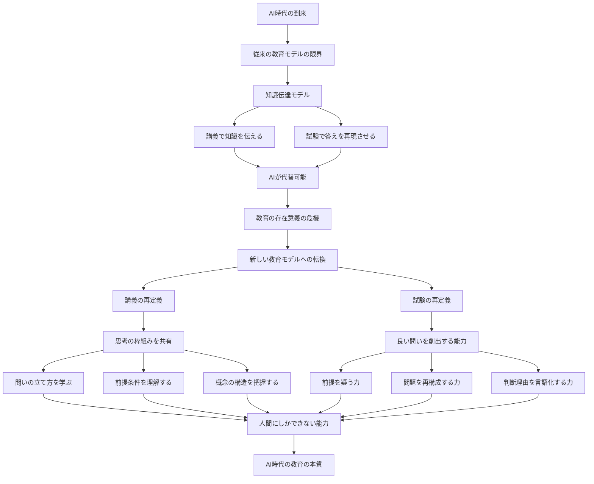
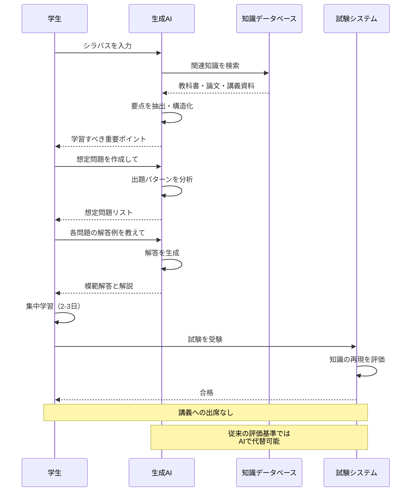

生成AI（ChatGPTなど）の登場により、大学の講義に一度も出席せずに試験に合格できる時代になりました。この事実は「AIが便利」という話ではなく、従来の教育システムが根本的に機能不全に陥っていることを示しています。

知識を伝えるだけの講義、正解を再現するだけの試験は、もはやAIで代替可能です。大学が生き残るには、講義を「思考の枠組みを学ぶ場」へ、試験を「良い問いを立てる能力を測る場」へと根本的に転換する必要があります。

これは小手先の対策（AI禁止、シラバス廃止など）では解決できません。教育の本質を問い直し、人間にしかできない能力を育て評価する仕組みへの大転換が求められています。

https://www.sbbit.jp/article/fj/179412

## 深掘り

### AI時代に露呈した教育システムの構造的欠陥

従来の大学教育は「知識伝達モデル」で成り立っていました。教授が体系化された知識を説明し、学生がそれを理解・記憶し、試験で再現する。このサイクルは200年以上続いてきた教育の基本形です。

しかし生成AIは、シラバスや教材を読み込んで要点を整理し、想定問題を作成し、解答例まで提示できます。つまり「知識の要点把握」と「標準的問題への対応」は、もはや人間が講義に出席しなくても実現できてしまうのです。

この現実が突きつけるのは「講義の存在意義とは何か？」という根源的な問いです。出席しなくても単位が取れるなら、なぜ講義が必要なのか。この問いに答えられない大学は、形式だけ残って中身が空洞化していくでしょう。

### 小手先の対策が本末転倒である理由

問題に対する安易な対処法として、以下のような案が考えられます：

**シラバス廃止案**：ChatGPTが想定問題を作れないよう、シラバスを公開しない。しかしこれは学生の学習権を侵害し、教育の質を後退させる本末転倒な策です。

**AI利用禁止案**：ChatGPTの使用を一律に制限する。しかしこれは19世紀の機械打ちこわし運動（ラッダイト運動）と同じ発想で、時代の流れに逆行するだけです。

**細部重視の出題**：講義に出席した学生だけが知り得る細かい情報を問う。しかしこれは本質的理解より些末な暗記を促し、教育の目的を歪めます。

これらの対策に共通するのは「AIの存在を否定しようとする」姿勢です。しかし問題の本質は、AIを排除できるかどうかではなく、AI時代における教育の役割を再定義できるかどうかなのです。

### 講義の再定義：知識伝達から思考の枠組みへ

講義が本来提供すべきは、完成された知識体系の暗記ではありません。むしろ以下のような「思考の枠組み」こそが重要です：

- その知識がどのような前提の下で構造化されているか
- どこに論点や議論の余地があるか
- どのように問いが立てられてきたか
- なぜその問いが重要なのか

例えば経済学の講義なら、単に「需要と供給の法則」を教えるのではなく、「なぜ価格メカニズムという問いが生まれたのか」「どんな前提が置かれているのか」「その前提が崩れるとどうなるのか」といった思考のプロセスを共有することが本質です。

### 試験の再定義：答えの再現から問いの創出へ

試験も同様に転換が必要です。従来の試験は「正しい答えを再現できるか」を測るものでした。しかしAIがそれを容易に行える以上、同じ能力を評価し続けることに意味はありません。

重要なのは、AIが代替できない能力を評価することです。具体的には：

- 前提を疑う力
- 問いそのものを組み替える力
- 複数の解釈を比較する力
- 不完全な情報の中で判断理由を言語化する力

極端な提案として「答えではなく、問いを出す能力を試す試験」が考えられます。将来AIがハルシネーション（誤情報生成）の問題を克服すれば、適切な問いさえあれば答えは得られます。であれば、人間は良い問いを作ることに専念すべきだという発想は論理的に自然です。

### 「良い問い」とは何か

「問いを出すだけなら基礎知識は不要では？」という反論があるかもしれません。しかしこれは誤解です。重要なのは「良い問い」を出すことであり、良い問いには深い基礎知識が不可欠だからです。

良い問いの条件：
- 前提条件を正確に理解している
- 何が既知で何が未解決かを把握している
- 概念間の関係を正しく認識している
- 問題の射程や影響範囲を見通している

実は高度専門領域では、この発想はすでに共有されています。研究者は「答え」より「問いの立て方」で評価され、政策立案では「正解」より「問題設定能力」が問われ、経営や監査でも「何を問うべきか」が成果を左右します。

教育評価をこれらの知的実務と同じ地平に引き上げることが求められているのです。

### 実現への最大の課題：評価の客観性

この提案の最大の課題は、問いの良し悪しをどう評価するかです。問いの深さ、前提の妥当性、問題設定の射程などは本質的に定性的であり、単純な採点には向きません。

そのため以下のような制度改革が不可分となります：
- 少人数教育の実現
- 記述評価の導入
- 複数評価者による多面的評価
- 教師自身の能力開発（新しいタイプの試験問題を作成できるか）

簡単には実現できませんが、現在の制度がそのままではAI時代に対応できないことは明らかです。形式としては残っても、形骸化し意味を失っていくでしょう。

### 深掘りを図解

### 用語解説

**生成AI（Generative AI）**
文章、画像、音声などを自動生成できる人工知能。ChatGPT、Claude、Geminiなどが代表例。大量のデータから学習し、人間のような自然な応答や創作が可能。

**シラバス（Syllabus）**
授業の計画書。授業の目的、内容、スケジュール、評価方法などをまとめた文書。学生が履修を決める際の重要な情報源。

**ハルシネーション（Hallucination）**
AIが事実ではない情報を、あたかも真実かのように生成してしまう現象。「幻覚」とも訳される。AIの重要な課題の一つ。

**ラッダイト運動（Luddite Movement）**
19世紀初頭のイギリスで起きた機械打ちこわし運動。産業革命による機械化で職を失うことを恐れた職人たちが、機械を破壊した。技術進歩への抵抗の象徴として使われる。

**問題設定能力（Problem Framing）**
適切な問いを立てる能力。何を問題として設定するかが、その後の解決策や成果を大きく左右する。高度な専門性を要する。

**定性的評価（Qualitative Assessment）**
数値化できない質的な側面を評価すること。記述式、面接、ポートフォリオなどの方法がある。客観性の確保が課題。

**知識伝達モデル（Knowledge Transmission Model）**
教師が知識を持ち、それを学生に伝えるという伝統的な教育観。一方向的な情報伝達を前提とする。

**思考の枠組み（Framework of Thinking）**
物事を考える際の基本的な視点や方法論。単なる知識ではなく、知識をどう構造化し使うかという「型」のこと。

## ルーツ・背景

### 大学教育の歴史的変遷

現代の大学教育システムの起源は、12世紀のヨーロッパにさかのぼります。ボローニャ大学（1088年）、パリ大学（1150年頃）など、最初期の大学は教会や修道院と深く結びついていました。

当時の教育方法は「講義（lecture）」が中心でした。これは「読む（legere）」というラテン語に由来し、文字通り教師が貴重な書物を読み上げ、学生がそれを書き写すことを意味していました。印刷技術がなかった時代、これが知識を伝える唯一の実用的方法だったのです。

### 産業革命と大規模教育の誕生

19世紀の産業革命は、教育システムにも革命をもたらしました。工場労働者の育成が必要となり、標準化された知識を効率的に大量伝達する仕組みが求められたのです。

このニーズに応えて生まれたのが「工場モデルの教育」です。一定時間座って講義を聞き、定期的に試験を受け、標準化された評価で選別される。この仕組みは、工場で規律正しく働ける労働者を育成するのに適していました。

現在の大学教育の基本構造（学期制、単位制、定期試験、成績評価）は、この時代に確立されたものです。

### 20世紀の教育理論の発展

20世紀には、知識伝達モデルへの批判が高まりました。デューイの「経験主義教育」、ピアジェの「構成主義」、ヴィゴツキーの「社会的構成主義」など、学習者の能動的な関与を重視する理論が登場しました。

しかし大学教育の実践レベルでは、講義と試験という基本構造はほとんど変わりませんでした。なぜなら、大規模教育を効率的に運営する代替手段がなかったからです。

### デジタル革命と教育の変化

21世紀に入り、インターネットとデジタル技術が教育を変え始めました。MOOCs（大規模公開オンライン講座）、反転授業、アダプティブラーニングなど、新しい試みが登場しました。

しかしこれらは主に「知識伝達の効率化」に焦点を当てていました。講義動画をオンラインで配信し、いつでもどこでも学べるようにする。これは便利ですが、教育の本質的な転換ではありませんでした。

### 生成AIの登場：200年ぶりの構造的転換点

2022年のChatGPT登場は、教育史における真の転換点となりました。なぜなら、200年間続いてきた「知識伝達モデル」そのものが機能不全に陥ったからです。

産業革命が工場モデルの教育を生み出したように、AI革命は新しい教育モデルを必要としています。ただし今回は、知識の効率的伝達ではなく、「人間にしかできない思考」を育てることが求められています。

歴史的に見れば、私たちは今、印刷技術の発明や産業革命に匹敵する、教育の根本的な再定義の時期にいるのです。

## 技術の仕組み

### 技術の仕組みを解説

#### 生成AIがどのように学習を支援するのか

生成AIは、大量のテキストデータから言語のパターンを学習した巨大な統計モデルです。シラバスや教科書を入力すると、以下のことができます：

**要点抽出**：長い文章から重要な概念やキーワードを自動的に抽出し、構造化してまとめます。人間が何時間もかけて行う作業を数秒で完了できます。

**想定問題の生成**：学習内容から出題されそうな問題を自動生成します。選択式、記述式、応用問題など、様々な形式で作成可能です。

**解答例の提示**：生成した問題に対する模範解答も作成できます。複数の解答パターンや、採点基準まで提示することも可能です。

**個別質問への対応**：理解できない部分について質問すれば、別の言い方で説明したり、具体例を挙げたり、図解したりして、理解を助けてくれます。

#### なぜ講義なしで試験に合格できるのか

従来の試験は「知識の再現」を評価していました。つまり：
1. 教科書や講義で学んだ内容を記憶する
2. 試験でその記憶を正確に再現する
3. 正解と照合して点数をつける

このプロセス全体が、AIによって代替可能です。シラバスから試験範囲を特定し、重要ポイントを抽出し、想定問題を解き、解答パターンを記憶する。これらすべてをAIが支援できるため、講義で教授の説明を聞く必要がなくなったのです。

#### AI時代の学習と従来の学習の違い

**従来の学習プロセス**：
講義出席 → ノート作成 → 教科書読解 → 要点整理 → 問題演習 → 試験対策 → 受験

**AI支援の学習プロセス**：
シラバス入力 → AI要点抽出 → AI問題生成 → AI解答確認 → 集中学習 → 受験

効率性は圧倒的にAI支援が上回ります。しかしこれは同時に、従来の教育システムが「本当に必要なスキル」を教え評価していなかったことを露呈しています。

#### 人間にしかできない思考とは

AIが苦手とする領域があります：

**前提を疑う思考**：AIは与えられた前提の範囲内で動作します。その前提自体が適切かを疑い、より根本的な問いを立てることは人間の役割です。

**文脈の深い理解**：AIは表面的なパターンマッチングは得意ですが、文化的・歴史的・倫理的な文脈を深く理解することは苦手です。

**創造的な問題再構成**：既存の問題を全く異なる角度から捉え直し、新しい問題として再構成することは、人間の創造性が発揮される領域です。

**判断の責任**：最終的な判断とその結果への責任を負うのは人間です。AIは選択肢を提示できても、決断の責任は取れません。

これらの能力こそ、AI時代に教育が育成すべき「人間にしかできない能力」なのです。

### 技術の仕組みを図解

## 実務での役立ち方

### ビジネスにおける問題設定能力の重要性

現代のビジネスでは「正解を実行する能力」より「正しい問いを立てる能力」が価値を持ちます。

例えば営業部門で「売上が伸び悩んでいる」という状況に直面したとき、多くの人は「どうすれば売上を増やせるか？」と問います。しかしこれは表面的な問いです。

より本質的な問いは「なぜ売上という指標に注目しているのか？」「顧客の真のニーズは何か？」「私たちが提供すべき価値は何か？」といったものかもしれません。問いの設定が変われば、導き出される戦略も全く異なります。

### プロジェクト管理での応用

プロジェクトが行き詰まったとき、「どう解決するか」の前に「何が本当の問題か」を問い直す能力が必要です。

表面的には納期遅延が問題に見えても、真の問題は要件定義の曖昧さかもしれません。あるいはチーム内のコミュニケーション不足、リソース配分の誤り、そもそものプロジェクト目的の不明確さかもしれません。

正しい問いを立てられれば、限られたリソースを最も効果的な部分に集中できます。これは「問題設定能力」が直接的に生産性向上につながる例です。

### 意思決定の質的向上

経営判断や重要な意思決定では、複数の選択肢から「最善」を選ぶことが求められます。しかし多くの場合、提示された選択肢そのものが適切とは限りません。

「A案とB案のどちらが良いか？」という問いに答える前に、「なぜこの2つが選択肢なのか？」「他の可能性は本当にないのか？」「そもそも今決めるべきことは何か？」と問い直す能力が、意思決定の質を劇的に高めます。

### データ分析・調査業務での活用

データ分析の価値は、データを集計することではなく、「何を分析すべきか」という問いを立てることにあります。

AIは膨大なデータから相関関係を見出せます。しかし「その相関に意味があるか」「因果関係と混同していないか」「ビジネス上の示唆は何か」といった解釈には、人間の判断が不可欠です。

適切な問いを立てられるアナリストは、同じデータから他の人が気づかない洞察を引き出せます。

### コミュニケーション能力の向上

良い問いは、会議やディスカッションの質を変えます。「この施策は成功するか？」という閉じた問いではなく、「成功をどう定義するか？」「誰にとっての成功か？」「短期と長期でトレードオフはあるか？」といった開かれた問いが、建設的な議論を生みます。

顧客との対話でも、「何をお求めですか？」ではなく、「どんな課題を解決したいですか？」「理想の状態はどんなものですか？」と問うことで、本質的なニーズを引き出せます。

### イノベーション創出への貢献

イノベーションは「答え」からではなく「問い」から生まれます。「スマートフォンをどう改善するか？」ではなく「人々は本当に電話をしたいのか？」という問いがiPhoneを生み出しました。

既存の枠組みを疑い、問題を再定義する能力は、破壊的イノベーションの源泉です。この能力は、AI時代においてますます希少価値を持つでしょう。

## キャリアへの効果

### 市場価値の向上：AI時代の差別化要因

今後、AIが普及するほど「AIでできること」の価値は下がります。逆に「AIではできないこと」の価値は相対的に上昇します。

問題設定能力、批判的思考力、創造的問い直しの力は、AIが代替しにくい能力です。これらを身につけることは、労働市場における希少性を高め、市場価値を向上させます。

具体的には、10年後に「データ入力」や「標準的な分析レポート作成」の仕事は大幅に減少するでしょう。一方で「戦略立案」「問題発見」「コンサルティング」といった、問いを立てる能力が必要な仕事の価値は上昇し続けます。

### 専門性の深化：表層的知識から本質的理解へ

従来のキャリア形成では、特定分野の知識を広く浅く持つことに価値がありました。しかしAIが膨大な知識にアクセスできる今、表層的な知識の優位性は失われつつあります。

代わりに重要になるのは、その分野の「思考の枠組み」を深く理解していることです。法律なら条文の暗記ではなく法的思考の構造、マーケティングなら手法の羅列ではなく消費者心理の本質的理解。

この本質的理解こそが、AIを使いこなし、AIでは到達できない洞察を生み出す基盤となります。

### キャリア転換の柔軟性

問題設定能力は、特定の業界や職種に依存しない汎用的スキルです。この能力を持つ人は、異なる分野への転職や複数のキャリアを掛け合わせることが容易になります。

例えば、エンジニアがビジネス側に移る、コンサルタントが起業する、専門職が教育に携わる。こうしたキャリア転換の成否は、新しい分野で「何が本質的な問題か」を素早く見抜けるかにかかっています。

### リーダーシップの基盤

組織のリーダーに求められるのは、チームが取り組むべき問題を定義する能力です。「正しい答え」を持っているリーダーより、「正しい問い」を立てられるリーダーが、不確実性の高い時代には必要とされます。

良い問いは、チームメンバーの思考を刺激し、自律的な行動を促します。これは、AIやリモートワークが普及する中で、ますます重要なリーダーシップスタイルとなるでしょう。

### 生涯学習能力の獲得

学習の本質が「知識の蓄積」から「思考の型の習得」に移行する中で、学び方そのものを学ぶことの重要性が増しています。

問いを立てる能力は、新しい分野を学ぶときの羅針盤となります。「この分野の核心的な問題は何か？」「どこから学び始めるべきか？」「何と何がつながっているか？」こうした問いを自ら立てられる人は、効率的に学習できます。

この生涯学習能力は、技術変化が加速する時代において、継続的なキャリア成長の鍵となります。

### 創造的な仕事への移行

AIが定型業務を代替するほど、人間の仕事は創造的な領域にシフトします。そして創造性の出発点は常に「良い問い」です。

アーティスト、デザイナー、ライター、研究者など、創造的職業はもちろん、あらゆる職種において創造的側面の比重が高まります。問題設定能力を持つことは、この移行を成功させる条件となります。

## 学習ステップ

### ステップ1：基礎理解フェーズ（1-2ヶ月）

**目標**：AI時代の教育が直面する課題と、自分の学習スタイルを理解する

具体的アクション：
- ChatGPTやClaudeなど生成AIを実際に使ってみる（無料版で十分）
- 自分の専門分野の基本的な概念をAIに説明させてみる
- その説明が適切か、不足している視点は何かを考える

チェックポイント：
- AIが得意なこと・苦手なことを3つずつ挙げられる
- 自分の学習でAIをどう使えそうか、具体的なアイデアが3つある

### ステップ2：批判的思考の基礎（2-3ヶ月）

**目標**：与えられた情報や前提を疑問視する習慣をつける

具体的アクション：
- ニュース記事を読むとき「この記事は何を前提としているか？」と自問する
- 職場や学校での議論で「そもそも何が問題なのか？」と立ち止まる
- 週に1回、気になるテーマについて「なぜ？」を5回繰り返すノートを書く

チェックポイント：
- 表面的な問題の背後にある本質的な問いを見つけた経験が3つある
- 「前提を疑う」ことで新しい視点が開けた実例を説明できる

### ステップ3：問いの質を高める（3-4ヶ月）

**目標**：答えやすい問いから、考えさせる問いへレベルアップする

具体的アクション：
- 「はい/いいえ」で答えられる閉じた問いを、開かれた問いに変換する練習
- 興味のあるトピックについて、「良い問い」を10個リストアップする
- それぞれの問いについて「なぜこれが重要な問いか」を説明する

チェックポイント：
- 同じテーマについて、表面的な問いと深い問いの違いを説明できる
- 自分の仕事や学習で「問いを変えたら結果が変わった」経験がある

### ステップ4：複数の視点を統合（4-6ヶ月）

**目標**：異なる立場や分野からの視点を取り入れ、問いを多面的にする

具体的アクション：
- 1つの問題について、3つの異なる専門分野からどう見えるか考える
- 賛成・反対の両方の立場から最良の議論を構築してみる
- 自分の考えに反する意見を積極的に読み、その論理を理解する

チェックポイント：
- 複雑な問題を多角的に分析し、それぞれの視点の長所・短所を述べられる
- 自分と異なる立場の人が重視する「問い」を理解し、説明できる

### ステップ5：実践と評価（継続的）

**目標**：日常的に問題設定能力を発揮し、フィードバックを得る

具体的アクション：
- 会議や議論の場で、積極的に「問い直し」を提案する
- プロジェクトの開始時に、チームで「本質的な問題は何か」を議論する時間を設ける
- 月1回、自分の立てた問いとその結果を振り返りジャーナルに記録する

チェックポイント：
- 自分の問いによって、議論や意思決定の方向が変わった経験がある
- 他者から「良い観点だ」「それは考えていなかった」というフィードバックを得ている

### ステップ6：専門性との統合（1年以上）

**目標**：自分の専門分野において、独自の問題設定ができるようになる

具体的アクション：
- 自分の分野の最新研究や動向について、「まだ問われていない問い」を探す
- 他分野の問題設定手法を自分の分野に応用してみる
- 学会、勉強会、ブログなどで自分の問いを発信し、議論する

チェックポイント：
- 自分の専門分野で、既存の枠組みを超える新しい問いを提示できる
- その問いが他者にとっても価値があると認められた経験がある

## あとがき

この記事が扱っているのは、単なる「大学教育の改革」ではありません。私たちの学び方、働き方、そして思考そのものが問い直されている時代の到来を告げるものです。

AIの登場で「知っていること」の価値が下がり、「考えられること」の価値が上がる。この転換は、実は多くの人が心のどこかで感じていたことではないでしょうか。暗記中心の教育に違和感を覚えながらも、「そういうものだ」と受け入れてきた。その違和感が、今、正当なものだったと証明されつつあります。

重要なのは、この変化を恐れるのではなく、チャンスと捉えることです。AIが定型的な仕事を代替するということは、私たちがより人間らしい、創造的な仕事に集中できるということでもあります。

ただし、その移行は自動的には起きません。私たち一人ひとりが、「答える人」から「問う人」へと変わる必要があります。それは決して簡単ではありませんが、学習ステップで示したように、段階的に取り組めば誰にでも可能です。

最後に、この記事を読んだあなた自身に問いかけてみてください。「私は何を問うべきか？」この問いへの答えを探す旅が、あなたのAI時代における学びと成長の出発点となるでしょう。

## オススメの書籍

### [問いかける技術 ― 確かな人間関係と優れた組織をつくる](https://amzn.to/3ZTp542)
組織心理学の第一人者が、なぜ「問い」が重要なのか、どのように問いかけるべきかを実践的に解説。上司と部下、医者と患者など、さまざまな関係性における問いの力を豊富な事例で示しています。ビジネスパーソンが即座に実践できる内容が魅力です。

### [イシューからはじめよ改訂版 ――知的生産の「シンプルな本質」](https://amzn.to/3Zp6EE9)

「正しく問題を設定すること」の重要性を、マッキンゼーとヤフーでの経験を基に語った名著。「イシュー（本質的な問い）を見極めよ」というメッセージは、本記事のテーマと完全に一致します。図解も多く、初学者にも分かりやすい構成です。

### [「超」AI整理法 ― 無限にためて瞬時に引き出す](https://amzn.to/4qpXeTQ)

経済学者がAI時代の知的生産術を語った一冊。AIをどう使いこなすかという実践的な内容から、AIと人間の役割分担まで、幅広く扱っています。「AIに任せるべきこと、人間がやるべきこと」の線引きを考える上で参考になります。

### [AI時代の大学と社会 ― アメリカでの学長経験から](https://amzn.to/4qkUyHj)

日本の大学教授、アメリカの大学長を歴任した著者による、日米の教育比較。学長としての体験談や、アメリカ移住のコラムなど、実体験にもとづく生きた文章を一冊の本に。本記事で扱った「講義の意味」「試験の在り方」について、より学術的な観点から深掘りしています。教育関係者だけでなく、すべての学ぶ人に読んでほしい内容です。

### [新版　考える技術・書く技術　問題解決力を伸ばすピラミッド原則](https://amzn.to/4qYqmTk)

論理的思考とコミュニケーションの古典的名著。「問題は何か」を明確にし、それに答える構造を作る技術を体系的に学べます。問題設定能力の基礎となる論理的思考力を鍛えるのに最適な一冊です。ビジネス文書作成にも直接役立ちます。
