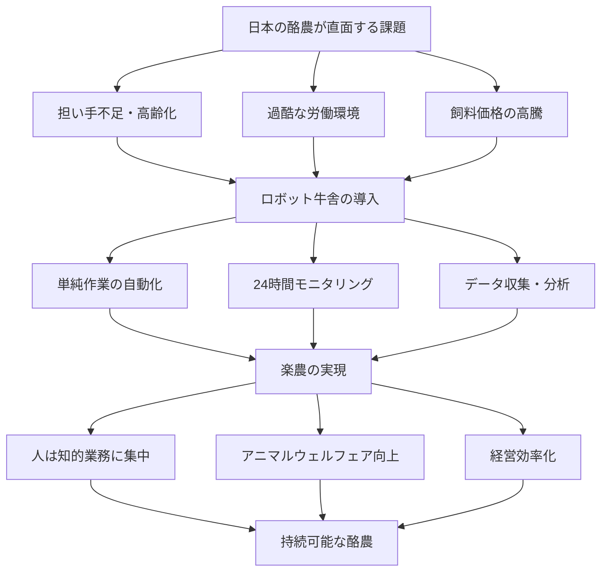
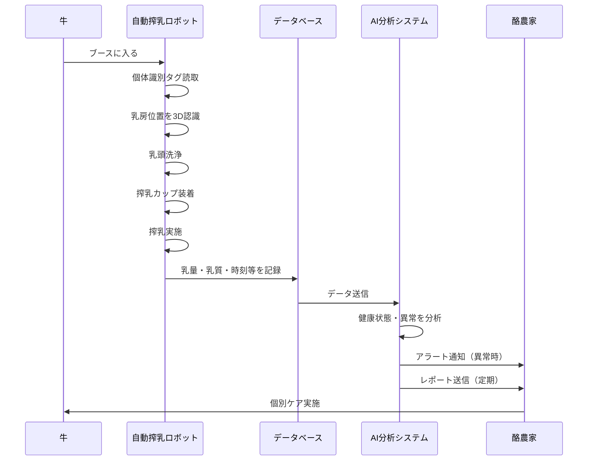
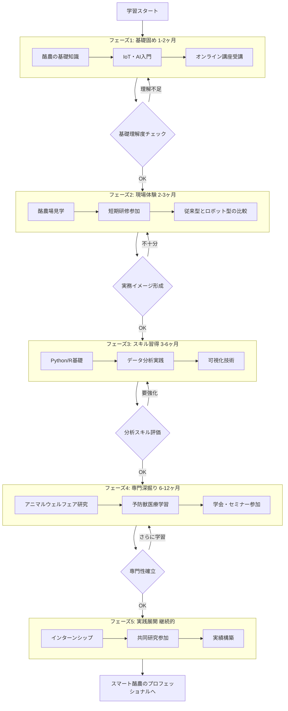

酪農学園大学が建設を進める「未来型ロボット牛舎」は、自動搾乳ロボット、給餌ロボット、除糞ロボットなどの最先端技術を導入し、酪農現場の労働負担を大幅に軽減する施設です。

このプロジェクトは、担い手不足や高齢化に苦しむ日本の酪農を、単純作業をロボットに任せ、人間は牛の健康管理や経営に専念できる「楽農」へと進化させることを目指しています。

2026年完成予定で、約150頭を飼育。動物福祉（アニマルウェルフェア）にも配慮し、牛が快適に過ごせる環境を科学的に実現します。

https://digitalpr.jp/r/128006

## 深掘り

### なぜ今「ロボット牛舎」が必要なのか

日本の酪農は深刻な課題に直面しています。担い手不足、高齢化、飼料価格の高騰により、酪農家の廃業が相次いでいます。特に酪農は365日休みなく、早朝からの搾乳作業や給餌、牛舎の清掃など、肉体的に過酷な労働が続きます。この「苦労」が若者の参入を阻み、産業全体の衰退を招いているのです。

### 「楽農」という新しいコンセプト

酪農学園大学が提唱する「楽農」は、単に「楽をする」という意味ではありません。ロボットやAI、ICTが単純作業を担うことで、人間は本来注力すべき「牛一頭一頭の健康観察」「データに基づく経営判断」「愛情を持った飼育」に時間を使えるようになります。これは労働の「質的転換」であり、酪農を知的で魅力的な仕事へと変える取り組みです。

### アニマルウェルフェアの実装

動物福祉（アニマルウェルフェア）は、国際的な潮流として重要性が高まっています。牛がストレスなく快適に過ごせる環境を整えることは、倫理的な観点だけでなく、乳質の向上や病気の予防にもつながります。ロボットによる24時間体制のモニタリングで、牛の小さな体調変化も見逃さず、「病気になってから治す」から「病気になる前に守る」予防獣医療が可能になります。

### データドリブンな酪農経営

従来の酪農は経験と勘に頼る部分が大きかったのですが、ロボットとICTの導入により、牛の行動パターン、食事量、乳量、健康状態などがすべてデータ化されます。このデータを分析することで、最適な飼料配合、個体ごとの健康管理、経営効率の改善が科学的に行えるようになります。

### 深掘りを図解

### 用語解説

**アニマルウェルフェア（動物福祉）**: 動物が心身ともに健康で、ストレスなく快適に過ごせる状態を保つこと。国際的な基準では「5つの自由」（飢えと渇きからの自由、不快からの自由、痛み・病気・怪我からの自由、正常な行動を表現する自由、恐怖や苦悩からの自由）が指標とされています。

**ICT（Information and Communication Technology）**: 情報通信技術の総称。センサー、ネットワーク、クラウドなどを活用してデータを収集・分析・共有する技術です。

**自動搾乳ロボット**: 牛が自主的にロボットに入ると、自動で乳房を洗浄し搾乳する機械。牛のペースで搾乳でき、人手による決まった時間の搾乳作業が不要になります。

**給餌ロボット**: 設定されたプログラムに従って、牛舎内を自動走行し、牛に餌を配る機械。個体ごとの最適な量と栄養バランスを管理できます。

**除糞ロボット**: 牛舎内の糞を自動で収集・除去する機械。清潔な環境を保ち、病気のリスクを低減します。

**予防獣医療**: 病気になってから治療するのではなく、日々のデータや観察から異変を早期発見し、病気を未然に防ぐ獣医学のアプローチ。

**健土健民**: 酪農学園大学の建学の理念。健康な土壌が健康な作物を育て、それが健康な家畜と人間を育むという、自然との調和を重視する考え方。

## ルーツ・背景

### 酪農とロボット技術の歴史

酪農の機械化は20世紀初頭の搾乳機の発明から始まりました。1960年代にはバケット式からパイプライン式へと進化し、大規模化が進みました。1990年代後半、オランダで世界初の自動搾乳ロボットが実用化され、酪農業界に革命をもたらしました。日本では2000年代に入ってから導入が始まり、現在では北海道を中心に普及が進んでいます。

### 日本の酪農が抱えてきた構造的課題

日本の酪農は戦後、北海道を中心に発展してきましたが、小規模経営が多く、家族経営が主体でした。1980年代以降、後継者不足が顕在化し、2000年代には高齢化と担い手不足が深刻化。さらに2020年代には飼料価格の高騰や環境規制の強化が追い打ちをかけ、離農が加速しています。

### アニマルウェルフェアの国際的潮流

欧州では1960年代から動物福祉への関心が高まり、1990年代以降は法制化が進みました。日本では遅れていましたが、2010年代から国際基準への対応が求められるようになり、特に輸出を視野に入れた場合、アニマルウェルフェアへの対応は避けられない課題となっています。

### 酪農学園大学の取り組みの系譜

酪農学園大学は1933年の創立以来、「健土健民」の理念のもと、実学教育を重視してきました。附属農場での実践的な教育は伝統であり、今回のプロジェクトもその延長線上にあります。時代の変化に応じて教育内容を進化させ、常に日本の酪農を牽引する人材を輩出してきた歴史があります。

## 技術の仕組み

### 技術の仕組みを解説

**自動搾乳ロボットの仕組み**: 牛が自主的にロボットブースに入ると、まず個体識別タグを読み取ります。次にレーザーやカメラで乳房の位置を3D認識し、ロボットアームが乳頭をブラシで洗浄。その後、搾乳カップが自動装着され搾乳が始まります。搾乳中は乳量、乳質、搾乳速度などがリアルタイムで測定され、データとして記録されます。

**給餌ロボットの仕組み**: レール上を走行するタイプや自律走行するタイプがあります。あらかじめ設定されたスケジュールや牛の状態に応じて、餌を混合し、決められた場所に配分します。牛が食べた量もセンサーで測定し、次回の給餌量に反映させることができます。

**除糞ロボットの仕組み**: 床面をスキージのような装置で自動清掃します。定期的に牛舎内を巡回し、糞を集めて指定場所へ運びます。清潔な環境を保つことで、蹄病などの疾病リスクを低減します。

**データ統合システム**: 各ロボットから集められたデータは中央のクラウドシステムに集約され、AI が分析します。牛の健康状態の異変、発情の兆候、最適な飼料配合などを自動で検出し、スマートフォンやPCで確認できます。

### 技術の仕組みを図解

## 実務での役立ち方

### 酪農現場での直接的な活用

酪農家にとって最大のメリットは労働時間の削減です。従来は早朝5時から始まる搾乳作業に2〜3時間、夕方にも同様の時間が必要でしたが、ロボット化により拘束時間が大幅に減ります。その時間を使って、経営計画の立案、マーケティング、牛の健康観察など、より付加価値の高い業務に集中できます。

### 獣医療・畜産コンサルタントへの応用

獣医師やコンサルタントは、ロボットが収集した膨大なデータを活用して、より科学的な診断やアドバイスができるようになります。経験や勘だけでなく、エビデンスに基づいた提案が可能になり、プロフェッショナルとしての価値が高まります。

### 食品・流通業界での差別化

アニマルウェルフェアに配慮した生産プロセスは、消費者からの信頼獲得につながります。小売業やレストラン業界では、こうした牛乳・乳製品を「エシカル商品」として差別化し、ブランド価値を高めることができます。

### IT・ロボット業界のビジネスチャンス

農業×テクノロジーの市場は急成長しています。センサー開発、AI分析ツール、ロボット保守サービスなど、新たなビジネス機会が生まれています。異業種からの参入も増えており、技術力を活かせる分野です。

### 教育・研修での活用

このような最先端施設は、教育機関にとって貴重な実習の場となります。学生が実際にロボットを操作し、データを分析することで、理論と実践を結びつけた学びが可能になります。社会人向けのリスキリング研修の場としても活用できます。

## キャリアへの効果

### 農業分野でのキャリアの可能性拡大

これまで「きつい、汚い、危険」のイメージが強かった酪農が、データサイエンスやロボット工学を活用するスマート産業へと変わりつつあります。理系人材、IT人材にとって、農業は新たなキャリアフィールドとして魅力的な選択肢になります。

### 複合的スキルの価値向上

ロボット牛舎を運営するには、畜産の知識、データ分析力、機械のメンテナンス技術、経営感覚など、複数のスキルが必要です。こうした複合的な能力を持つ人材は、今後ますます市場価値が高まります。

### グローバルな活躍の機会

日本で培ったスマート酪農の知見は、世界中で需要があります。特にアジアの新興国では、これから酪農の近代化が進むため、日本の先進事例を学びたいというニーズが高まっています。国際的なコンサルタントやアドバイザーとして活躍する道が開けます。

### 起業・新規事業の創出

農業テック（アグリテック）の分野では、スタートアップの成功事例が増えています。酪農×ITの知見を持つことで、新たなサービスやプロダクトを開発し、起業する選択肢も広がります。

## 学習ステップ

### 学習ステップを解説

#### ステップ1: 基礎知識の習得（1〜2ヶ月）

まずは酪農の基本を学びましょう。牛の生理、乳牛の品種、搾乳の仕組み、飼料の種類など、基礎的な知識をオンライン講座や書籍で学びます。同時に、IoT、AI、データ分析の入門知識も並行して学習します。

#### ステップ2: 現場見学・体験（2〜3ヶ月）

可能であれば実際の酪農場を見学したり、短期の研修プログラムに参加しましょう。従来型の牛舎とロボット牛舎の両方を見ることで、技術導入の効果を実感できます。酪農学園大学のような教育機関のオープンキャンパスや公開講座も活用しましょう。

#### ステップ3: データ分析スキルの習得（3〜6ヶ月）

Excel、Python、Rなどを使った基本的なデータ分析を学びます。特に時系列データの扱い方、統計的な異常検知、可視化の技術は重要です。オンライン学習プラットフォームで実践的なプロジェクトに取り組みましょう。

#### ステップ4: 専門知識の深掘り（6〜12ヶ月）

アニマルウェルフェアの国際基準、予防獣医療、精密畜産（Precision Livestock Farming）など、より専門的なテーマを学びます。学会やセミナーに参加し、最新の研究動向をキャッチアップします。

#### ステップ5: 実践プロジェクトへの参加（継続的）

学んだ知識を活かして、実際のプロジェクトに参加します。インターンシップ、共同研究、コンサルティングなど、形式は様々です。失敗を恐れず、小さくても良いので実績を積み重ねましょう。

### 学習ステップを図解

## あとがき

酪農学園大学の「農場・Renewプロジェクト」は、単なる施設の更新ではなく、日本の酪農の未来を切り開く挑戦です。「酪農」から「苦労」を引いて「楽農」へ――このシンプルながら力強いメッセージには、現場の切実な課題と、それを解決しようとする強い意志が込められています。

技術は手段であって目的ではありません。ロボットやAIを導入する真の目的は、人間が本来向き合うべき「生命（いのち）との対話」に時間を使えるようにすることです。牛一頭一頭の個性を理解し、健康を見守り、快適な環境を提供する。そのために必要な時間と心の余裕を、技術が生み出してくれます。

また、このプロジェクトは教育機関ならではの意義を持ちます。学生たちが最先端の環境で学び、実践することで、次世代の酪農を担う人材が育ちます。彼らが現場に出たとき、「酪農は苦しい仕事」ではなく「知的でやりがいのある仕事」として捉えられるような、そんな未来を作ろうとしているのです。

私たちビジネスパーソンにとっても、このプロジェクトから学べることは多くあります。伝統的な産業に最新技術を融合させるアプローチ、人間中心の設計思想、持続可能性への配慮――これらは、どの業界にも通じる普遍的な価値です。

日本の新しい農業が始まります。

## オススメの書籍

### [アニマルウェルフェアとは何か: 動物の幸せについての科学と倫理](https://amzn.to/4kqhnrJ)』
動物福祉の基本概念から国際基準、実践方法まで、科学的根拠に基づいて解説。畜産に関わる人必読の一冊です。

### [図解よくわかる　実践！スマート農業　デジタル技術による効率的な農業経営](https://amzn.to/4asqYcX)
日本のスマート農業の全体像を俯瞰できます。酪農だけでなく、稲作、施設園芸などの事例も豊富です。
