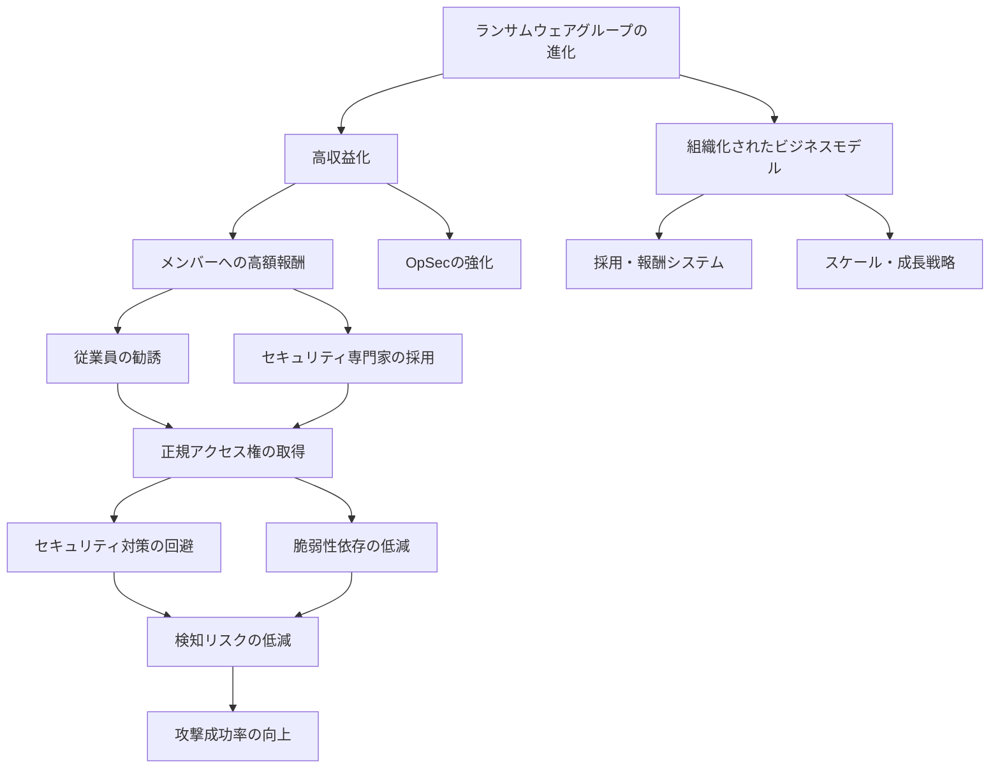
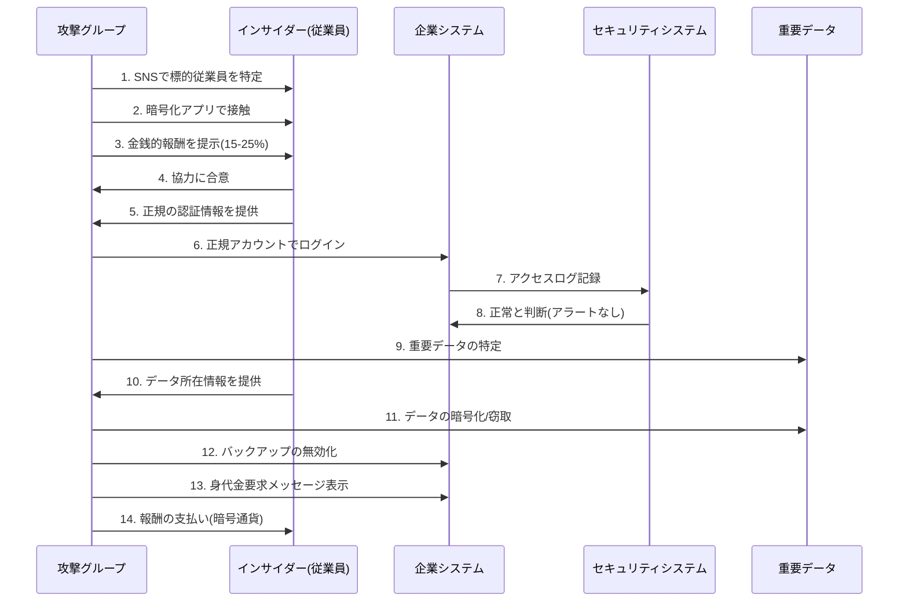
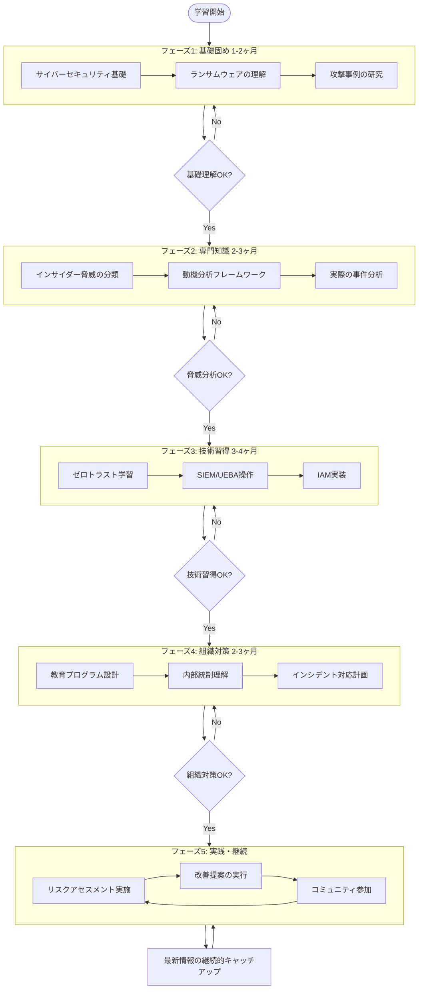

# ランサムウェア集団が企業の「中の人」を狙う時代：Qilinの脅威と対策
サイバー攻撃グループが企業の従業員やセキュリティ専門家を積極的に採用する動きが加速しています。

アサヒGHDを攻撃したQilinをはじめとするランサムウェアグループは、正規の認証情報やシステムアクセス権を得るため、内部関係者に高額報酬を提示。

2025年12月にはランサムウェア攻撃が前月比13%増加し、Qilinだけで170件の攻撃を実行しました。

攻撃者は脆弱性に頼らず、内部者を使うことでセキュリティ対策を回避する戦略へシフトしています。

https://techtarget.itmedia.co.jp/tt/news/2602/04/news10.html

## 深掘り

### ランサムウェアグループの「採用活動」の実態

攻撃グループは従来の技術的な侵入手法から、人的要素を活用する戦略へと移行しています。NCC Groupの調査によれば、Ransomware as a Service（RaaS）モデルを採用するグループが、企業の正規従業員に接触し、システムアクセス権と引き換えに身代金の15〜25%という高額報酬を提示しています。

BBC特派員への勧誘事例では、攻撃グループMedusaが最初15%、拒否されると25%まで報酬を引き上げました。この柔軟な交渉姿勢は、攻撃グループがビジネスとして洗練されていることを示しています。

### 高収益化するランサムウェアビジネス

2025年12月のランサムウェア攻撃件数は前月比13%増加し、攻撃グループの収益も大幅に増加しています。この資金力により、メンバーへの高額報酬支払いが可能になり、さらに堅牢なOpSec（作戦セキュリティ）の整備も進んでいます。

Qilinグループは2025年12月だけで170件の攻撃を成功させ、次点のAkira（78件）の2倍以上の活動量を記録しました。この攻撃規模は、組織的なビジネスモデルとしての成熟度を物語っています。

### セキュリティ専門家までもが標的に

米国では2025年11月、BlackCatランサムウェアを使用した攻撃で、インシデント対応やランサムウェア交渉を専門とするセキュリティプロフェッショナル3人が起訴されました。そのうち1人は借金を理由に犯行に加担したとされています。

この事例は、専門知識を持つ人材が経済的圧力により攻撃側に転じるリスクを示しており、企業は技術的防御だけでなく、従業員の経済状態や心理的ストレスにも注意を払う必要があります。

### 深掘りを図解

### 用語解説

**ランサムウェア（Ransomware）**
コンピュータやデータを暗号化して使用不能にし、復旧と引き換えに身代金を要求する悪意あるプログラム。

**Ransomware as a Service（RaaS）**
ランサムウェアを「サービス」として提供するビジネスモデル。開発者が攻撃ツールを提供し、実行者（アフィリエイト）が攻撃を行い、利益を分配する仕組み。

**OpSec（Operations Security）**
作戦セキュリティ。自組織の活動、目的、機密情報などを敵対者に知られないように保護するための取り組み。

**インサイダー脅威（Insider Threat）**
組織内部の人間（従業員、契約社員、元従業員など）が組織に損害を与える行為。意図的なものと非意図的なものがある。

**脆弱性（Vulnerability）**
システムやソフトウェアの設計・実装上の欠陥で、攻撃者に悪用される可能性のある弱点。

**ソーシャルエンジニアリング（Social Engineering）**
人間の心理的な隙や行動の特性を利用して、機密情報を入手したり、不正行為をさせたりする攻撃手法。

## ルーツ・背景

### ランサムウェアの歴史的進化

ランサムウェアの起源は1989年の「AIDS Trojan」まで遡ります。しかし、本格的な脅威となったのは2010年代以降で、2013年のCryptoLockerが現代的なランサムウェアの原型となりました。当初は個人を標的とした小規模な攻撃が主流でしたが、2016年頃から企業や組織を狙う「ビッグゲームハンティング」へと移行しました。

### RaaSモデルの登場

2015年頃からRaaSモデルが登場し、攻撃の敷居が大幅に下がりました。技術的な知識がなくても、既製のランサムウェアツールを使って攻撃を実行できるようになったのです。このモデルは、ソフトウェア業界のSaaS（Software as a Service）を模倣したもので、攻撃の民主化と産業化をもたらしました。

### インサイダー脅威の認識の高まり

インサイダー脅威自体は古くから存在しましたが、2010年代後半から組織的に内部者を勧誘する動きが顕著になりました。2020年のTesla事件（従業員に100万ドルを提示した勧誘未遂）などが転換点となり、技術的防御だけでは不十分であることが広く認識されるようになりました。

### サイバー犯罪のビジネス化

2020年代に入り、サイバー犯罪は完全にビジネスモデルとして確立しました。攻撃グループは人事、マーケティング、カスタマーサポートまで備えた「企業」として機能しており、従来の犯罪組織とは異なる洗練された運営を行っています。

## 技術の仕組み

### インサイダーを活用した攻撃の流れ

従来のランサムウェア攻撃は、フィッシングメールやシステムの脆弱性を悪用して侵入するものでした。しかし、インサイダーを活用する手法では、既に正規のアクセス権を持つ人間が協力するため、セキュリティシステムを「正面突破」できます。

まず、攻撃グループは標的企業の従業員を特定します。LinkedInなどのSNSで職務内容やアクセス権限のレベルを推測し、接触する相手を選びます。次に、SignalやTelegramなどの暗号化メッセージアプリを通じて接触し、金銭的報酬を提示します。

従業員が協力に同意すると、正規の認証情報（IDとパスワード）やVPNアクセス、社内システムへのアクセス権を提供します。攻撃グループはこれらを使って堂々とシステムに侵入し、データを暗号化したり窃取したりします。

### 正規アクセス権を使う利点

この手法の最大の利点は、異常な動きとして検知されにくいことです。従業員が普段使っているアカウントで、通常の業務時間内にアクセスするため、セキュリティシステムのアラートを回避できます。また、パッチが適用される前の脆弱性を探す必要もなく、攻撃の準備期間を大幅に短縮できます。

さらに、内部者は重要なデータの所在や、バックアップシステムの場所、セキュリティ対策の弱点を熟知しているため、攻撃の効率が飛躍的に向上します。

### 技術の仕組みを図解

## 実務での役立ち方

### セキュリティ担当者への実践的知見

この脅威を理解することで、セキュリティ担当者は技術的対策だけでなく、人的リスク管理の重要性を経営層に説明できます。ゼロトラストアーキテクチャの導入、アクセス権限の最小化、異常行動検知システムの導入など、具体的な対策を提案する根拠となります。

### 人事・総務部門での活用

従業員のバックグラウンドチェックや退職プロセスの見直しに活用できます。特に、システム管理者や機密情報にアクセスできる職務の採用時には、より慎重な審査が必要です。また、経済的困窮などのストレスサインを早期に発見するための相談窓口の設置なども有効です。

### 経営層への啓蒙活動

経営層にとって、サイバーセキュリティは「IT部門の問題」と捉えられがちです。しかし、この事例を通じて、従業員満足度、労働環境、報酬体系といった経営課題とセキュリティが密接に関連していることを示せます。セキュリティ投資の必要性を説得する材料となります。

### 監査・コンプライアンス部門での応用

内部統制の観点から、職務分掌の適切性、アクセス権限の妥当性、ログ監視体制の評価に活用できます。また、インサイダー脅威を想定したリスクアセスメントの実施や、インシデント対応計画の策定に役立ちます。

### 一般従業員への教育

全従業員が「自分も標的になり得る」という意識を持つことが重要です。不審な接触を受けた際の報告体制を整備し、報告者を保護する仕組みを作ることで、攻撃グループの勧誘を早期に検知できます。

## キャリアへの効果

### セキュリティ専門家としての市場価値向上

インサイダー脅威対策は、技術的スキルと人間理解の両方が必要な高度な領域です。この分野に精通することで、CISO（最高情報セキュリティ責任者）やセキュリティコンサルタントとしてのキャリアパスが開けます。

### 横断的なスキルセットの獲得

この問題は、セキュリティ、人事、法務、経営戦略にまたがる横断的なテーマです。これらを統合的に理解することで、組織全体を俯瞰できる人材として評価されます。特にDX推進やリスク管理の分野で重宝されるでしょう。

### グローバルな視点の獲得

サイバー攻撃は国境を越えた脅威です。国際的なセキュリティ基準や法規制、海外の事例を学ぶことで、グローバルビジネスに対応できる人材として差別化できます。

### 経営層との対話能力

技術的な詳細を経営的なリスクとして翻訳する能力は、IT部門と経営層をつなぐブリッジ人材として非常に価値があります。この能力は、CIO（最高情報責任者）やCTO（最高技術責任者）へのキャリアパスにつながります。

## 学習ステップ

### ステップ1：基礎知識の習得（1〜2ヶ月）

**目標**: サイバーセキュリティとランサムウェアの基本を理解する

- サイバーセキュリティの基本概念（CIA triad、認証・認可など）を学習
- ランサムウェアの種類と攻撃手法を理解
- 代表的な攻撃事例を5件以上調査

**チェックポイント**:
- ランサムウェアとマルウェアの違いを説明できる
- RaaSモデルの仕組みを図解できる

### ステップ2：インサイダー脅威の理解（2〜3ヶ月）

**目標**: 内部脅威の種類と対策を体系的に学ぶ

- CERT Insider Threat Centerの資料を読む
- 実際のインサイダー事件を分析（Tesla事件、Edward Snowden事件など）
- 動機分析フレームワーク（MICE: Money, Ideology, Compromise, Ego）を学習

**チェックポイント**:
- 意図的脅威と非意図的脅威を分類できる
- インサイダー脅威の兆候を5つ以上挙げられる

### ステップ3：技術的対策の学習（3〜4ヶ月）

**目標**: 実践的な防御技術を習得する

- ゼロトラストアーキテクチャの概念を学習
- SIEM（Security Information and Event Management）の基本操作
- UEBAツール（User and Entity Behavior Analytics）の理解
- アクセス権限管理（IAM: Identity and Access Management）の実装

**チェックポイント**:
- ゼロトラストの7原則を説明できる
- 異常行動検知の基本ルールを設定できる

### ステップ4：組織的対策の理解（2〜3ヶ月）

**目標**: 人的・組織的なセキュリティ対策を学ぶ

- セキュリティ意識向上トレーニングの設計手法
- 内部統制フレームワーク（COSO、COBITなど）
- インシデント対応計画の策定方法
- 従業員のストレス管理とメンタルヘルス

**チェックポイント**:
- セキュリティ教育プログラムの企画書を作成できる
- インシデント対応フローチャートを作成できる

### ステップ5：実践とアウトプット（継続的）

**目標**: 学んだ知識を実務に活かし、継続的に更新する

- 自社のインサイダー脅威リスクアセスメントを実施
- セキュリティポリシーの見直し提案
- 経営層向けプレゼンテーション資料の作成
- 業界コミュニティへの参加（JPCERT/CC、ISOG-Jなど）

**チェックポイント**:
- 具体的な改善提案を3件以上実行できた
- セキュリティカンファレンスで情報収集できている

### 学習ステップを図解

## あとがき

ランサムウェアグループが企業の「中の人」を積極的に採用する時代は、サイバーセキュリティの新たな局面を迎えています。技術的な防御だけでなく、従業員一人ひとりが攻撃の標的となり得るという認識が不可欠です。

この脅威は、セキュリティを「IT部門の問題」から「経営課題」へと昇格させる契機でもあります。従業員の労働環境、報酬、メンタルヘルス、そして組織文化そのものがセキュリティと直結しているのです。

Qilinのような攻撃グループは、単なる犯罪者集団ではなく、洗練されたビジネスモデルを持つ組織として進化しています。私たちもまた、技術と人間理解を統合した、より高度な防御戦略を構築する必要があります。

この記事が、セキュリティ担当者だけでなく、経営層、人事部門、そして一般従業員の方々にとって、新たな視点を提供できれば幸いです。サイバーセキュリティは、もはや全員参加の経営課題なのです。

## オススメの書籍

### [サイバーセキュリティ レッドチーム実践ガイド](https://amzn.to/45YKV9R)
攻撃者の視点を理解することで、より効果的な防御戦略を構築できます。インサイダーを活用した攻撃手法の技術的側面を深く学べます。

### [実践　不正リスク対応ハンドブック](https://amzn.to/3ZwUVU4)
日本の組織に特化したインサイダー脅威対策の実務書。組織的対策から技術的対策まで、具体的な実装方法が詳しく解説されています。

### [ゼロトラストネットワーク 第2版 ―境界防御の限界を超えるためのセキュアなシステム設計](https://amzn.to/4rN0UQN)
「誰も信頼しない」という前提に立つゼロトラストの概念を体系的に学べます。インサイダー脅威対策の技術的基盤として必読です。

### [ランサムウエアから会社を守る　～身代金支払いの是非から事前の防御計画まで](https://amzn.to/3MlrXUg)
ランサムウェアの最新動向から実践的な対策まで、日本企業の事例を交えて解説。経営層への説明資料としても活用できます。

### [経営層のためのサイバーセキュリティ実践入門～生成AI、DX、コネクティビティ時代を勝ち抜くための必須スキル～](https://amzn.to/4awZOS9)
経営層がサイバーセキュリティにどう向き合うべきかを示した公的ガイドラインの解説書。セキュリティを経営課題として位置づけるための必携書です。
