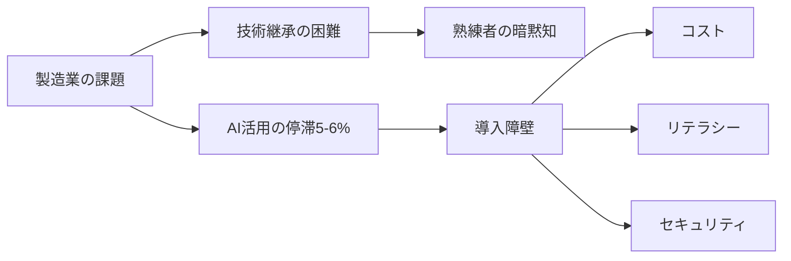
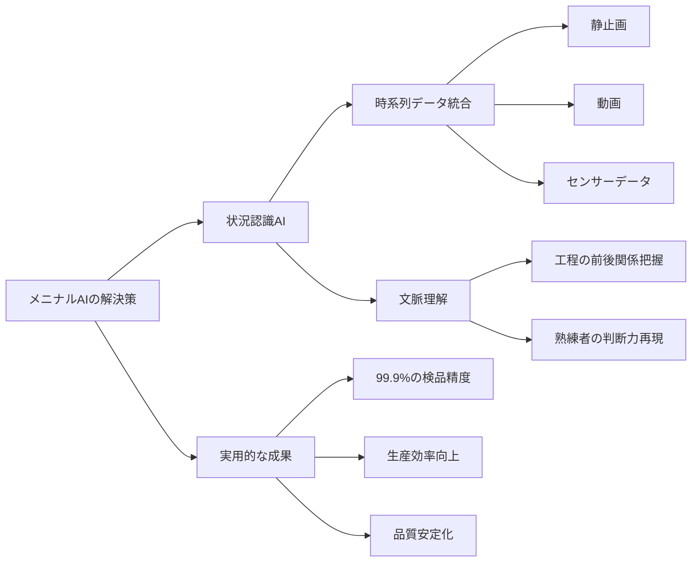
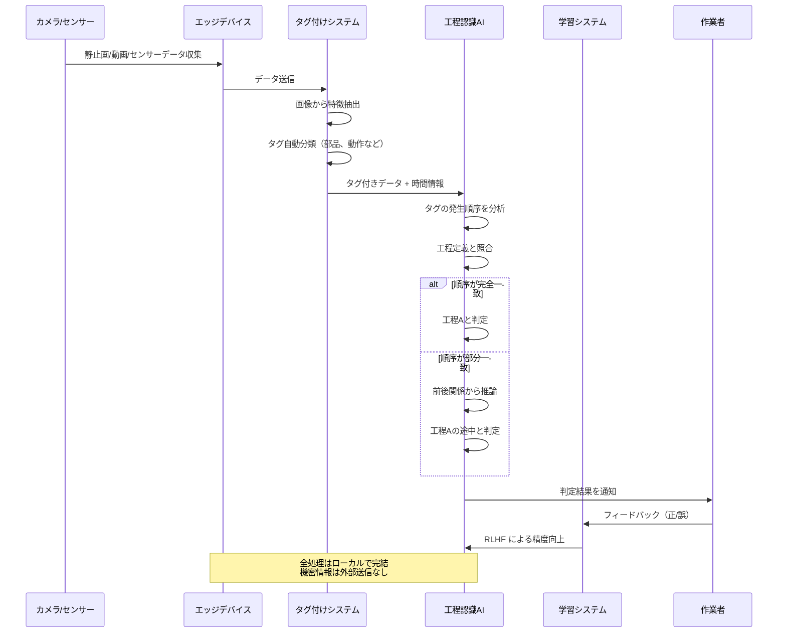

# 製造業の技術継承を革新する「メニナルAI」とは？熟練者の判断力をAIで再現する新技術を徹底解説

ソフトクリエイトが発表した「メニナルAI」は、製造業における熟練技術者の「工程全体を見渡す判断力」をAIで再現するサービスです。

静止画・動画・センサーデータを統合し、工程の前後関係を理解することで、技術継承の課題を解決します。

クラウドに依存せずローカルで動作するため機密性が高く、使い込むほど精度が向上する特徴があります。

https://monoist.itmedia.co.jp/mn/articles/2602/13/news032.html

## 深掘り

### 製造業が直面する技術継承の危機

日本の製造業は今、深刻な課題に直面しています。2025年のアンケート調査によれば、製造業に従事する2500人のうち、AIを実際に活用できている企業はわずか5〜6%程度。多くの企業がリテラシー不足、導入コスト、運用体制、セキュリティといった壁に阻まれています。

特に深刻なのが技術継承の問題です。熟練作業者は長年の経験から「工程全体の流れ」を理解し、前後の文脈を踏まえた判断を行っています。しかし、この暗黙知は言語化が難しく、若手への伝承が困難です。

### メニナルAIが実現する「状況認識AI」の革新性

メニナルAIの最大の特徴は、単なる画像認識ではなく「状況認識」ができる点です。従来のAIは「今この瞬間に何が映っているか」しか判断できませんでしたが、メニナルAIは時系列データを統合することで「今何が起きているのか」という文脈を理解します。

例えば、"チョキ""チョキ""グー"という順序を「工程A」と定義した場合、撮影が途中から始まって"チョキ""グー""チョキ"という順序になっても、メニナルAIは「手前にもう1つ"チョキ"が来れば工程Aになる」と推論し、「工程Aの途中」と判断できます。

### 実証実験で証明された高い実用性

300以上の細かな工程で構成される現場では、メニナルAIが工程の前後関係を自動判定し、生産効率と品質の安定化に貢献しました。

また、金属の反射などで従来の画像認識AIでは困難だった部品の嵌合状態の検品では、AIが自動で画像補正を施すことで、99.9%という高精度での不良品検出を達成しています。

### 深掘りを図解

### 用語解説

**AI（人工知能）**: コンピュータが人間のように学習・推論・判断を行う技術

**状況認識AI**: 単なる画像認識ではなく、時系列データから「今何が起きているか」という文脈を理解するAI

**ファインチューニング**: 既存のAIモデルを特定の現場や用途に合わせて追加学習させること

**RLHF（人間のフィードバックによる強化学習）**: 人間の評価をもとにAIの性能を改善していく学習方法

**エッジデバイス**: クラウドではなく、現場のローカル環境で動作する機器

**IoT（モノのインターネット）**: さまざまな機器がインターネットに接続され、データをやり取りする仕組み

**ハッシュ化**: データを一定の法則で変換し、改ざんを検知できるようにする技術

**ブロックチェーン**: データの改ざんが極めて困難な分散型データベース技術

**嵌合（かんごう）**: 部品同士がぴったりとはまり合うこと

**プロンプトフィルター**: AIへの指示（プロンプト）を監視し、不適切な指示を排除する仕組み

## ルーツ・背景

### 画像認識技術の進化

画像認識AIの歴史は1950年代の初期コンピュータビジョン研究に遡ります。2012年のディープラーニング革命により、画像認識の精度が飛躍的に向上しました。しかし、従来の画像認識は「静止画1枚」を分析するのみで、時間的な文脈を理解することができませんでした。

### 製造業DXの歴史的背景

日本の製造業は1980年代に世界を席巻しましたが、2000年代以降、デジタル化の遅れが指摘されてきました。経済産業省が提唱する「Connected Industries」（2017年）やDX推進政策により、製造業のデジタル変革が急務となっています。

### 技術継承問題の深刻化

団塊世代の大量退職（2007年問題）以降、製造現場の技能継承は喫緊の課題です。熟練技術者の持つ「カン・コツ」は形式知化が難しく、多くの企業が技術の空洞化に直面しています。

### 時系列AI技術の登場

近年、Transformerアーキテクチャ（2017年）やLSTM（長短期記憶）といった時系列データを扱う技術が発展し、文脈を理解するAIが可能になりました。メニナルAIはこれらの技術を製造現場に特化させた応用例と言えます。

## 技術の仕組み

### 技術の仕組みを解説

メニナルAIは3つの層で動作します。

**第1層：データ取得層**
現場のカメラやセンサーから、静止画・動画・センサーデータを収集します。重要なのは、連続した動画である必要がなく、監視カメラの断続的な画像でも機能する点です。

**第2層：タグ付けと工程定義層**
収集した画像に「部品を持つ」「組み立てる」「確認する」といったタグを付けます。そして、タグの発生順序を指定して「工程A」「工程B」といった工程を定義します。

**第3層：推論・判断層**
新しい画像データが入力されると、AIは自動的にタグを分類し、タグの時間順序から「今どの工程なのか」を認識します。重要なのは、順序が完全一致しなくても、前後関係から「工程の途中」であることを推論できる点です。

この仕組みを支えるのが、独自開発した「連続している事象の時間幅を自動的に最適化する仕組み」と「フィルターの仕組み」で、これらは特許出願されています。数学的には複雑な時系列パターンの相関計算が必要ですが、メニナルAIでは各事象を独立したものとして扱うことで、計算を簡略化しています。

また、小型のローカル生成AIと従来型アルゴリズムを組み合わせたハイブリッド方式により、機密情報を外部に送信せずエッジデバイスで処理できます。

### 技術の仕組みを図解

## 実務での役立ち方

### 品質管理の自動化と標準化

従来は熟練検査員の目視に頼っていた品質チェックを、AIが99.9%の精度で自動化できます。人手不足の現場でも、24時間安定した品質管理が可能になります。特に、金属の反射など難しい条件下でも高精度な検品ができる点は実用的です。

### 技術継承の効率化

熟練者の判断プロセスをAIが学習・再現することで、暗黙知の形式知化が進みます。新人教育の時間を短縮し、ベテラン退職後も技術レベルを維持できます。手順書の自動生成機能により、マニュアル作成の手間も削減されます。

### 工程管理の見える化

300以上の細かな工程を自動で認識・記録することで、どの工程でどれだけ時間がかかっているかが可視化されます。ボトルネックの特定や改善活動のPDCAサイクルが加速します。

### セキュリティを保ちながらのAI活用

機密性の高い製造現場では、データを外部に送ることが大きなリスクです。メニナルAIはローカルで動作するため、企業秘密を守りながらAIの恩恵を受けられます。生成AI用ファイアウォール機能により、不正なアクセスや情報漏洩も防止できます。

### 段階的な導入が可能

軽量で低コストなため、大規模投資が難しい中堅企業でも導入しやすい設計です。まず一部の工程から始めて、効果を確認しながら展開できます。

## キャリアへの効果

### 製造業DXの推進者として市場価値向上

製造業のDXは今後10年の最重要課題です。AI活用の実務経験を持つ人材は、製造業界で引く手あまたとなります。特に、現場の課題とAI技術の両方を理解できる「橋渡し人材」は希少価値が高く、キャリアアップの大きな武器になります。

### 複数領域のスキル獲得

メニナルAIの活用を通じて、画像認識・時系列分析・IoT・エッジコンピューティングなど、複数の先端技術を実践的に学べます。これらは製造業以外の分野（小売、物流、医療など）でも応用可能で、キャリアの選択肢を広げます。

### マネジメント層への昇進機会

技術継承やDX推進は経営課題です。これらのプロジェクトをリードできる人材は、現場からマネジメント層への昇進が期待できます。データドリブンな意思決定スキルは、管理職として不可欠な能力です。

### AI時代の雇用安定性

AIに仕事を奪われるのではなく、AIを使いこなす側に立つことで、雇用の安定性が高まります。特に製造業は日本経済の基幹産業であり、その最先端技術を扱えることは長期的なキャリアの安定につながります。

## 学習ステップ

### ステップ1：基礎知識の習得（1〜2ヶ月）

**目標**: AI・機械学習の基本概念を理解する

- オンライン学習プラットフォーム（Coursera、Udemy等）でAI入門コースを受講
- 画像認識の基本原理を学ぶ
- Pythonの基礎を習得（プログラミング未経験の場合）

**チェックポイント**: 「教師あり学習」「ニューラルネットワーク」「畳み込み」といった用語を説明できる

### ステップ2：製造業の現場理解（1ヶ月）

**目標**: 製造現場の課題とプロセスを把握する

- 自社または取引先の工場見学を実施
- 熟練作業者にインタビューし、暗黙知を言語化する練習
- 工程フロー図を自分で作成してみる

**チェックポイント**: 1つの製造工程について、課題と改善案を具体的に提案できる

### ステップ3：画像認識の実践（2〜3ヶ月）

**目標**: 簡単な画像認識AIを自分で構築する

- Google Teachable MachineやCreate MLなど、ノーコードツールで画像分類を体験
- OpenCVライブラリを使った画像処理を実践
- 小規模なデータセット（100枚程度）で良品・不良品判定を試す

**チェックポイント**: 自分で撮影した画像データを使って、80%以上の精度で分類できるモデルを作成

### ステップ4：時系列データの扱い（2〜3ヶ月）

**目標**: 時系列データ分析の基礎を習得する

- センサーデータの収集方法を学ぶ（Arduino、Raspberry Pi等）
- 時系列データの可視化（グラフ化）
- 異常検知の基本手法を実装

**チェックポイント**: 温度センサーなどのデータを収集・分析し、異常を検出できる

### ステップ5：統合プロジェクトの実施（3〜6ヶ月）

**目標**: 画像とセンサーデータを組み合わせた小規模AIシステムを構築

- 実際の現場課題を1つ選定（例：組立工程の進捗管理）
- カメラとセンサーでデータ収集
- タグ付けと工程定義を実践
- 関係者にフィードバックをもらい改善

**チェックポイント**: 小規模でも実際に動作するプロトタイプを完成させ、現場で試用

### ステップ6：運用とチューニング（継続的）

**目標**: AIの精度向上と現場への定着を推進

- RLHFの仕組みを理解し、フィードバックループを構築
- 定期的な精度評価とファインチューニング
- 他部門や他工程への横展開を検討

**チェックポイント**: 3ヶ月以上の継続運用を実現し、初期より精度が向上していることを数値で示せる

### ステップ7：専門性の深化（1年以上）

**目標**: AI活用のリーダーとなる

- AIエンジニアやデータサイエンティストの資格取得（G検定、E資格など）
- 学会や勉強会での発表
- 社内でのAI活用推進プロジェクトをリード

**チェックポイント**: 社内外でAI活用事例を発表し、他社からの見学や相談を受ける立場になる

## あとがき

メニナルAIは、日本の製造業が直面する技術継承という深刻な課題に対する、実践的な解決策です。単なる技術的な新しさだけでなく、現場の実態に即した設計思想が光ります。

特に注目すべきは、クラウドに依存せずローカルで動作する点、そして使い込むほど精度が向上するRLHF対応です。これらは「AIを導入して終わり」ではなく、「現場と共に成長するAI」という新しい価値を提示しています。

また、ソフトクリエイトがセキュリティやAIの系譜管理（ブロックチェーン活用）にこだわっている点も重要です。製造業では機密情報の保護が最優先であり、「どんなAIが働いているのか分からない」状態は受け入れられません。「素性の知れているAI」という表現には、同社の製造現場への深い理解が表れています。

今後、音声認識AI「ミミニナルAI」やフィジカルAI（物理制御AI）へと展開していく構想も示されており、製造業のAI活用は新たなステージに入ろうとしています。

この技術を学び、現場で活用できる人材は、日本の製造業の未来を支える存在となるでしょう。小さな一歩から始めて、AIと共に成長する姿勢が大切です。

## オススメの書籍

### スマートシンキングで進める工場変革 つながる製造業の現場改善とITカイゼン
法政大学教授による、製造業DXの実践的な手引き。コロナ禍を経験し、デジタルシフトが加速する製造業の変革法を具現化する。個別企業や現場が有機的につながり、価値を生む仕組みをスマートシンキングと定義。中小製造業でも実践できる現業と管理、ITをつなぐプラットフォーム再構築を16のチャートを用いて実現する。

### [Pythonで動かして学ぶ 自然言語処理入門](https://amzn.to/4tAl4Pu)
プログラミング初心者向けに、Pythonを使った機械学習の実装方法を丁寧に解説。画像認識だけでなく、テキスト処理や時系列データの扱い方も学べます。実際に手を動かしながら学びたい方に最適です。

### [図解即戦力　機械学習&ディープラーニングのしくみと技術がこれ1冊でしっかりわかる教科書](https://amzn.to/4aztTk8)
見開き2ページで1つのトピックを完結させる構成で、忙しいビジネスパーソンでも読みやすい。ディープラーニング、画像認識、時系列分析など、メニナルAIに関連する技術要素が網羅的に理解できます。

### [イラスト図解 スマート工場のしくみ IoT、AI、RPAで変わるモノづくり](https://amzn.to/3MGn48j)
工場業務のシステムがスマート化で具体的にどう変わるのか、どう活かしていくのか、工場全体の業務についてくわしく解説。メニナルAIのようなエッジAIの活用方法、センサーデータの収集・分析、現場へのAI導入プロセスなど、実務に直結する知識が得られます。
