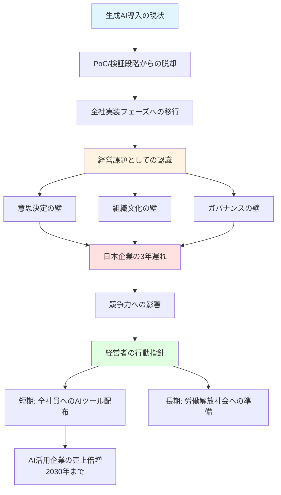
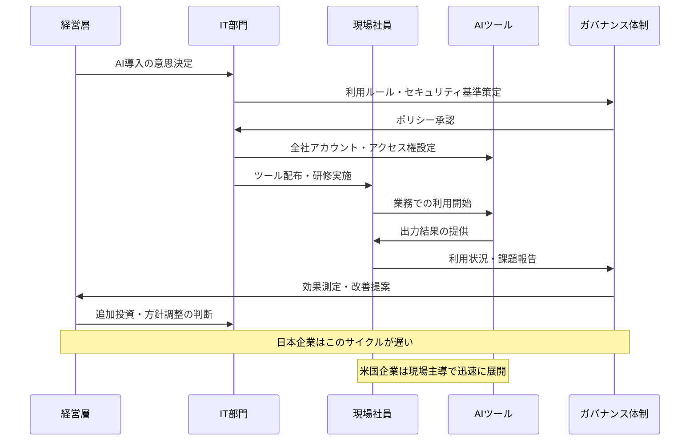

# 生成AI導入で日本企業が直面する経営課題と実装戦略の全貌

WEB 300 Conferenceという選抜制カンファレンスで、生成AIの実装を主導する経営層300名が集結し、AI導入が「技術の問題」から「経営の問題」へと変化していることが明らかになった。

日本企業のAI導入は米国より3年遅れており、その原因は技術力ではなく意思決定のスピードや組織文化にある。元Google Japan代表の村上憲郎氏は「資本主義の終わりの始まり」という理想を語りつつ、足元では全社員へのAIツール配布を経営者の最優先課題として提言。

生成AIは検証段階を終え、全社実装という経営判断が求められるフェーズに突入している。

https://biz-journal.jp/company/post_393443.html

## 深掘り

### PoCから全社実装への転換点

生成AIの導入は、もはや一部門での実験段階を脱却し、企業全体の競争力を左右する経営マターとなった。300名の意思決定層が集まった場で交わされた議論は、技術的な可能性の検証ではなく、全社展開における障壁の克服に焦点が当てられていた。具体的には、現場の抵抗をどう乗り越えるか、ガバナンス体制をどう設計するか、リスクをどう管理するかといった、経営判断を伴う実践的な課題が中心だった。

### 日本企業が抱える3年遅れの本質

米国と比較して3年遅れているという指摘は、単なる技術導入のタイミングの問題ではない。根本的な差異は、意思決定プロセスの速度、全社展開を可能にする権限設計、そして失敗を許容する企業文化にある。日本企業の多くは合意形成を重視するため意思決定に時間がかかり、部門間の壁が高いため全社展開の権限設計が複雑化し、失敗を避ける文化が実験的な取り組みを阻害している。この構造的な問題が、AI活用において競争劣位を生み出している。

### 二層構造から見るメッセージ

元Google Japan代表の村上氏は、長期的な理想と短期的な実務の両方を語ることで、経営者が持つべき視座を示した。「人類が労働から解放される」という理想論は、AI時代の本質的な変化を見据えた哲学的な視点だが、同時に「今すぐ全社員にAIツールを配布せよ」という極めて具体的な行動指針を提示している。この二層構造は、経営者が遠い未来のビジョンを持ちながらも、足元の具体的なアクションを怠ってはならないというメッセージを含んでいる。

### 深掘りを図解

### 用語解説

**PoC (Proof of Concept)**: 概念実証。新しい技術やアイデアが実際に機能するかを検証する小規模な実験的プロジェクト。生成AI導入においては、限定的な範囲で効果を確認する初期段階を指す。

**全社展開**: 特定部門や限定的な範囲での試験運用を終え、企業全体に技術やシステムを導入すること。生成AIの場合、全従業員が日常業務で活用できる状態を意味する。

**ガバナンス設計**: 組織における意思決定の仕組み、権限配分、責任の所在、リスク管理体制などを定めること。AI導入では、データの取り扱い、利用範囲、セキュリティ基準などのルール策定が含まれる。

**WEB 300 Conference**: 公募・推薦により選ばれた300名限定の招待・審査制カンファレンス。AI実装を主導する意思決定層が参加し、実践的な議論を行う場。

**意思決定層**: 企業や組織において重要な判断を下す権限を持つ経営陣や上級管理職。技術責任者やCxOレベルの役職者を指すことが多い。

## ルーツ・背景

### 生成AIブームの起点

生成AIが経営課題として認識されるようになった転換点は、2022年11月のChatGPTの一般公開だった。それ以前もGPT-3などの大規模言語モデルは存在したが、誰もが使える形でリリースされたことで、ビジネス現場への影響が可視化された。日本企業も2023年から本格的な検証を開始したが、すでに米国企業は全社展開を進めており、ここで3年の差が生まれた。

### 日本企業のIT導入文化

日本企業が新技術の導入で慎重になる背景には、1990年代後半から2000年代にかけての大規模システム導入の失敗体験がある。ERP導入やデジタル化プロジェクトで多額の投資が無駄になった経験から、「まず小さく試す」「失敗を避ける」という文化が定着した。この慎重姿勢が、スピードが求められるAI時代においては逆に足かせとなっている。

### 招待制カンファレンスの必要性

一般公開のカンファレンスでは、参加者のレベルや関心が多様すぎて深い議論ができないという課題があった。特に生成AIのような新技術では、「どう使うか」から「どう経営判断するか」へと議論の深度を上げる必要があるが、オープンな場では本音の意思決定プロセスや失敗事例を共有しにくい。WEB 300のような選抜制の場が価値を持つのは、参加者全員が「実装する当事者」という共通基盤を持つからだ。

## 技術の仕組み

### 技術の仕組みを解説

生成AI自体の技術は、大規模言語モデル(LLM)と呼ばれる、膨大なテキストデータから学習したAIシステムだ。しかし企業導入における「仕組み」とは、技術そのものよりも、それをどう組織に組み込むかの設計を指す。具体的には、社員がどのツール(ChatGPT、Gemini、Claudeなど)にアクセスできるようにするか、どのようなデータを入力してよいか、出力結果をどう検証するか、といった運用ルールの構築が核心となる。

技術導入の仕組みは三層構造で考えられる。第一層はインフラ整備で、全社員がAIツールにアクセスできる環境を作る。第二層はガバナンスで、機密情報の取り扱いやAI出力の責任所在を明確にする。第三層は文化醸成で、AIを使うことへの心理的抵抗を減らし、積極的な活用を促進する仕組みを作る。日本企業が遅れているのは、この三層すべてにおいて意思決定と実行が遅いためだ。

### 技術の仕組みを図解

## 実務での役立ち方

### 経営判断の加速

生成AIに関する知識は、経営層やマネジメント層が迅速な意思決定を行うために不可欠だ。技術の詳細を理解する必要はないが、「何ができて何ができないか」「どのようなリスクがあるか」「競合他社の動向」を把握することで、投資判断や全社展開のタイミングを適切に判断できる。特に「3年遅れている」という事実を認識することは、危機感を持って行動するための重要な指標となる。

### 組織変革のリーダーシップ

AI導入は技術導入ではなく組織変革であるという認識を持つことで、現場の抵抗や文化的な障壁に対処できるようになる。変革を推進する立場にある人は、村上氏の「全社員にツールを配布する」という明確な指針を実行する際に、単なるツール配布ではなく、使い方の研修、成功事例の共有、失敗を許容する文化の醸成といった包括的なアプローチを設計できる。

### ガバナンス体制の構築

AI導入におけるリスク管理は、法務、情報セキュリティ、コンプライアンスの各部門が連携して取り組む必要がある。具体的には、どのような情報をAIに入力してよいか、AI生成コンテンツの著作権はどう扱うか、誤った出力による損害の責任は誰が負うか、といった問題に対する社内ルールを策定する。この知識があれば、実務レベルでの運用マニュアル作成や社員教育プログラムの設計に直接活かせる。

### 競争優位の獲得

AI活用企業は2030年までに1人当たり売上が倍増するという予測があることを知っていれば、自社のAI活用度を定量的に測定し、改善施策を立案できる。営業部門なら提案書作成の効率化、マーケティング部門ならコンテンツ生成の自動化、人事部門なら採用プロセスの最適化など、各部門で具体的な活用方法を考え、実装することで、個人レベルでも生産性向上に貢献できる。

## キャリアへの効果

### AI時代の意思決定者としての価値

生成AIの実装に関する知識と経験を持つことは、今後のキャリアにおいて極めて高い市場価値を持つ。特に「技術を理解しつつ経営判断ができる人材」は希少であり、CxOレベルや事業責任者への昇進において強力な武器となる。WEB 300のような選抜制の場に参加できる人材は、社内外で「実装を推進できるリーダー」として認識され、重要プロジェクトへのアサインや転職市場での評価が高まる。

### 組織変革を主導できる能力

AI導入という組織変革を経験することで、変革マネジメントのスキルが身につく。これは他の技術導入やビジネス変革にも応用できる普遍的な能力だ。現場の抵抗を説得する力、異なる部門を調整する力、リスクを管理しながら前進させる力は、どのような業界や企業でも求められるリーダーシップの本質であり、長期的なキャリア形成において強固な基盤となる。

### 次世代技術への適応力

生成AIは今後も進化し続け、新たな技術が次々と登場する。今の段階で「新技術を組織に実装する」というプロセスを経験しておくことで、次の技術革新が来たときにも迅速に対応できる適応力が養われる。この適応力こそが、技術変化の激しい時代において最も重要なキャリア資産となる。一度この経験を積めば、次のAI技術、量子コンピューティング、その他の革新技術が登場しても、同じフレームワークで対処できる。

### グローバル標準への接近

米国企業との3年の差を認識し、それを埋めるための行動を取ることは、グローバル標準のビジネススピードや意思決定プロセスを体得することを意味する。日本企業にいながらグローバル基準の仕事の進め方を実践できる人材は、国際的なプロジェクトや外資系企業への転職において高く評価される。AI実装の経験は、グローバルキャリアへの扉を開く鍵となる。

## 学習ステップ

### ステップ1: 基礎知識の習得(1-2ヶ月)

まず生成AIとは何かを理解することから始める。ChatGPT、Claude、Geminiなどの主要なツールを実際に使ってみて、何ができて何ができないかを体感する。この段階では、プロンプトの書き方、回答の精度、限界などを自分で試すことが重要だ。毎日30分、業務に関連する質問をAIに投げかけ、出力を検証する習慣をつける。

**チェックポイント**: 主要な3つのAIツールを使い、それぞれの特性の違いを説明できる。業務で使えそうな具体的なユースケースを5つ以上リストアップできる。

### ステップ2: 組織導入の事例研究(2-3ヶ月)

国内外の企業がどのようにAIを導入しているかの事例を収集し、成功要因と失敗要因を分析する。特に自社と似た業種や規模の企業の事例に注目する。カンファレンスへの参加、ウェビナーの視聴、事例記事の精読を通じて、実装プロセスの全体像を把握する。

**チェックポイント**: 最低10社の導入事例を分析し、共通する成功パターンと失敗パターンを整理できる。自社に適用できそうな施策を3つ以上具体的に提案できる。

### ステップ3: 小規模実装の実践(3-6ヶ月)

自分の所属する部門やチームで小規模なAI活用プロジェクトを立ち上げる。全社展開を目指す前に、限定的な範囲で効果を検証し、問題点を洗い出す。例えば、チーム内の議事録作成、提案書のドラフト作成、データ分析の補助など、明確に効果測定できるタスクを選ぶ。

**チェックポイント**: 3ヶ月間のパイロットプロジェクトを完遂し、定量的な効果(時間削減率、品質向上度など)を測定できる。発生した問題とその解決策を文書化できる。

### ステップ4: ガバナンス設計の学習(2-3ヶ月)

AI活用におけるリスク管理、セキュリティ、コンプライアンスについて学ぶ。法務部門や情報セキュリティ部門と連携し、社内ルールの策定に関わる。どのような情報を入力してよいか、出力結果の責任はどう扱うか、著作権はどうなるかといった問題に対する方針を理解する。

**チェックポイント**: 自社のAI利用ガイドラインの草案を作成できる。少なくとも5つの主要なリスクとその対策を具体的に説明できる。

### ステップ5: 全社展開の企画立案(3-6ヶ月)

小規模実装の成果をもとに、全社展開の計画を立てる。予算、スケジュール、体制、研修プログラム、効果測定の方法などを具体的に設計する。経営層へのプレゼンテーション資料を作成し、承認を得るプロセスを経験する。他部門の責任者と調整し、全社的な合意形成を図る。

**チェックポイント**: 経営層に提出できるレベルの全社展開計画書を完成させる。少なくとも3つの部門から賛同を得られる。投資対効果(ROI)を定量的に示せる。

### ステップ6: 継続的改善と知識共有(継続的)

全社展開後も、利用状況のモニタリング、問題点の収集、改善施策の実施を継続的に行う。社内外のコミュニティに参加し、最新の動向や他社事例を学び続ける。自社の経験を社外で発表したり、後進の育成に関わることで、知識を深化させる。

**チェックポイント**: 四半期ごとに効果測定レポートを作成し、改善施策を実行している。社内で「AI活用の専門家」として認知され、相談を受ける立場になっている。

## あとがき

生成AIの導入は、もはや「やるかやらないか」ではなく「いつ、どのように全社展開するか」という段階に入っています。WEB 300 Conferenceで交わされた議論が示すのは、技術の可能性を語る時代の終わりと、経営判断が求められる時代の到来です。

村上憲郎氏が語った「資本主義の終わりの始まり」という壮大なビジョンと、「今すぐ全社員にツールを配布せよ」という具体的な行動指針は、一見矛盾するようで実は深くつながっています。遠い未来を見据えながらも、足元の一歩を着実に踏み出すこと。これが、AI時代を生き抜く組織と個人に求められる姿勢なのかもしれません。

日本企業の3年遅れは、悲観すべき事実であると同時に、今から行動すれば挽回できる可能性を示してもいます。選ばれた議論の場で交わされる本音の対話が、その挽回のヒントを与えてくれるはずです。

## オススメの書籍

### [生成AI導入の教科書](https://amzn.to/4tJcMoS)
生成AIの基礎から企業導入の実践までを網羅した入門書。技術的な説明と経営的な視点がバランスよく解説されており、意思決定層が最初に読むべき一冊。

### [DX経営戦略](https://amzn.to/4kDqxAY)
デジタル変革を経営課題として捉え、組織をどう動かすかに焦点を当てた実践的な戦略書。AI導入を含む技術変革の推進方法が具体的に学べる。

### [AIガバナンス入門: リスクマネジメントから社会設計まで](https://amzn.to/4rWVZgg)
AI活用におけるリスク管理、倫理、法的問題を体系的に解説。企業がAIを導入する際に直面するガバナンスの課題と対策が詳しく書かれている。

### [THE MODEL マーケティング・インサイドセールス・営業・カスタマーサクセスの共業プロセス](https://amzn.to/3ZEl6Ix)
組織変革と業務プロセスの再設計を実践的に解説。AI導入という変革を組織全体で推進するための考え方とフレームワークが学べる。

### [イノベーションのジレンマ 増補改訂版 Harvard business school](https://amzn.to/4qIu3vA)
新技術の導入がなぜ既存企業で難しいのかを理論的に説明した古典的名著。日本企業がAI導入で遅れる構造的な理由を理解するための必読書。
