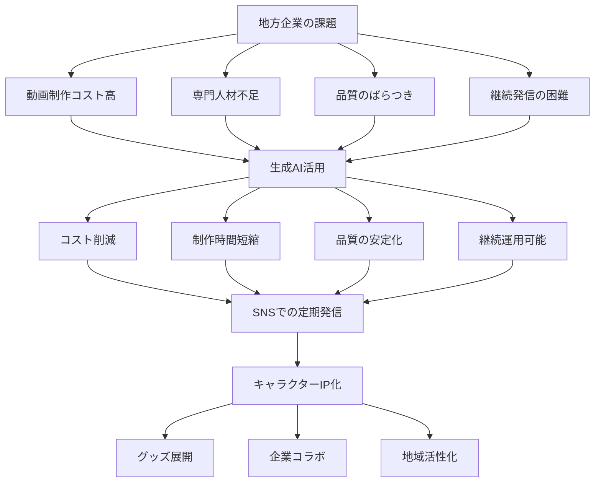
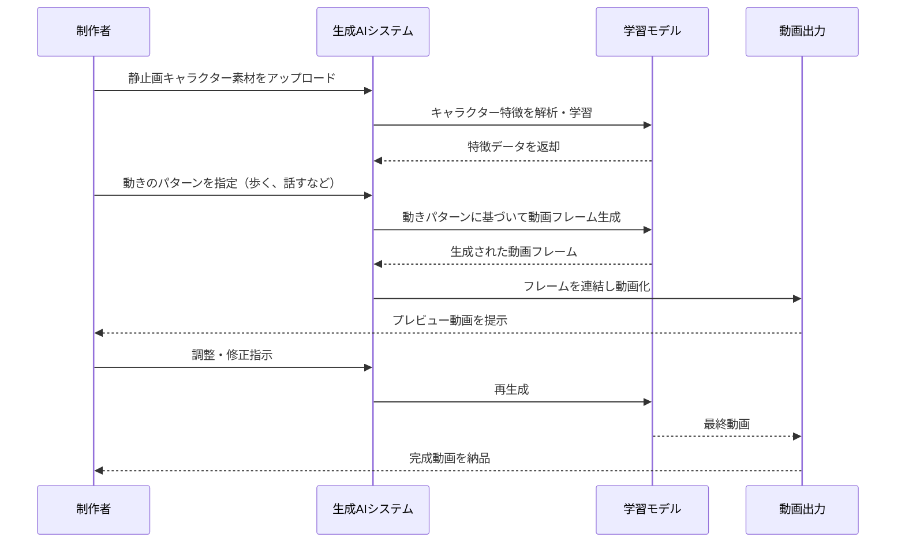

# 山梨ゴリゴリラを動かす生成AI活用術──地方発キャラクター動画で学ぶ、次世代コンテンツ制作の全貌

山梨県の企業・株式会社アルプスが、イラストレーター中野シロウ氏のキャラクター「山梨ゴリゴリラ」を生成AIで動画化するプロジェクトを開始しました。

静止画のキャラクターをSNS向けのショート動画として継続的に制作し、Instagram、YouTube Shorts、TikTokなどで発信します。

これまで地方企業が抱えていた「動画制作コストの高さ」「専門人材不足」「品質のばらつき」といった課題を、生成AIの活用で解決し、キャラクターの世界観を保ちながら低コストで量産できる仕組みを構築しました。

地域の魅力発信と、中小企業の新しい広報モデルとして注目されています。

https://prtimes.jp/main/html/rd/p/000000009.000105870.html

https://www.youtube.com/@%E5%B1%B1%E6%A2%A8%E3%82%B4%E3%83%AA%E3%82%B4%E3%83%AA%E3%83%A9

## 深掘り

### 地方企業が直面する動画コンテンツの壁

従来、地方企業や自治体がSNSで動画を発信しようとすると、制作会社への外注費用が1本あたり数十万円かかることも珍しくありませんでした。さらに、定期的に発信するには継続的な予算確保が必要で、多くの組織では実現困難でした。特にキャラクター動画の場合、アニメーターの確保やキャラクターの表情・動きの統一が難しく、品質がばらつくとブランドイメージを損なうリスクもありました。

### 生成AIが変えるキャラクター動画制作

今回のプロジェクトでは、生成AI技術を使って静止画のキャラクターイラストから動画を生成します。AIが学習したキャラクターの特徴をもとに、表情や動き、トーンを一定に保ちながら、短時間で複数の動画を作成できます。従来は数週間かかっていた制作が、数日から数時間に短縮され、コストも大幅に削減されます。

### SNSショート動画市場の拡大背景

Instagram ReelsやYouTube Shorts、TikTokなどの短尺動画プラットフォームは、2020年代に急速に成長しました。特に15秒から60秒程度の縦型動画は、スマートフォンユーザーに最適化されており、高いエンゲージメント率を誇ります。地方の観光地や特産品の紹介も、こうしたプラットフォームを通じて若年層にリーチしやすくなっています。

### キャラクターIPとしての価値創出

「山梨ゴリゴリラ」は単なるマスコットではなく、知的財産(IP)として展開されます。動画コンテンツを通じてキャラクターの認知度を高め、将来的にはグッズ販売、企業とのコラボレーション、イベント出演など、多角的なビジネス展開が可能になります。地方発のIPが全国区の人気キャラクターに成長した例として、くまモンやふなっしーなどがあります。

### 深掘りを図解

### 用語解説

**生成AI（Generative AI）**: テキスト、画像、音声、動画などを自動的に生成する人工知能技術。既存のデータを学習し、新しいコンテンツを作り出せます。

**SNS向けショート動画**: Instagram Reels、YouTube Shorts、TikTokなどで配信される15秒〜60秒程度の短い動画コンテンツ。縦型フォーマットでスマートフォン視聴に最適化されています。

**キャラクターIP（知的財産）**: キャラクターの著作権や商標権などの知的財産権。適切に管理・活用することで、ライセンスビジネスや商品展開が可能になります。

**静止画素材**: イラストや写真など、動きのない画像データ。これをAIで解析し、動きを付けて動画化します。

**属人性**: 特定の個人のスキルや経験に依存する状態。属人性が高いと、その人がいなくなると業務が滞るリスクがあります。

## ルーツ・背景

### キャラクターマーケティングの起源

日本におけるキャラクターマーケティングは、1970年代のサンリオのハローキティから本格化しました。企業や自治体がオリジナルキャラクターを活用する動きは1980年代に広がり、2000年代以降は「ゆるキャラ」ブームで地方自治体のキャラクター活用が活発化しました。

### 生成AI技術の発展史

生成AI技術は2014年のGAN（敵対的生成ネットワーク）の登場で飛躍的に進化しました。2022年にはStable Diffusion、Midjourney、DALL-Eなどの画像生成AIが一般公開され、2023年以降は動画生成AI（Runway Gen-2、Pika、Soraなど）が急速に発展しています。

### 地方創生とデジタル活用の流れ

日本政府は2014年に「まち・ひと・しごと創生総合戦略」を策定し、地方創生を国家的課題としました。2020年代に入ると、デジタル技術を活用した地方活性化が重視され、SNSを通じた情報発信や観光プロモーションが標準的な手法となっています。

## 技術の仕組み

### 技術の仕組みを解説

生成AIによるキャラクター動画制作は、主に以下の流れで行われます。まず、静止画のキャラクターイラストをAIに読み込ませ、キャラクターの特徴（顔の形、色使い、描画スタイルなど）を学習させます。次に、動きのパターン（歩く、手を振る、表情を変えるなど）を指定すると、AIがキャラクターの特徴を保ったまま動画フレームを生成します。

この際、AIは数千〜数万枚の学習データから、自然な動きや表情の変化を推測します。複数の動画を生成する際も、同じキャラクター特徴を参照するため、世界観や印象が一貫します。最後に、背景やテキスト、音声を追加して、SNS用の動画として書き出します。

従来のアニメーション制作では、1秒間に24フレーム（コマ）を人間が描く必要がありましたが、生成AIは数分でこれを自動生成できます。ただし、細かい調整や品質チェックは人間が行い、AIと人間の協働で最終的なクオリティを担保します。

### 技術の仕組みを図解

## 実務での役立ち方

### 広報・マーケティング担当者の業務効率化

従来は外部業者に依頼していた動画制作を内製化でき、予算と時間を大幅に削減できます。SNSの投稿頻度を週1回から毎日に増やすことも現実的になり、フォロワーとのエンゲージメント向上につながります。

### 地方自治体の観光プロモーション

観光地や特産品の紹介動画を低コストで量産でき、季節ごとのキャンペーンやイベント告知に柔軟に対応できます。若年層が多く利用するSNSプラットフォームでの露出が増え、新たな観光客層の開拓が期待できます。

### 中小企業の商品PR

自社商品をキャラクターが紹介する動画を手軽に作成でき、ECサイトやSNS広告で活用できます。親しみやすいキャラクターを通じた情報発信は、硬い商品説明よりも視聴者の興味を引きやすく、購買意欲向上に貢献します。

### イベント運営での活用

イベント告知や当日の様子を即座に動画化し、リアルタイムでSNS発信できます。会場の盛り上がりをキャラクター動画で拡散することで、次回イベントへの集客につながります。

## キャリアへの効果

### デジタルマーケティングスキルの獲得

生成AI活用によるコンテンツ制作は、今後のデジタルマーケティングの標準スキルになる可能性が高いです。早期に経験を積むことで、企業内でのデジタル戦略立案やSNS運用の中心人物として活躍できます。

### AI時代の実践的知見の蓄積

生成AIツールの実務活用経験は、転職市場でも高く評価されます。特に「AIと人間の協働」という新しい働き方を実践した経験は、多くの業界で求められる人材像と合致します。

### 地方創生・地域ビジネスへの貢献実績

地方発のプロジェクトに関わることで、地域課題解決の実績を積めます。これは社会的意義の高いキャリアとして、今後ますます重要視される分野です。

### クリエイティブとテクノロジーの融合経験

従来は別々の領域だったクリエイティブ制作とAI技術を統合する経験は、次世代のコンテンツビジネスで不可欠です。この分野の先駆者として、新しい職種やビジネスモデルの創出に携わるチャンスが広がります。

## 学習ステップ

### ステップ1：生成AIの基礎理解（1〜2週間）

まずは生成AIとは何かを理解しましょう。無料で使えるChatGPTやBing Image Creatorなどを実際に触ってみて、AIが何を得意とし、何が苦手なのかを体感します。この段階では、プロンプト（指示文）の書き方を練習し、AIとの対話に慣れることが目標です。

**チェックポイント**: ChatGPTで5つ以上の異なるタスク（文章作成、アイデア出し、要約など）を試し、それぞれの結果を比較できる

### ステップ2：画像・動画生成AIツールの実践（2〜4週間）

Runway ML、Pika、CapCutなどの動画生成ツールを使って、簡単な動画を作成してみましょう。まずは静止画から簡単なアニメーションを生成し、徐々に複雑な動きに挑戦します。無料プランで十分練習できます。

**チェックポイント**: 自分で用意した静止画から10秒程度のショート動画を3本以上作成し、SNSに投稿できる

### ステップ3：SNSマーケティングの基本習得（2〜3週間）

Instagram、TikTok、YouTube Shortsのアルゴリズムや投稿のベストプラクティスを学びます。実際にアカウントを作成し、自分で作った動画を投稿して、エンゲージメント（いいね、コメント、シェア）を観察しましょう。

**チェックポイント**: 1週間に3本以上の動画を投稿し、分析ツールでエンゲージメント率を確認できる

### ステップ4：キャラクター開発とブランディング（3〜4週間）

簡単なキャラクターを考案し、そのキャラクターに一貫した世界観やストーリーを設定します。Canvaなどのデザインツールでキャラクターのビジュアルガイドラインを作成し、生成AIで動画化する練習をします。

**チェックポイント**: オリジナルキャラクターで統一感のある動画シリーズを5本以上制作できる

### ステップ5：実践プロジェクトの企画・実行（4〜8週間）

地元の商店や観光地、自分が所属する組織などに提案し、実際のプロジェクトとして動画制作に取り組みます。企画書の作成、制作スケジュール管理、効果測定までを一貫して経験します。

**チェックポイント**: 実際のクライアントやステークホルダーに向けた動画コンテンツを企画し、10本以上制作・配信して効果レポートを作成できる

## あとがき

生成AIの登場によって、これまでは大企業や専門制作会社にしかできなかった高品質な動画制作が、地方の中小企業や個人でも可能になりました。山梨ゴリゴリラのプロジェクトは、その実践例として非常に示唆に富んでいます。

重要なのは、AIはあくまでツールであり、そこに人間のクリエイティビティや地域への愛情、戦略的な思考が加わることで、初めて価値あるコンテンツになるということです。技術だけでなく、「何を伝えたいのか」「誰に届けたいのか」という本質的な問いを常に持ち続けることが、成功への鍵となります。

これから生成AI活用に取り組む皆さんには、まず小さく始めて、失敗を恐れずに試行錯誤することをお勧めします。今日学んだことが、明日の新しいビジネスチャンスや地域貢献につながるかもしれません。

## オススメの書籍

### [生成AIで世界はこう変わる](https://amzn.to/4amKb0U)
生成AIの基礎から社会への影響まで、初心者にも分かりやすく解説した入門書です。ビジネス活用の具体例も豊富で、実務への応用イメージが湧きやすい内容になっています。

### [ChatGPT 120%活用術](https://amzn.to/46TgQbY)
ChatGPTをはじめとする生成AIツールの実践的な使い方を網羅した一冊です。プロンプトの書き方から、業務別の活用例まで、すぐに使えるテクニックが満載です。

### [SNSマーケティング7つの鉄則](https://amzn.to/3OjzFyO)
Instagram、TikTok、YouTubeなど主要SNSの特性と効果的な運用方法を解説しています。ショート動画時代のマーケティング戦略を学ぶのに最適です。

### [実践！ 地方創生の地域経営―全国32のケースに学ぶボトムアップ型地域づくり](https://amzn.to/469IPE8)
人口1万7,000人の町に2万5,000人を集める「パン博」、清酒を柱とした地域デザインの拠り所「日本酒学」、将来の地域の担い手を育てる「地域人教育」、地域に根づいた広島東洋カープの経済波及効果、新宿・歌舞伎町のイメージアップ戦略…… 北から南まで全国32地域の苦悩と工夫の軌跡を紹介

### [強いブランドをつくる キャラクターマーケティングの新しい教科書 企業キャラクターの開発・育成・運用からコミュニケーション戦略まで](https://amzn.to/46deggS)
キャラクターIPの開発から、ライセンスビジネス、ブランディングまで、キャラクタービジネスの全体像を学べる実践的なガイドブックです。地方発キャラクターの可能性を理解するのに最適です。
