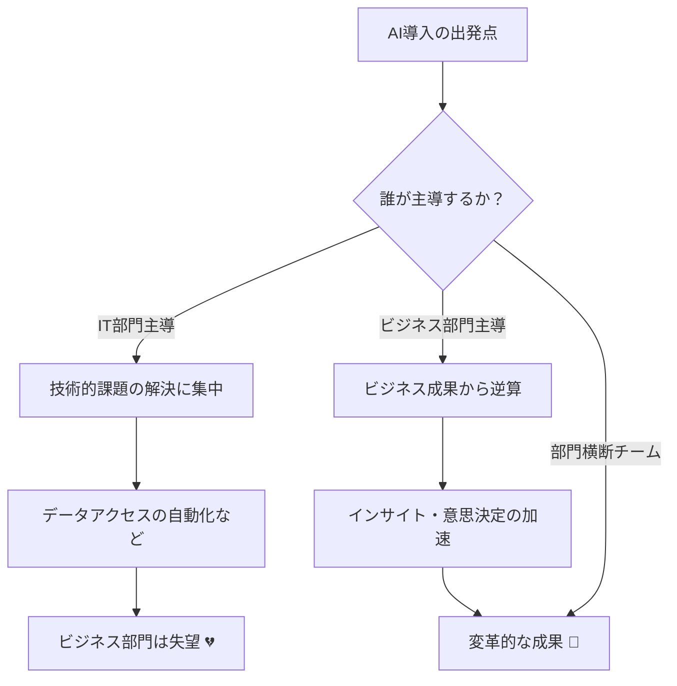
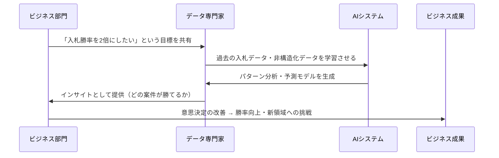

# 企業のAI導入が失敗する本当の理由：技術主導ではなくビジネス主導で進めるべき理由と実践方法

多くの企業がAI導入に失敗している根本原因は「技術部門が主導している」ことにあります。IT部門はセキュリティや標準化を優先するため、ビジネスの現場が本当に必要としているものを見落としがちです。

AIはインフラ整備とは違い、業務のやり方そのものを変える変革です。成功するAI導入は、「何を達成したいか」というビジネス目標から出発し、IT・データ・ビジネス部門が連携して進める必要があります。

https://forbesjapan.com/articles/detail/91904

## 深掘り

### IT主導のAI導入がなぜ失敗するのか

IT部門は本来、安定性・コスト管理・セキュリティのために設計された組織です。そのため、AIのように「速い反復」「現場ニーズへの柔軟な対応」が求められる取り組みとは相性が悪です。技術的には正しいものを作っても、現場が求める「インサイト」ではなく「データ」しか提供できないという根本的なズレが生まれます。

### シャドーAIプロジェクトが示す本質

IT部門の遅さに業を煮やしたビジネス部門が、ガバナンスの外で独自にAIを動かし始める「シャドーAI」は、実はビジネスニーズ主導の正しいアプローチの証拠です。ただしガバナンス不在のリスクも伴います。本来はIT部門とビジネス部門が最初から組んでいれば、このような迂回路は不要なのです。

### AIは「課題解決」だけでなく「新しい可能性」を開く

既存業務を速く・安くするだけがAIの役割ではありません。建設業の例が示すように、以前は非現実的だった野心的な入札が可能になるなど、ビジネスの「できること」の範囲自体を広げます。この視点を持てるのは、現場を知るビジネス部門だけです。

### 深掘りを図解

### 用語解説

**インサイト**：データを分析して得られる「意味のある気づき・示唆」。単なるデータとは異なり、意思決定に直結する情報のこと。

**シャドーAI**：IT部門の公式ガバナンスを通さず、ビジネス部門が独自に進めるAIプロジェクト。

**ERP**：企業の基幹業務（会計・在庫・人事など）を統合管理するシステム（例：SAP）。

**テキストtoSQL**：自然言語の質問をデータベース検索用のSQL文に自動変換するAI技術。

**限界費用ゼロ**：追加的に1単位生産・実行するコストがほぼゼロになること。デジタル・AI活用の大きなメリット。

**パイロットプロジェクト**：本格展開前に小規模で実施する試験的な取り組み。

## ルーツ・背景

### なぜIT部門がAIを担ってきたのか

クラウド移行やERP導入など、過去のデジタル変革はすべてIT部門が推進してきた歴史があります。企業はAIもその延長として捉え、自然とIT部門に委ねてきました。しかし、過去のIT施策が「インフラ整備」だったのに対し、AIは「業務の意思決定そのもの」に介入します。この本質的な違いが認識されないまま導入が進んだことが、今日の失敗の温床となっています。

### AIバブル議論の背景

2022〜2023年のChatGPT登場以降、企業のAI投資が急増しました。しかし期待値が高まりすぎた結果、「使ってみたが成果が出ない」という声が増加。ガートナーのハイプサイクルでいう「幻滅期」に差し掛かっているという議論がこの記事の背景にあります。

### ビジネス主導という考え方の台頭

デジタルトランスフォーメーション（DX）の失敗例が積み重なる中、「技術ありきではなく戦略ありき」という考え方が主流になってきました。AIもその文脈で、経営・現場・技術が三位一体で動く必要性が強調されています。

## 技術の仕組み

AIは大量のデータからパターンを見つけ、予測・分類・生成を行う技術です。重要なのは、AIはあくまで「目的に応じて設計された道具」であるという点。何を入力し、何を出力させるかの設計（＝ビジネス目標の定義）が性能を左右します。どんなに優れたモデルでも、解くべき問題が間違っていれば無意味な答えしか返しません。建設業の例で言えば、「入札勝率を上げる」という目標があって初めて、分析すべきデータや生成すべきインサイトが決まります。

### 技術の仕組みを図解

## 実務での役立ち方

### ビジネスリーダーとしてのAI導入の問い方

「どの意思決定を速くしたいか」「どこで事業を拡大したいか」という問いを起点にAI活用を考えることで、技術部門に丸投げせず、成果に直結したプロジェクト設計ができます。

### 部門横断チームの作り方

ビジネス・データ・IT の3者が連携する体制を最初から設計することが重要です。特に初期のパイロット選定は、「技術的に実現できるか」だけでなく「実際のビジネスインパクトを示せるか」で判断します。

### 成果指標の設定

AI導入の成功を「システムが動いているか」ではなく、「意思決定が速くなったか」「収益や勝率が変わったか」というアウトカムで測ることが、プロジェクトを本物の変革につなげるカギです。

## あとがき

AI導入の失敗の多くは技術の問題ではなく、組織とプロセスの問題です。「AIを入れた」という事実ではなく「AIで何が変わったか」を問い続ける姿勢が、これからのビジネスパーソンには不可欠です。技術に詳しくなくても、自分のビジネスの課題を明確に言語化できる人こそが、AI時代の主役になれます。

## オススメの書籍

### [AI・データ分析プロジェクトのすべて ビジネス力×技術力=価値創出](https://amzn.to/4qDC2d5)
ビジネス現場でのAIプロジェクト推進を実務目線で解説。IT部門任せにしない進め方が学べる。

### [DX実行戦略 デジタルで稼ぐ組織をつくる](https://amzn.to/4aVExD1)
デジタル変革をビジネス戦略として捉えるフレームワークを提供。AI導入の上位概念として必読。

### [データ分析の力　因果関係に迫る思考法](https://amzn.to/4kHK7wd)
データから正しいインサイトを得るための思考法を、因果推論の観点からわかりやすく解説。

### [生成ＡＩ活用の最前線―世界の企業はどのようにしてビジネスで成果を出しているのか](https://amzn.to/3MjwzdD)
企業のAI活用事例を多数収録。ビジネス主導の成功・失敗パターンを俯瞰できる。

### [THE MODEL（MarkeZine BOOKS） マーケティング・インサイドセールス・営業・カスタマーサクセスの共業プロセス](https://amzn.to/4qKOyaS)
マーケティング・営業・カスタマーサクセスの連携モデルを解説。部門横断でビジネスを設計する思考の土台になる。
