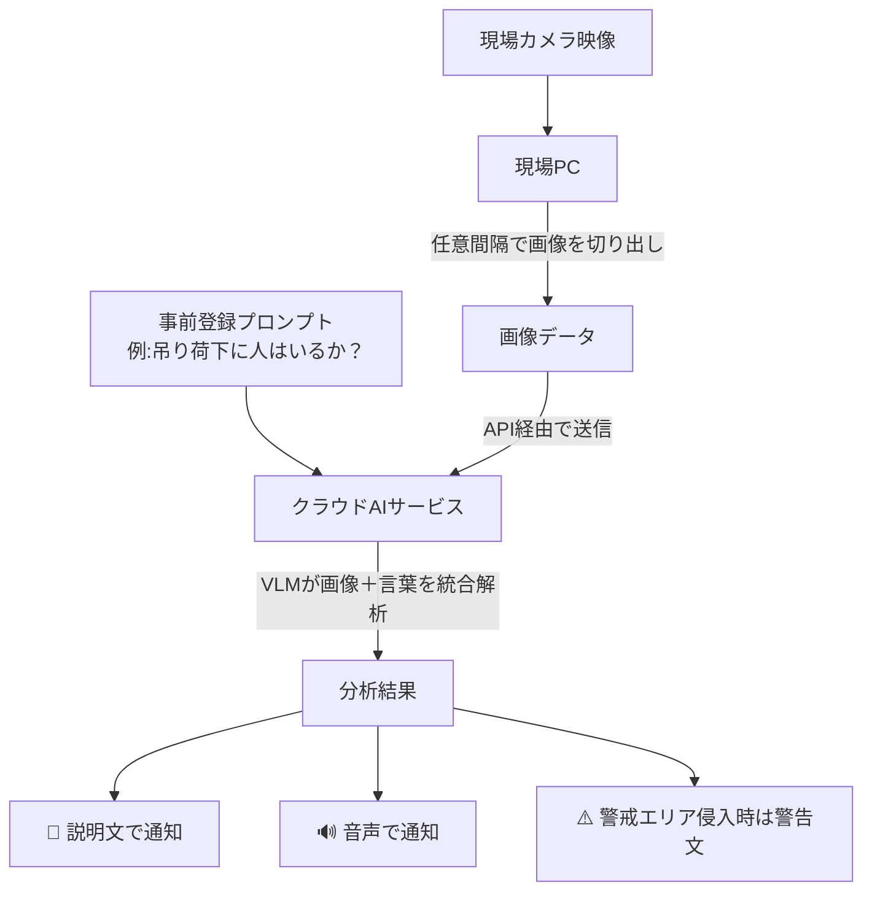
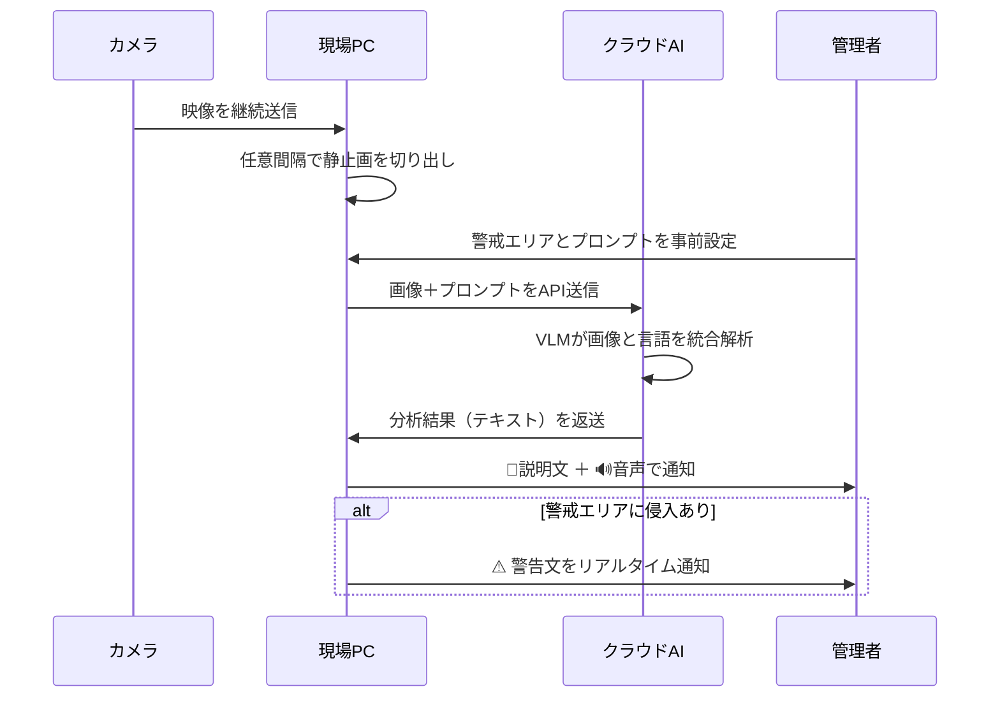

# 工事現場の「AIの目」が安全を守る！映像を見て状況を言葉で教えてくれる次世代監視システムとは？

## 1. ざっくり言うと？

- 東洋建設が、工事現場のカメラ映像をAIがリアルタイムで分析し、**危険な状況を文章＆音声で知らせる**システムを開発
- 従来のAIは「事前に覚えたもの」しか認識できなかったが、新システムは**画像と言葉を同時に理解するAI　VLM**で柔軟に対応
- 現場の状況に合わせてプロンプト（指示文）を変えるだけで、**同じシステムをどんな工事にも使い回せる**のが革命的

## 2. もっと詳しく！

### 「覚えていないものは見えない」という従来AIの限界

これまでの画像認識AIは、「作業員を認識させたい→作業員の写真を大量に学習させる」という手順が必要でした。まるで「試験に出る単語だけ丸暗記した学生」みたいなもので、想定外のものが現れたら完全にお手上げ。

### 新システムは「状況を読める」AIを採用

VLモニターが使う**VLM 視覚言語モデル**は、画像と言葉の意味を同時に理解できるAI。「この写真の中に、クレーンの吊り荷の下に人が入っていますか？」という質問に、まるで人間のように答えられます。

### プロンプトを変えるだけで現場に合わせられる

「警戒エリアAに作業員が入ったら警告」「重機と人の距離が3m以内になったら通知」といった指示を、管理者がPC画面で設定するだけ。現場が変わるたびにAIを一から作り直す必要がありません。

### 構造をビジュアル解説（図解）

## 3. これだけは知っておきたい用語集

**VLM（視覚言語モデル）**：画像と言葉を「同時に」理解できるAI。「写真を見て説明文を書く」「文章から画像の内容を判断する」ができる。GPT-4oやGeminiのように画像を送って質問できるアレのこと。

**プロンプト**：AIへの指示文。「〇〇が映っていたら教えて」という指定書みたいなもの。これを変えるだけでAIの動きをカスタマイズできる。

**API**：異なるソフトやサービスをつなぐ「共通の差込口」。現場PCとクラウドAIが別会社のシステムでも、APIがあれば連携できる。

## 4. なぜこれが生まれたの？

### 建設現場の「人手不足＋事故リスク」という二重苦

日本の建設業界は深刻な高齢化・人手不足に直面しています。現場を24時間人間が監視し続けることは現実的ではなく、かつ重機や吊り荷による死亡事故は今も後を絶ちません。

### 従来AIでは「現場の多様性」に対応できなかった

工事の種類は港湾、橋梁、ビル、道路とさまざま。現場ごとに「危険なシチュエーション」が全然違う。都度AIを作り直すのはコストも時間もかかりすぎた。

### 国の政策「i-Construction 2.0」が後押し

国土交通省が推進する建設現場の自動化・省人化政策が追い風になり、テクノロジーで現場を変えようという機運が高まっています。

## 5. どんな仕組みなの？

### 仕組みをわかりやすく解説

現場カメラが撮り続けた映像を、現場に置いたPCが一定間隔（例：5秒ごと）で「写真」として切り抜きます。その写真に「こういう状況があったら教えて」という指示文（プロンプト）を添えて、クラウド上のAIに送信。AIが写真と指示文をセットで読み解いて、「異常あり」「〇〇が入っています」と日本語で返してくれます。問題があれば音声でも現場に知らせます。

### 動きをシミュレーション（図解）

## 6. 明日の仕事にどう活かす？

### 現場監督の「目の代わり」として使う

広い工事現場を一人の監督が全部見張るのは不可能。VLモニターを複数カメラに設置すれば、危険な動きがあった瞬間だけ人間に知らせてくれる「自動見張り番」になります。

### プロンプトを使いこなして現場をカスタマイズ

IT知識不要。「吊り荷の下に人がいたら教えて」「重機の10m以内に作業員がいたら通知」と日本語で書くだけ。現場が変わるたびに文章を書き換えるだけでAIが対応します。

### 将来は機械データとの連携で「予防保全」へ

現在開発中の拡張機能として、カメラ映像の分析結果を重機のセンサーデータと組み合わせることで、「事故が起きる前に兆候を察知する」予防型の安全管理も視野に入っています。

## 7. あとがき

個人的に注目したいのは「プロンプトを変えるだけで現場に対応できる」という設計思想です。これまでのAIは「作る側の専門家」が必要でしたが、このシステムは**現場の職人さんが自分でAIをカスタマイズできる**可能性を秘めています。

技術は難しい人だけのものじゃない。そんな民主化の波が現場にも届き始めています。安全な現場が当たり前になる未来、思ったより近いかもしれません。

## 参考・引用元
https://dcross.impress.co.jp/docs/usecase/004542.html

## 8. さらに学びたい人のための5冊

- [ChatGPT vs. 未来のない仕事をする人たち](https://amzn.to/40jcVSa)：AIが職場をどう変えるか、現場目線で理解できる入門書。
- [生成AIで世界はこう変わる](https://amzn.to/4s0d493)：VLMを含む最新AI技術の全体像をわかりやすく解説した決定版。
- [建設業界 DX革命](https://amzn.to/4rrlvuj)：建設業界のデジタル変革の最前線がまとまった実務書。
- [プログラミング知識ゼロでもわかる プロンプトエンジニアリング入門 第2版](https://amzn.to/46Ad4o7)：AIへの指示文（プロンプト）を使いこなすための実践ガイド。
- [図解即戦力　機械学習&ディープラーニングのしくみと技術がこれ1冊でしっかりわかる教科書](https://amzn.to/40jtNrW)：VLMの土台となるAI技術をゼロから学べる定番教科書。
