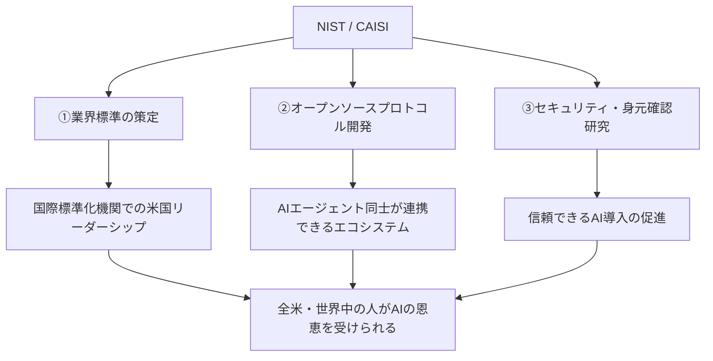
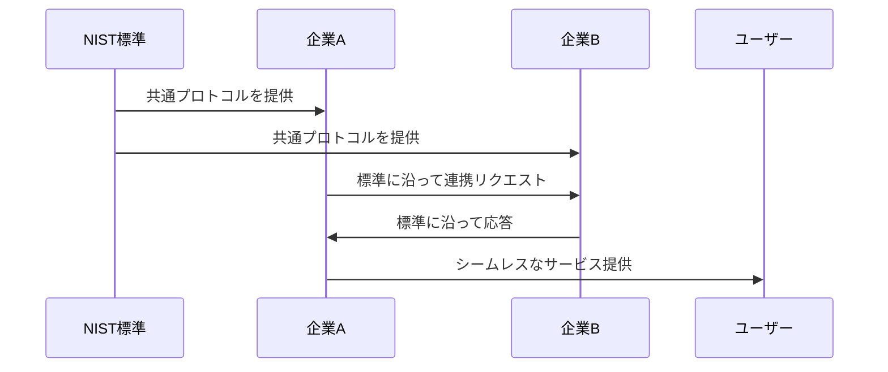

# AIエージェントに「共通ルール」が生まれる！アメリカ政府が動き出した理由と私たちへの影響

## 1. ざっくり言うと？（要約）

- アメリカの技術標準機関NISTが、AIエージェントの「共通ルールづくり」に本格着手した
- 今のままだとAIエージェントがバラバラに開発されて使い物にならなくなる危険があるため
- 安全・安心・みんなが使える「AIエージェントの交通法規」を世界に先駆けて作ろうとしている

## 2. もっと詳しく！（深掘り）

### AIエージェントって何がすごいの？

メールの返信、コードのバグ修正、ネットショッピング——これ全部、人間が頼めば「自分でやり遂げる」AIのことをAIエージェントと呼びます。ただ質問に答えるだけじゃなく、**自律的に動いて仕事を完結させる**のが最大の特徴です。

### なぜ「標準化」が必要なの？

たとえばコンセントを想像してみてください。日本とアメリカでは形が違い、変換プラグがないと使えませんよね。AIエージェントも今は「会社ごとに独自仕様」の状態。このままだと、A社のエージェントとB社のエージェントが連携できず、企業も開発者も混乱してしまいます。NISTはここに「世界共通のコンセント規格」を作ろうとしています。

### 3本柱で何をするの？

NISTは①業界を巻き込んで標準を作る、②オープンソースのプロトコルを育てる、③セキュリティと「エージェントの身元確認」の研究を進める、という3方向で動きます。

### 構造をビジュアル解説（図解）

## 3. これだけは知っておきたい用語集

**AIエージェント**：「やっといて」と頼んだら最後まで自分でやり遂げるAIのこと。チャットに答えるだけのAIより一段上の存在。

**相互運用性（インターオペラビリティ）**：異なる会社のシステムやAIが、きちんと「話し合える」状態のこと。USBケーブルがどのパソコンでも使えるイメージ。

**NIST**：アメリカ政府の技術標準を決める機関。重さや長さの単位から、サイバーセキュリティの基準まで幅広く策定している「ルールブックの番人」。

## 4. なぜこれが生まれたの？（ルーツ・背景）

### AIブームの「負の側面」が見えてきた

ChatGPTの登場以来、AIツールは爆発的に増えました。しかし今度はAIエージェントが急増し、「どれも独自仕様」という混乱期に突入しています。インターネット黎明期にHTTPという共通規格ができたからこそウェブが普及したように、AIエージェントにも同じ「共通言語」が必要な時代になりました。

### アメリカの国家戦略としての動き

AIの覇権争いが激化する中、標準化のルールを「誰が決めるか」は国家の競争力に直結します。NISTが動いたのは、技術の普及を助けると同時に、国際標準の場で主導権を握るという戦略的な意図もあります。

## 5. どんな仕組みなの？（技術解説）

### 仕組みをわかりやすく解説

NISTが標準を作る → 企業がその標準に沿ってAIエージェントを開発する → 異なる会社のエージェントが共通プロトコルで連携できる → ユーザーはどのエージェントでも安心して使える、という流れです。

### 動きをシミュレーション（図解）

## 6. 明日の仕事にどう活かす？（実務での活用）

### ツール選定の判断軸にする

今後、AIエージェントツールを選ぶときは「NIST標準に準拠しているか」が重要な指標になります。準拠ツールなら将来的な連携がしやすく、後で乗り換えるコストも下がります。

### 社内AI導入の稟議に使える

「国際標準化が進んでいる分野だから安全に投資できる」という論拠として、この動きを上司への説明資料に活用できます。

### セキュリティリスクへの備えを早めに

NISTが「AIエージェントの身元確認」研究を進めるということは、逆に言えば今は「なりすまし」などのリスクが存在するということ。自社でエージェントを使う場合は認証・アクセス管理を今のうちに整備しておきましょう。

## 7. あとがき

インターネットが当たり前になったのも、電気が家庭に届くようになったのも、陰で「共通ルール」を整備した人たちのおかげです。AIエージェントという新しい波が来たとき、そのルールを誰が書くかが未来を決める。NISTの動きはまさにその「見えない基礎工事」の始まりです。派手さはないですが、10年後に振り返ったとき「あれが転換点だった」と言われる可能性が高い話だと感じます。

## 参考・引用元
https://www.publickey1.jp/blog/26/nistaiai_agent_standards_initiative.html

## 8. さらに学びたい人のための4冊

* [AI 2041　人工知能が変える20年後の未来](https://amzn.to/3OoBfzD)：AIが社会をどう塗り替えるかをストーリー形式で体感できる。技術の先にある「人間の暮らし」がリアルに描かれています。

* [AIエージェント革命 「知能」を雇う時代へ](https://amzn.to/4b4YeZ3)：AIエージェントの現在地と今後の展望を日本語でわかりやすく解説。技術背景から産業応用まで網羅。

* [標準化ビジネス戦略大全](https://amzn.to/4avn8Ry)：「ルールを作った者が市場を制す」というビジネス戦略を学べる一冊。NISTの動きの意味が腑に落ちます。

* [セキュリティエンジニアのための機械学習 ―AI技術によるサイバーセキュリティ対策入門](https://amzn.to/4rwtXYW)：AIシステムを安全に運用するための視点を身につけられる。エージェントのセキュリティリスクを具体的に理解するのに最適。
