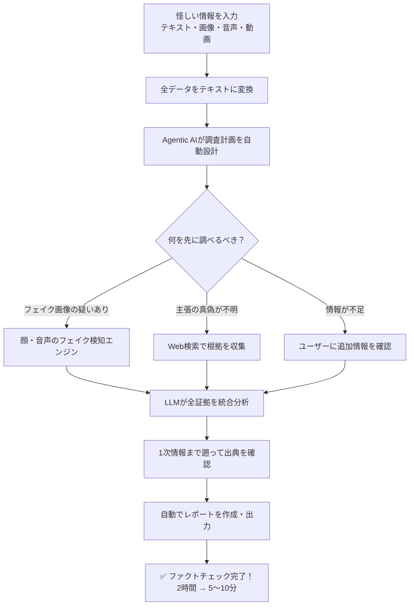
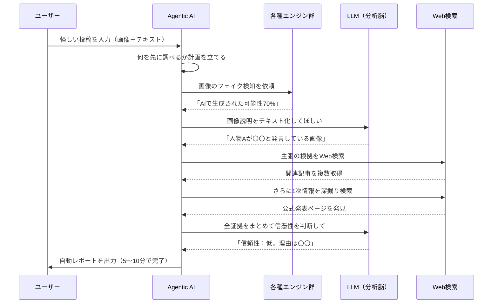

# フェイクニュースを2時間→5分で見破る！NECのAI偽情報検出システムが凄すぎる件

## 1. ざっくり言うと？（要約）

- NECが開発中のAIシステムが、テキスト・画像・音声・動画を統合的に分析して偽情報・誤情報を自動でファクトチェックできる
- これまでプロが2時間かけていた証拠収集作業を、わずか5〜10分に短縮することに成功した
- 「全データをいったんテキストに変換してからAIに分析させる」という独自アイデアが核心で、国際学会でも高く評価された

## 2. もっと詳しく！（深掘り）

### なぜ今、偽情報が危険なのか？

SNSのタイムラインに流れてくる情報、全部信じていませんか？実は今、AIの進化によって「本物そっくりの偽情報」を誰でも簡単につくれる時代になっています。世界経済フォーラムの「Global Risk Report 2025」では、偽・誤情報を**1〜2年以内で最もリスクが高い問題のひとつ**として挙げているほどです。金融市場を意図的に動かす偽情報や、災害時に正しい避難情報が届かなくなる誤情報など、現実の被害がすでに起きています。

### NECが開発した「偽情報探偵AI」の全貌

NEC のセキュアシステムプラットフォーム研究所のチームが開発しているのは、怪しい情報を入力するだけで自動的にファクトチェックしてレポートを作ってくれるシステムです。すごいのは、**テキストだけでなく、画像・音声・動画も全部まとめて分析できる**こと。普通の方法だと「画像は画像専用のAI」「動画は動画専用のAI」と、バラバラに調べる必要がありますが、このシステムは違います。

### 全部「テキスト」に変換するという天才的な発想

このシステムの核心アイデアはシンプルです——**どんな形式のデータでも、まず全部テキスト（文字）に変換してしまう**。画像なら「この画像には笑顔の男性が写っていて、背景には国会議事堂が…」という具合にテキストで表現し直す。そうすることで、LLM（高性能なAI）が全データを同じ土俵で比較・分析できるようになります。このアイデアはAI分野の難関国際学会「AAAI 2025」のデモ部門にも採択されました。

### Agentic AI：自分で考えて動く「名探偵」

さらにすごいのが「Agentic AI」の組み込みです。これはあらかじめ決まった手順で動くのではなく、**状況を見ながら自分で調査の順番を判断する**AIのこと。「まずフェイク検知をすべきか、先にWeb検索すべきか」を自動で判断し、足りない情報があればユーザーに聞き返す。まさに優秀な探偵のように動きます。

### 構造をビジュアル解説（図解）

## 3. これだけは知っておきたい用語集

**LLM（大規模言語モデル）**
ChatGPTのような、膨大な文章を学習して人間と会話できる超高性能AIのこと。文章を読んで意味を理解したり、要約したりするのが得意。このシステムでは「全情報を読んで判断を下す裁判官」のような役割を果たします。

**Agentic AI（エージェンティックAI）**
あらかじめ決まった手順をこなすだけでなく、「次は何をすべきか」を自分で考えて行動できるAI。工場のロボットではなく、指示を理解して臨機応変に動ける「優秀なアシスタント」のイメージです。

**マルチモーダル**
「モーダル＝情報の形式」が複数あること。テキスト・画像・音声・動画という異なる種類の情報をまとめて扱える能力を指します。人間が目でも耳でも情報を受け取れるのと同じ発想です。

## 4. なぜこれが生まれたの？（ルーツ・背景）

### 画像生成AIの普及が「諸刃の剣」になった

2022〜2023年頃から、誰でも本物そっくりの写真や動画をAIで作れるようになりました。クリエイターにとっては夢のツールですが、悪意を持った人にとっては「完璧な偽情報製造機」にもなります。政治家の偽発言動画、存在しない災害の写真、実在する人物のフェイク音声——こうしたコンテンツがSNSに拡散する事例が世界中で急増しました。

### 「専用ツール」では追いつけない現実

従来、画像の偽造検知には画像専用のAI、動画には動画専用のツールを使う必要がありました。しかし本物の偽情報は「正しい画像に嘘のキャプションをつける」「本物の映像を切り取ってミスリードさせる」など、**複数の要素を組み合わせた複雑な手口**が増えています。バラバラのツールでは全体の文脈を見抜けないのです。

### 総務省の公募が開発の後押しに

NECのチームがシステムのコアアイデアを練り始めたタイミングで、総務省が「インターネット上の偽・誤情報対策技術の開発・実証事業」の公募をスタート。NECがこれに応じる形で、実用的なシステム開発が本格的に動き出しました。

## 5. どんな仕組みなの？（技術解説）

### 仕組みをわかりやすく解説

まず、ユーザーが怪しいと思った情報（SNSの投稿、ニュース記事、画像など）をシステムに入力します。するとAIが**その情報を全部テキストに翻訳**します。画像なら「写っているもの」を文章で説明し、音声なら書き起こし、動画なら各シーンを文章で記述します。全部テキストになったら、LLMが「この主張は本当か？」「画像は加工されていないか？」を検証します。Web検索を繰り返して1次情報（元の発表や公式声明）まで遡り、証拠を集めたうえで最終的なレポートを自動生成します。

### 動きをシミュレーション（図解）

## 6. 明日の仕事にどう活かす？（実務での活用）

### 報道・メディア関係者：記者の「第六感」をデータで裏付ける

速報性が求められるニュースの現場では、怪しい情報を確認する時間が圧倒的に足りません。このシステムがあれば、SNSで拡散中の情報を入力するだけで証拠収集が5〜10分で完了します。記者が「これは怪しい」と感じた勘を、AIが客観的な証拠で裏付けてくれる形です。

### 自治体・防災担当者：災害時の情報混乱を防ぐ

大きな災害が起きると、SNSには「〇〇が崩落した」「△△に逃げてはいけない」という真偽不明の情報が溢れかえります。自治体の担当者がこのシステムを使えば、どの情報が信頼できて住民に伝えるべきか、どれが誤情報で打ち消すべきかを素早く判断できます。

### 企業の広報・リスク管理部門：自社に関する風評を素早く検証

「自社製品で事故が起きた」という偽情報がSNSで拡散した場合、対応が遅れるほどダメージが大きくなります。このシステムで情報の信憑性を素早く分析し、必要であれば迅速に否定声明を出すための判断材料として使えます。

## 7. あとがき

正直に言うと、自分がこの記事を読んで一番驚いたのは「全部テキストに変換する」というアイデアのシンプルさです。複雑な問題ほど、解決策は拍子抜けするほどシンプルだったりする——この技術はその典型例だと思います。

それ以上に感じたのは、開発チームが「新しい脅威に素早く対応する」というセキュリティの思想をシステム設計の根幹に据えていることです。AIが進化するほど偽情報も巧妙になる。そのいたちごっこに勝つための「更新し続けられる構造」を最初から設計している点に、本物のプロの仕事を感じました。

フェイクニュースは「騙される人が悪い」問題ではなく、もはや社会インフラの問題です。こうした技術が一日も早く実用化されることを、一読者として心から願っています。

## 参考・引用元
https://jpn.nec.com/rd/technologies/202511/index.html

## 8. さらに学びたい人のための5冊

- [フェイクニュースを科学する: 拡散するデマ、陰謀論、プロパガンダのしくみ](https://amzn.to/46L0jqT)：デマや誤情報がどうやって拡散するかをデータで解明した一冊。「なぜ人は嘘を信じるのか」がスッキリわかります。

- [ジェネレーティブAIの衝撃](https://amzn.to/40t0cfL)：ChatGPTをはじめとする生成AIが社会や仕事をどう変えるかを多角的に解説。技術の全体像をつかむのに最適です。

- [AI時代の経営新常識: リソース不足を武器に変える6つの戦略](https://amzn.to/3N1Ryll)：創業25年・社員数60名の建設関連企業を経営しながら新規事業の立ち上げを繰り返し成功させてきた著者が、「少ないリソースであっても、AIやDXを活用して短期で“稼ぐ仕組み”を作るノウハウ」を一冊にまとめたものです。

- [マンガ＋図解で基礎がよくわかる　情報セキュリティの教科書](https://amzn.to/46mv4Ci)：サイバー攻撃から偽情報まで、デジタル社会のリスク全般を体系的に学べる入門書。難しい用語も丁寧に解説されています。

- [影響力の武器 実践編[第二版]:「イエス! 」を引き出す60の秘訣](https://amzn.to/4rEmXJR)：なぜ人は偽情報に騙されるのか、その心理的メカニズムを理解できる名著。AIの問題を「人間の問題」として捉え直すきっかけになります。
