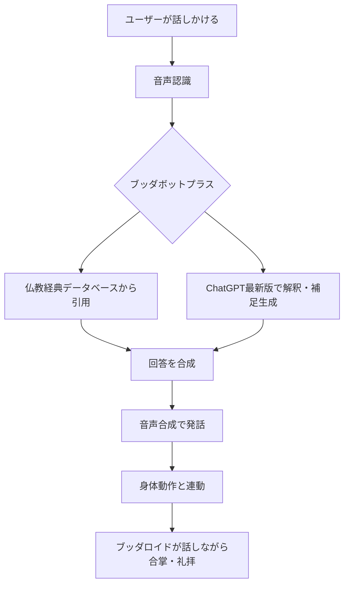
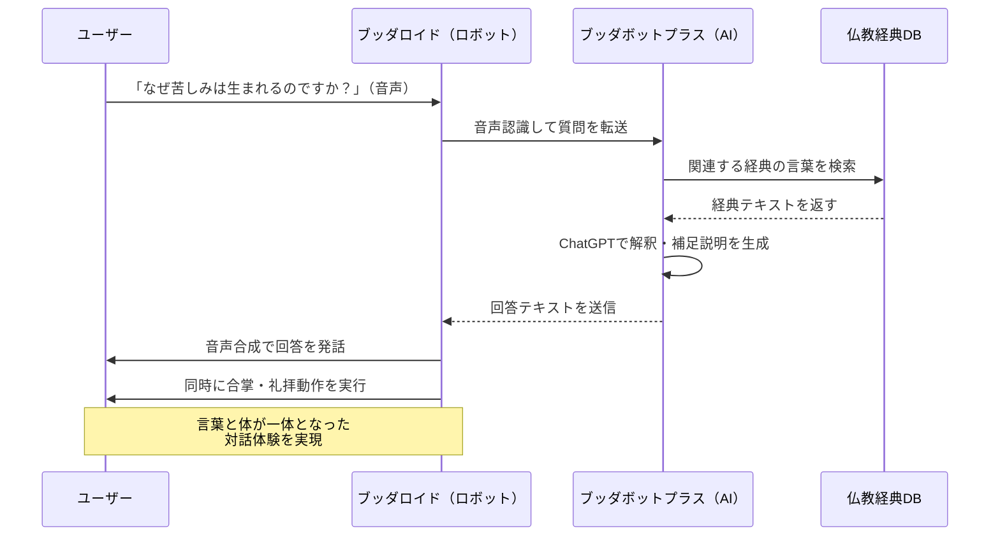

# 仏教AIロボット「ブッダロイド」2026年最新：3分でわかりやすく解説

## 1. ざっくり言うと？（要約）

- 京都大学の研究チームが、仏教の教えに答えてくれる**AIを搭載したヒューマノイドロボット ブッダロイド**を開発した。
- スマホ画面の中だけだったAIお坊さんが、ついに**リアルな体を持って目の前に現れ、合掌や礼拝もしてくれる**ようになった。
- 将来は**人手不足の宗教界を支えたり、職場のメンタルケアを行ったり**と、宗教の枠を超えた活躍が期待されている。

## 2. もっと詳しく！（深掘り）

### テキストから身体へ——5年間の進化ロードマップ

2021年、京都大学の熊谷誠慈教授チームは「ブッダボット」という仏教チャットボットを世に出しました。いわば「LINEでお坊さんに相談できる」サービスです。2022年にはARで画面の中にお坊さんのアバターを出現させることにも成功。見て・聞いて話せるようになりました。

でも、まだ何かが足りなかった。「**目の前にいる感じ**」です。画面越しだと、どうしても「機械と話している」という感覚が拭えない。人は何千年も「生身のお坊さんが目の前でお経を唱えてくれる」という体験から癒しを受けてきたからです。

### 「身体性」という最後のピース

そこで研究チームが注目したのが、二足歩行できるヒューマノイドロボット「Unitree G1」（中国のUnitree Robotics社製）。このロボットに仏教対話AI「ブッダボットプラス」を組み合わせたのが「ブッダロイド」です。

ブッダロイドは単に話すだけではありません。**合掌（手を合わせる動作）、礼拝、ゆったりとした荘厳な歩き方**まで身に付けています。「ありがとう」と言いながらペコッと頭を下げる——その何気ない動きが、対話の質を根本から変えるのです。

### AIの頭脳部分はどうなっている？

「ブッダボットプラス」は、ChatGPTの最新版をベースに、仏教の原始経典（『スッタニパータ』など）を学習させた特別仕様のAIです。質問に対してまず経典の言葉を引用し、そのうえでChatGPTが分かりやすい解釈を付け加えるという二段構えの仕組みです。

「なんで生きるのが辛いんだろう」と問いかければ、2500年前に仏陀が語った言葉を根拠にしながら、現代語で優しく答えてくれます。

### 構造をビジュアル解説（図解）

## 3. これだけは知っておきたい用語集

**ヒューマノイドロボット**
「人間に似た形のロボット」のこと。二本足で歩き、両手を使い、頭がある——人間そっくりの見た目と動きを持つロボットです。今回のUnitree G1はマラソンやボクシング大会にも出場するほど高性能。

**身体性（しんたいせい）**
「体があること」の重要性を指す言葉。ロボットや画面の中のキャラクターではなく、リアルに目の前で動く存在と対話することで、人間が感じる「安心感」や「つながり」が大きく変わります。握手や合掌のような「触れ合い」が心に与える影響は、文字や音声だけとは全く違います。

**ELSI（エルシー）**
「Ethical, Legal, Social Issues」の略で「倫理・法律・社会的な問題」のこと。「AIロボットがお葬式を仕切ってもいいの？」「ロボットに感情移入しすぎたらどうなる？」といった、技術が進む前に必ず考えておくべき大事な問いです。

## 4. 【まず読むべき1冊】理解が一気に深まる本

> 💡 ここまで読んで「もっと知りたい」と思ったあなたへ

* [AIの倫理 人間との信頼関係を創れるか](https://amzn.to/4qQbd5z)
  - **この記事とのつながり**：ブッダロイドが直面する「AIが人の心に寄り添っていいのか」「ロボットが宗教儀礼を代替することの意味」という問いに、哲学的な土台から正面から向き合える一冊。記事のELSIセクションがまさにこの本のテーマそのもの。
  - **読むとこうなる**：「すごいね」で終わらず、「この技術と社会がどう向き合うべきか」を自分の言葉で語れるようになる。職場や家族との会話で「AIって結局どうなの？」という問いに答えられる武器が手に入る。
  - **こんな人に刺さる**：AIニュースを読むたびに「なんか怖い気もするけど…」とモヤモヤしている人。技術の中身より「人間社会への影響」が気になる人。
  - **難易度**：★★★☆☆（5段階）

## 5. なぜこれが生まれたの？（ルーツ・背景）

### 「お寺が遠い」「話しにくい」——現代人の宗教的孤独

日本の多くの人にとって、お坊さんに悩みを相談することはハードルが高い。「葬式の時だけ来る人」というイメージが強く、日常的に仏教の教えに触れる機会はほとんどありません。でも人が「生きる意味」「死の恐怖」「孤独感」に悩む時、2500年前に仏陀が語った言葉は今でも驚くほどの力を持っています。

### チャットボットでは届かなかった「温もり」

2021年に「ブッダボット」が登場し、スマホで仏教の教えを質問できるようになりました。でもテキストだけでは「癒された」という感覚が弱い。ARでアバターを出現させても「やっぱり画面だよな」という壁がある。人は何万年もの歴史の中で、「目の前にいる誰かと向き合う」ことで心を癒してきた生き物です。その本能的なニーズに応えるには、体が必要だった。

### ヒューマノイドロボットの急速な進化が追い風に

ちょうどこの数年で、ヒューマノイドロボットの性能が劇的に向上しました。マラソンを走り、ボクシングをするロボットが登場するなど、「人間に近い動き」が現実のものになってきた。この波に乗って、研究チームは「では、心の支援にも使えるのでは？」と考えたわけです。

## 6. どんな仕組みなの？（技術解説）

### 仕組みをわかりやすく解説

ブッダロイドの「頭」「口」「体」は、それぞれ別の技術が担っています。

**頭（思考）**：ブッダボットプラスが担当。ユーザーの質問に対し、まず仏教経典データベースから関連する言葉を引っ張ってきます。次にChatGPTがその経典の言葉を現代語に翻訳し、分かりやすい補足説明を加えます。出典が明確なので「AIが勝手に作った答え」ではなく「経典に基づいた答え」という信頼性があります。

**口（コミュニケーション）**：音声認識で質問を受け取り、音声合成で話します。声は青年男性がデフォルトですが、性別・年齢の変更も可能。

**体（動作）**：XNOVA社の技術で、合掌・礼拝・荘厳な歩き方を学習済み。言葉を発するタイミングと体の動きが連動するよう設計されており、「ありがとうございます」と言いながらきちんと礼をする、という人間らしい間（ま）を持った動作を実現しています。

### 動きをシミュレーション（図解）

## 7. 明日の仕事にどう活かす？（実務での活用）

### お寺・宗教施設での人手不足解消

日本の寺院の多くが後継者不足に悩んでいます。法事や法話など「人が集まる場」でのサポート役として、ブッダロイドが参拝者の質問に答えたり、日常的な宗教教育を担ったりする未来は、もう遠くありません。「生身の住職に話しにくい悩み」をロボットになら話せる、という人も多いはず。

### 企業のメンタルケア・カウンセリング

研究チームはすでに「思想AIヒューマノイドロボット」への応用を視野に入れています。経営哲学や心理学を学習したロボットが、従業員の悩みを聞き、アドバイスをする——「AI産業カウンセラー」として職場に置かれる日が来るかもしれません。人間のカウンセラーに言いにくいことも、ロボット相手なら話せる、という効果が期待されます。

### 「伝統知テック」ビジネスの新市場

熊谷教授が提唱する「伝統知テック」——仏教・儒教・哲学などの古典的知恵をAIで現代に甦らせるビジネスは、ブルーオーシャンです。孔子ロボット、ソクラテスロボット、マルクス・アウレリウスロボット……アイデアは無限にあります。コンテンツビジネス、教育、観光など、応用先は幅広く、新規事業のヒントがここに眠っています。

## 8. あとがき

仏陀の教えをAIに学ばせ、ロボットの体を与える——数年前なら「バチ当たり」と怒られそうな発想です。でも考えてみれば、お経を印刷した本も、寺院建築も、すべて「人間が技術を使って智慧を伝えようとした」歴史の連続です。ブッダロイドはその最新バージョンに過ぎないのかもしれません。

特に面白いと思うのは、「身体性」へのこだわりです。研究チームが「チャットだけでは足りない」と感じ、体を持たせることに意味を見出したこと——それは逆説的に、「人間にとって体を持つことがいかに大切か」を証明しているように思えます。孤独を感じた時、画面の光より、目の前で合掌してくれる存在の方が、心に届く。テクノロジーが「人間らしさ」を再発見させてくれる、そんな時代になりました。

この記事が「AIってこういうことか！」という気づきにつながったなら嬉しいです。さらに理解を深めたいなら、ぜひ関連書籍もチェックしてみてください。知識が行動に変わる瞬間、きっと訪れますよ。

## 参考・引用元
https://www.kyoto-u.ac.jp/ja/research-news/2026-02-25

## 9. 【行動したい人へ】さらに学びを深める4冊

> 📚 「理解して終わり」ではなく「実務で使えるレベル」を目指す人へ

* [ロボットと人間　人とは何か](https://amzn.to/4c9nxdD)
  - **読むと何ができるようになるか**：「ロボットが人間社会に入ってくること」の意味を哲学的・工学的両面から理解でき、職場や家庭でのロボット導入を自分なりに評価できるようになる。
  - **こんな人におすすめ**：ブッダロイドの「身体性」に興味を持った人・人とロボットの関係性を考えたい人。
  - **読んだ後どんな未来になるか**：ヒューマノイドロボットのニュースを見るたびに、「これは人間社会をどう変えるか」という視点で考えられるようになる。
  - **難易度**：★★☆☆☆（5段階）

* [生成AIで世界はこう変わる](https://amzn.to/4cMALx1)
  - **読むと何ができるようになるか**：ChatGPTをはじめとする生成AIの仕組みと限界を正確に把握でき、ブッダボットプラスのような応用事例を自分でも発想できるようになる。
  - **こんな人におすすめ**：AIのビジネス活用を考えている人・生成AIの「頭の中」が気になった人。
  - **読んだ後どんな未来になるか**：AIツールを「なんとなく使う」から「設計して使う」レベルに一歩近づける。
  - **難易度**：★★☆☆☆（5段階）

* [ブッダが教える愉快な生き方](https://amzn.to/4cg3tq8)
  - **読むと何ができるようになるか**：ブッダロイドが答える「仏教の教え」の源泉を体感でき、AIが引用する経典の言葉がリアルに響くようになる。
  - **こんな人におすすめ**：仏教って難しそう…と思っていた人・ブッダロイドと実際に対話してみたい人。
  - **読んだ後どんな未来になるか**：悩んだとき、2500年前の知恵を自分の言葉で活用できるようになる。
  - **難易度**：★☆☆☆☆（5段階）

* [ヒューマノイド・ロボット AIとシミュレーション: ヒューマノイド・ロボティクスおよびAIシステム設計の完全ガイド](https://amzn.to/4kWeK13)
  - **読むと何ができるようになるか**：二足歩行ロボットの技術的挑戦と現在地を把握でき、Unitree G1のような最新ロボットの「すごさ」を正確に説明できるようになる。
  - **こんな人におすすめ**：ロボットの動作や制御技術に興味が湧いた人・エンジニアリング視点でブッダロイドを理解したい人。
  - **読んだ後どんな未来になるか**：ロボット関連のビジネスや研究動向をウォッチする視点が身につく。
  - **難易度**：★★★☆☆（5段階）
