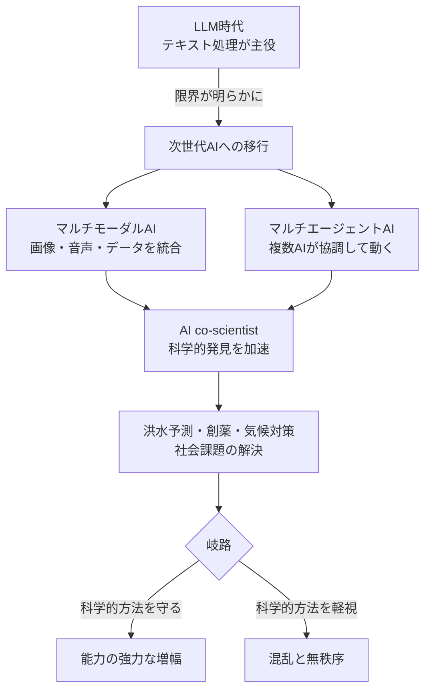
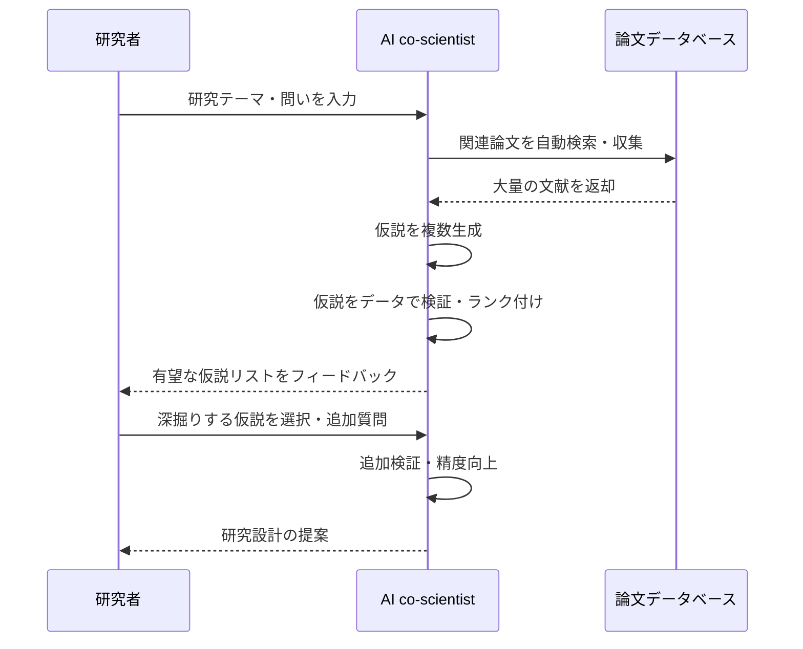

# LLMはもう古い？2026年最新AI革命を3分でわかりやすく解説
## 1. ざっくり言うと？（要約）

- ChatGPTを支えるLLM（大規模言語モデル）は、専門家の間では「近いうちに時代遅れになる」と見られています。
- 次世代AIは「マルチモーダル」「マルチエージェント」など、まったく別の仕組みで動く新アーキテクチャへ移行中です。
- AIは今、科学的発見を加速させる「バーチャル研究室」として機能し始めており、洪水予測など社会課題の解決にも活躍しています。

## 2. もっと詳しく！（深掘り）

### LLMはなぜ「絶滅危惧種」なのか？

LLMとは、膨大なテキストを学習して文章を生成するAIの心臓部です。でも考えてみてください。人間の脳は「文字を読む」だけでなく、映像・音・感触・行動を統合して判断しますよね。LLMは「文字」しか扱えない時代の産物。AI研究の第一人者ヤン・ルカンは今年のダボス会議で「LLMはまもなく時代遅れになる」と断言しました。次世代AIは複数の情報源（画像・音声・データ）を同時に扱える「マルチモーダル」システムや、複数のAIが協調して動く「マルチエージェント」システムへと進化しています。

### AIが「研究者の相棒」になる時代

GoogleのAI研究責任者ヨッシ・マティアスが紹介した「AI co-scientist（AIコサイエンティスト）」は、まさにこの進化の象徴です。研究者が「こういうことを調べたい」と投げると、AIが論文を読み漁り、仮説を立て、検証し、結果をフィードバックしてくれます。以前なら数年かかっていた研究サイクルが、数カ月で回せるようになりつつあります。大学院生やポスドクでも、AIという「無料のバーチャルラボ」を手に入れられる世界がすぐそこにあります。

### 「150カ国・20億人」を守る洪水予測AI

「変数が多すぎて不可能だ」と専門家たちが諦めていた洪水リスクの予測。Googleのチームはそれをやり遂げました。現在、約150カ国の大規模洪水を最大7日前に通知するシステムが稼働し、約20億人をカバーしています。気候変動・暴風雨・山火事など、地球規模の問題にAIが本格参戦し始めています。

### 構造をビジュアル解説（図解）

## 3. これだけは知っておきたい用語集

**マルチモーダルAI**：文字だけでなく、画像・音声・動画など複数の「感覚」を同時に処理できるAIのこと。人間が五感をフル活用して考えるのに近いイメージです。

**マルチエージェントシステム**：複数のAIが「チーム」を組んで、それぞれ役割分担しながら問題を解くしくみ。1人の天才よりも、専門家チームのほうが強い、というイメージです。

**ドラッグリパーパシング**：すでに世に出ている薬を、まったく別の病気の治療に転用すること。新薬開発より速くて安いため、AIを使った探索が急加速しています。

## 4. 【まず読むべき1冊】理解が一気に深まる本

> 💡 ここまで読んで「もっと知りたい」と思ったあなたへ

* [AI 2041 人工知能が変える20年後の未来](https://amzn.to/4tYGOF6)
  - **この記事とのつながり**：LLMを超えた次世代AIが社会や科学にどんなインパクトを与えるか、この記事の「未来の扉が開いた」という感覚を10倍の解像度で体験できます。
  - **読むとこうなる**：「AIは自分の仕事をどう変えるか」を具体的にシミュレーションでき、今すぐ動けるキャリア戦略の仮説が立てられるようになります。
  - **こんな人に刺さる**：AIの進化が速すぎてついていけないと感じているビジネスパーソン・研究者・学生全員
  - **難易度**：★★☆☆☆

## 5. なぜこれが生まれたの？（ルーツ・背景）

### LLMが「完成形」ではなかった理由

ChatGPTが登場した2022年末、多くの人がAIは完成したと感じました。でも研究者たちは違いました。LLMは「次の単語を予測するゲーム」を超巨大スケールでやっているだけで、世界を理解しているわけではないという根本的な限界が指摘され続けてきました。ヤン・ルカンはずっとこの点を訴えてきた一人で、「世界モデルを持つAI」こそが本物の知能だと主張しています。

### ダボスという「未来の震源地」

毎年1月にスイスで開かれる世界経済フォーラム（ダボス会議）は、政府・企業・研究機関のトップが集まり、世界の方向性を決める場です。今年はAIが最大のテーマとなり、「LLMの次」「科学的方法の維持」「教育の再設計」という3つの問いが会場全体を貫きました。

## 6. どんな仕組みなの？（技術解説）

### 仕組みをわかりやすく解説

AI co-scientistの動きをざっくり説明すると、こういう流れです。研究者が「肝臓が硬くなる病気の新しい治療法を探したい」と入力する→AIが世界中の論文データベースを自動で読み込む→「こういう仮説が立てられる」と複数の候補を生成する→それぞれの仮説を既存データで検証してランク付けする→研究者に「この方向が有望ですよ」とフィードバックする。研究者は「どの仮説を深掘りするか」という本質的な判断に集中できるようになります。

### 動きをシミュレーション（図解）

## 7. 明日の仕事にどう活かす？（実務での活用）

### 「AIを道具として使いこなす人」になる最初の一歩

マティアスが言う「すべての職業でAIをツールとして使う適応」は、遠い未来の話ではありません。今すぐできることとして、日々の調査・情報収集・仮説立案にChatGPTやGeminiを「下書き係」として組み込むだけでも、仕事の質と速度が変わり始めます。

### 「コーディングの原理」を学ぶという視点

マティアスが「特定の文法より原理を学べ」と言ったように、プログラミング未経験者でも「AIに何を指示するか（プロンプト設計）」を学ぶことは、今後のどんな職種にも通じる基礎力になります。コードが書けなくても、AIを動かす「問いの立て方」を磨くことが、これからの最強スキルです。

### 研究・企画職の人へ：「仮説生成」をAIに任せてみる

論文調査や市場調査の一次情報収集をAIに委ねて、自分は「どの仮説が本当に意味があるか」の判断に時間を使う。これがAI co-scientistの使い方そのものであり、ビジネスの企画・戦略立案にも同じ思想が応用できます。

## 8. あとがき

「LLMが終わる」と聞いて不安になる人もいるかもしれませんが、希望もあります。道具がより賢くなるということは、私たちが「より人間らしい問い」に集中できるということだからです。洪水から20億人を守るAI、研究者の相棒になるAI——これらは全て、道具を使いこなす人間の意志があってこそ生まれたものです。マティアスが強調した「科学的方法を守る」という言葉は、AIに使われる側ではなく使いこなす側に立つための、最も根本的な姿勢だと思います。この記事が少しでも「明日から動いてみよう」というきっかけになれば嬉しいです。関連書籍もぜひ手に取ってみてください。知識が行動に変わる瞬間が、きっと訪れます。

## 参考・引用元
https://forbesjapan.com/articles/detail/92424

## 9. 【行動したい人へ】さらに学びを深める4冊

> 📚 「理解して終わり」ではなく「実務で使えるレベル」を目指す人へ

### 書籍4選

* [世界標準の経営理論](https://amzn.to/4rK6Nyw)
  - **読むと何ができるようになるか**：AIが加速させるビジネス変化を「経営の原理」から捉え直し、自社・自部署への応用仮説が立てられます
  - **こんな人におすすめ**：AI導入を検討している管理職・経営者・コンサルタント
  - **読んだ後どんな未来になるか**：流行に流されず、本質を見極めて意思決定できるビジネスパーソンになれます
  - **難易度**：★★★☆☆

* [チャットＧＰＴvs.人類](https://amzn.to/4r2pw7g)
  - **読むと何ができるようになるか**：LLMの「できること・できないこと」を正確に把握でき、過信も過小評価もしない冷静なAIリテラシーが身につきます
  - **こんな人におすすめ**：AIに振り回されていると感じている人、メディア・教育・行政に関わる人
  - **読んだ後どんな未来になるか**：AIリスクを的確に語れる「信頼される専門家」として周囲から頼られます
  - **難易度**：★★☆☆☆

* [プログラミング知識ゼロでもわかる プロンプトエンジニアリング入門 第2版](https://amzn.to/3OBerN2)
  - **読むと何ができるようになるか**：AIへの「問いの立て方」を体系的に学べ、職種を問わず生産性が2〜3倍変わる実感を得られます
  - **こんな人におすすめ**：コーディングの原理・プロンプト設計を今すぐ実践したい人
  - **読んだ後どんな未来になるか**：AIを「なんとなく使う人」から「設計できる人」に一段階アップできます
  - **難易度**：★★☆☆☆

* [気候変動の真実 科学は何を語り、何を語っていないか?](https://amzn.to/4kYwfxL)
  - **読むと何ができるようになるか**：洪水予測AIや気候変動対策AIのニュースを、技術だけでなく「社会実装」の文脈で読めるようになります
  - **こんな人におすすめ**：AIの社会インパクトに関心を持った人、サステナビリティ・ESG担当者
  - **読んだ後どんな未来になるか**：「AIで何を解決すべきか」という問いに、自分なりの答えが持てるようになります
  - **難易度**：★★☆☆☆

## zennで使えるハッシュタグ

`#AI` `#LLM` `#機械学習` `#AIエージェント` `#マルチモーダル` `#科学的方法` `#ChatGPT` `#AIリテラシー` `#未来予測` `#テクノロジー`
